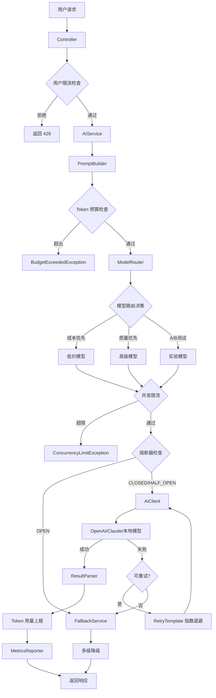
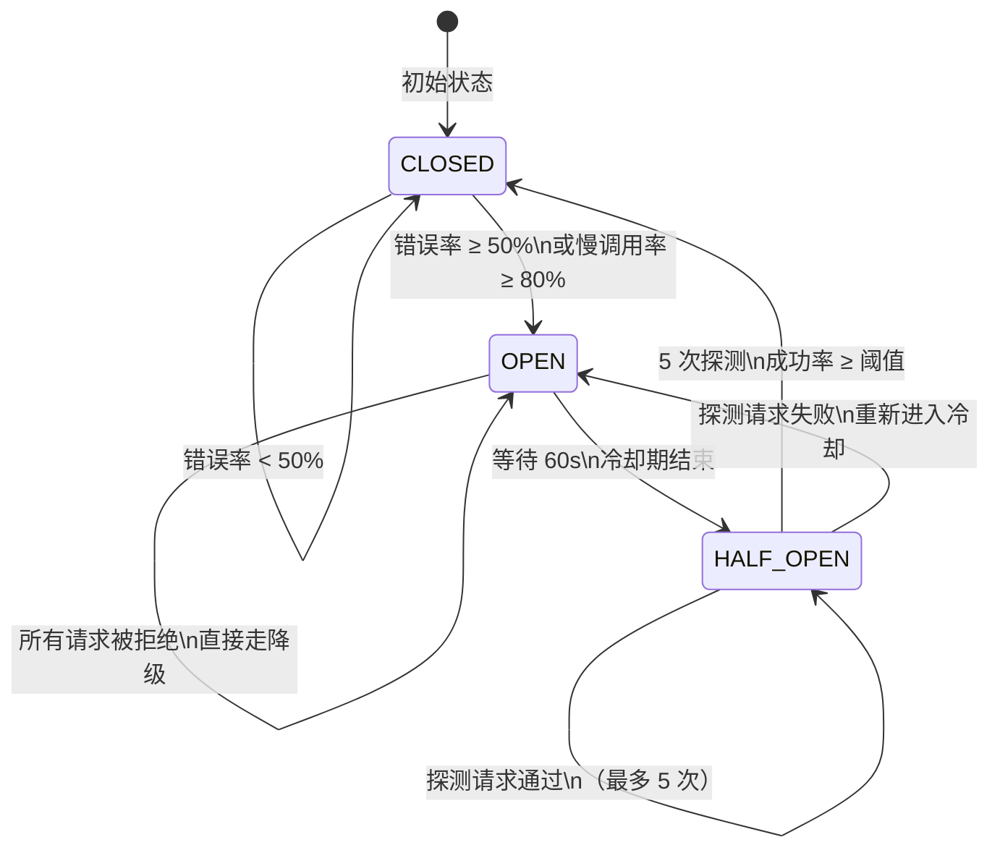
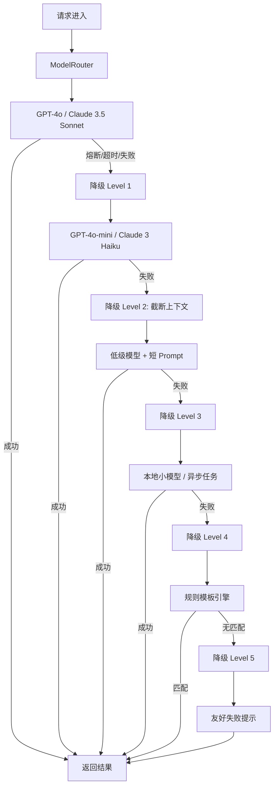
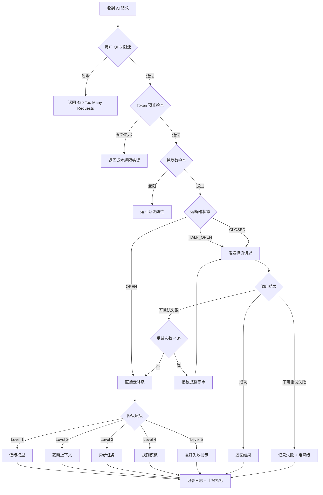

# AI 推理调用稳定性治理完整指南

> 面向 Java 后端开发 · 从原理到生产实战

---

## 目录

1. [业务背景：为什么 AI 推理调用更需要稳定性治理](#一业务背景)
2. [核心概念解析](#二核心概念解析)
3. [AI 推理调用链路分析](#三ai-推理调用链路分析)
4. [限流设计详解](#四限流设计详解)
5. [降级设计详解](#五降级设计详解)
6. [熔断设计详解](#六熔断设计详解)
7. [重试策略详解](#七重试策略详解)
8. [Java 工程落地方案](#八java-工程落地方案)
9. [架构图（Mermaid）](#九架构图)
10. [生产环境最佳实践 Checklist](#十生产环境最佳实践-checklist)
11. [推荐默认参数](#十一推荐默认参数)
12. [学习路线图](#十二ai-推理调用稳定性治理学习路线图)

---

## 一、业务背景

### 为什么 AI 推理调用比普通 HTTP/RPC 调用更需要稳定性治理？

普通微服务调用通常在 10~200ms 内完成，响应体小，成本几乎为零，失败即重试代价极低。  
但 AI 推理调用具备以下**独特风险特征**，需要一套专门的稳定性治理体系：

| 风险维度 | 普通 HTTP/RPC | AI 推理调用 |
|----------|--------------|------------|
| 响应延迟 | 10~200ms | 1s~120s（流式或非流式） |
| 单次成本 | 接近零 | $0.001~$0.1+ 每次调用 |
| 上游限流 | 少见 | 极常见（TPM / RPM 限制） |
| 超时概率 | 低 | 高（模型推理本身不稳定） |
| 并发上限 | 高 | 低（受 GPU 资源约束） |
| 输入大小 | 固定 | 动态（几百~几十万 Token） |
| 输出大小 | 固定 | 动态（影响延迟和成本） |
| 结果确定性 | 强确定性 | 概率性输出（temperature > 0） |
| 价格差异 | 统一 | 不同模型差异可达 100x |
| 失败重试代价 | 低 | 高（重试 = 再次花钱） |

### 核心痛点分析

**1. 模型响应慢**  
大模型首 Token 延迟（TTFT）可能达 2~5s，完整输出时间可能 30~120s。这意味着一旦并发上升，线程/连接资源会被大量持有，导致服务雪崩。

**2. Token 成本高**  
每次调用消耗 Token，成本直接计费。无限制的重试、无限制的用户请求，都会导致成本失控。一个用户如果提交了 10 万 Token 的 Prompt，一次调用成本可能超过 $1。

**3. 上游服务限流**  
OpenAI、Anthropic、Azure OpenAI 等都有严格的 TPM（Tokens Per Minute）和 RPM（Requests Per Minute）限制。超出即返回 `429 Too Many Requests`，且限流窗口可能持续较长时间。

**4. 大模型偶发超时**  
模型推理受 GPU 负载、批次调度影响，随机超时率可能达 1%~5%。长文档总结任务更容易触发。

**5. 并发不可控**  
如果不做并发隔离，一批高 Token 的请求可能完全占满线程池，导致普通请求也无法响应。

**6. 输入输出长度不稳定**  
相同业务场景，不同用户的 Prompt 可能差 100 倍。这使得超时时间、Token 预算难以统一配置。

**7. 不同模型价格和能力差异大**  
GPT-4o 和 GPT-4o-mini 价格差 10x。Claude 3.5 Sonnet 和 Claude 3 Haiku 差 20x。在保证体验的前提下，智能路由可以大幅降低成本。

**8. AI 结果不是强确定性**  
重试时拿到的结果和上次不同，这在某些业务场景下可能是问题（如需要幂等的写入操作）。

---

## 二、核心概念解析

### 2.1 限流 Rate Limiting

**定义**  
控制在单位时间内允许通过的请求数量（QPS）、Token 消耗量或并发数，超出则拒绝或排队。

**解决什么问题**  
- 防止单用户 / 租户滥用耗尽资源
- 保护上游 AI 服务不被打爆（避免触发上游 429）
- 平滑流量，避免突发压力击穿系统

**适合场景**  
- 多租户 SaaS 场景，按租户 / 用户限流
- 对接外部 AI API，需要控制 TPM / RPM
- 公共接口，防止恶意刷量

**不适合场景**  
- 内部定时批处理任务（应该用队列 + 速率控制代替）
- 单一低频调用（限流意义不大）

**常见错误用法**  
- 只在 Controller 层限流，忘记在 ModelRouter 层对模型级别限流
- 用固定窗口计数，导致窗口边界突刺（应使用滑动窗口或令牌桶）
- 限流粒度太粗（只限 QPS，不限 Token），导致少量大请求压垮系统

**在 AI 推理调用中的特殊点**  
- 需要同时限制 QPS 和 Token 消耗量
- 上游 API 有自己的 TPM 限制，本地限流要比上游更严
- 队列满时要快速失败，不能无限等待

**Java 实现思路**  
使用 Guava RateLimiter（单机）或 Redis + Lua 脚本（分布式）实现令牌桶限流。

---

### 2.2 降级 Degradation / Fallback

**定义**  
当主链路不可用或性能不满足要求时，切换到能力更低但仍可用的备用方案，保证服务基本可用。

**解决什么问题**  
- 高级模型不可用时，用低级模型兜底
- 实时推理失败时，返回缓存结果或规则模板
- 防止服务完全不可用，保证用户体验

**适合场景**  
- 对结果质量要求不极端严格的场景（客服回复、文案生成）
- 有多个模型可以切换的场景
- 可以接受异步延迟回复的场景

**不适合场景**  
- 强一致性要求的金融 / 法律场景（降级结果可能不合规）
- 无法接受低质量输出的场景（如医疗诊断建议）

**常见错误用法**  
- 降级链太长导致响应时间更慢（没有快速失败）
- 降级后不记录日志，无法分析降级频率
- 把降级当正常路径，没有修复根因的机制

**在 AI 推理调用中的特殊点**  
- 降级层次可以是：高级模型 → 低级模型 → 规则模板 → 友好提示
- 降级时需要告知用户当前处于降级状态（或悄悄降级）
- 降级决策应该是动态的，而不是静态配置

---

### 2.3 熔断 Circuit Breaker

**定义**  
当检测到下游服务持续失败（错误率超阈值）时，自动"断开"连接，不再转发请求，经过一段时间后进行探测恢复。

**解决什么问题**  
- 防止持续调用已经失败的服务，浪费资源 + 花钱
- 防止故障级联扩散（雪崩保护）
- 给下游服务恢复时间

**适合场景**  
- 下游 AI 服务不稳定，错误率周期性波动
- 需要保护系统不被下游拖垮

**不适合场景**  
- 下游服务偶尔失败但整体健康（应该用重试而不是熔断）
- 请求本身有问题（鉴权失败、参数错误），这类不应该计入熔断统计

**常见错误用法**  
- 将客户端参数错误（4xx）计入熔断错误率，导致误熔断
- 熔断恢复阈值设置太低，频繁抖动（开 → 关 → 开）
- 没有针对不同模型单独设置熔断实例

**在 AI 推理调用中的特殊点**  
- 熔断触发后应立即走降级路径，而不是返回错误
- 上游 429 是限流不是故障，不应该触发熔断（或单独统计）
- 熔断状态需要暴露监控指标，供 Alerting 系统告警

**与降级的关系**  
熔断是触发器，降级是行为。熔断打开后，自动执行降级策略。

---

### 2.4 超时 Timeout

**定义**  
设定请求的最大等待时间，超时则主动终止请求，返回超时错误或走降级。

**解决什么问题**  
- 防止慢请求长时间持有线程 / 连接资源
- 避免用户长时间等待无响应
- 控制单次调用的最大成本（超时意味着部分 Token 已计费）

**适合场景**  
- 所有对外 AI API 调用都应该设置超时
- 流式返回（SSE）需要设置"首 Token 超时"和"完整响应超时"两个维度

**不适合场景**  
- 批处理异步任务（应使用任务状态轮询，不依赖同步超时）

**常见错误用法**  
- 使用默认的 HTTP 客户端超时（通常 30s~60s，对 AI 调用来说可能太短或太长）
- 只设置 Connection Timeout，没有设置 Read Timeout
- 超时时间对所有模型 / 接口统一配置，没有针对不同场景调优

**在 AI 推理调用中的特殊点**  
- 非流式响应：超时 = 连接超时 + 读取超时（需要考虑最大 Token 数 × 生成速度）
- 流式响应：超时 = 连接超时 + 首 Token 超时 + 单 Token 间隔超时
- 超时后务必关闭底层连接，防止 TCP 半开连接累积

---

### 2.5 重试 Retry

**定义**  
请求失败后，按照一定策略自动重新发起请求。

**解决什么问题**  
- 处理网络抖动、临时服务不可用导致的偶发失败
- 提高请求成功率，减少用户感知错误

**适合场景**  
- 网络超时、502、503 等基础设施级别的失败
- 上游临时限流（需配合退避策略）

**不适合场景**  
- 参数错误、鉴权失败（重试无效）
- 非幂等操作（重试可能导致重复写入）
- 已经触发熔断的下游

**常见错误用法**  
- 立即重试（没有退避），加重下游压力
- 重试次数过多，叠加成本（每次重试都花 Token 钱）
- 没有区分可重试异常和不可重试异常

**在 AI 推理调用中的特殊点**  
- 每次重试都有成本，需要与成本预算联动
- 429 重试需要遵守 `Retry-After` 响应头
- 长文档总结任务重试前应截断或简化 Prompt，避免再次超时

---

### 2.6 隔离 Bulkhead

**定义**  
将不同类型的请求隔离到不同的资源池（线程池、连接池、信号量），防止一类请求占满所有资源。

**解决什么问题**  
- 高 Token 的"慢请求"不影响低 Token 的"快请求"
- 不同优先级的业务相互隔离
- 防止一个模型的问题影响其他模型的调用

**适合场景**  
- 同时存在实时对话和批量处理两种场景
- 多模型并行调用
- 不同 SLA 要求的请求（VIP vs 普通用户）

**在 AI 推理调用中的特殊点**  
- 线程池隔离：为每个模型 / 每类业务分配独立线程池
- 信号量隔离：限制同时执行的最大并发数（适合快速任务）
- 连接池隔离：为不同 AI 服务提供商分配独立 HTTP 连接池

---

## 三、AI 推理调用链路分析

### 完整调用链

```
用户请求
    ↓
[Controller]          ← 用户级 QPS 限流
    ↓
[AIService]           ← 业务编排，超时总控
    ↓
[PromptBuilder]       ← Token 预算检查，Prompt 长度限制
    ↓
[ModelRouter]         ← 模型路由，成本决策，模型级限流
    ↓
[AiClient]            ← 熔断 + 重试 + 读取超时
    ↓
[OpenAI/Claude/本地]  ← 实际 AI 服务
    ↓
[ResultParser]        ← 结果解析，Token 用量记录
    ↓
[FallbackService]     ← 降级兜底（熔断/超时时触发）
    ↓
Response
```

### 各层职责与治理策略

| 层级 | 职责 | 治理措施 |
|------|------|---------|
| Controller | 接收请求，参数校验 | 用户级 QPS 限流、租户级并发限流 |
| AIService | 业务流程编排 | 整体超时（30s~120s）、日志链路 |
| PromptBuilder | 构建 Prompt | Token 长度检查、上下文截断 |
| ModelRouter | 选择目标模型 | 模型级限流、成本路由、A/B 分流 |
| AiClient | 发起 HTTP 调用 | 熔断、重试、连接超时、读取超时 |
| ResultParser | 解析响应 | Token 用量上报、成本记录 |
| FallbackService | 降级兜底 | 多级降级链 |

### 日志应该记录什么

```
traceId          // 链路 ID
userId           // 用户 ID
tenantId         // 租户 ID
requestId        // 请求 ID（用于去重）
model            // 实际使用的模型
promptTokens     // 输入 Token 数
completionTokens // 输出 Token 数
totalTokens      // 总 Token 数
latencyMs        // 总延迟 ms
ttftMs           // 首 Token 时间
status           // SUCCESS / TIMEOUT / CIRCUIT_OPEN / FALLBACK / ERROR
fallbackLevel    // 降级层级 0=未降级, 1=低级模型, 2=规则模板
errorCode        // 错误码
errorMessage     // 错误信息（脱敏）
retryCount       // 重试次数
estimatedCost    // 估算成本（USD）
```

### 监控指标应该监控什么

```
ai.call.qps                    // 调用 QPS（按 model, tenant 分组）
ai.call.success_rate           // 成功率
ai.call.error_rate             // 错误率（按错误类型）
ai.call.latency_p50/p95/p99    // 延迟分位数
ai.call.timeout_rate           // 超时率
ai.call.circuit_open           // 熔断开关状态
ai.call.fallback_rate          // 降级率（按级别）
ai.token.input_sum             // 输入 Token 总量
ai.token.output_sum            // 输出 Token 总量
ai.cost.total                  // 成本总量（按 tenant/model）
ai.ratelimit.rejected_rate     // 限流拒绝率
ai.queue.length                // 队列积压长度
```

---

## 四、限流设计详解

### 4.1 限流维度

| 限流维度 | 实现方式 | 典型阈值 |
|---------|---------|---------|
| 按用户 QPS | Redis 滑动窗口 | 5 req/s |
| 按租户 QPS | Redis 令牌桶 | 50 req/s |
| 按接口 QPS | Sentinel 规则 | 100 req/s |
| 按模型并发 | Redis 计数 + Lua | 20 并发/模型 |
| 按 Token 预算 | Redis INCRBY | 100K tokens/min |
| 按成本预算 | 定时任务 + Redis | $10/day/tenant |
| 按队列长度 | 队列 size 检查 | 500 条 |

### 4.2 算法对比

| 算法 | 原理 | 优点 | 缺点 | 适用场景 |
|------|------|------|------|---------|
| 固定窗口 | 每个窗口内计数 | 简单 | 窗口边界突刺 | 低精度场景 |
| 滑动窗口 | 按时间滑动计数 | 平滑 | 内存较高 | 用户级限流 |
| 令牌桶 | 匀速产生令牌 | 允许突发 | 实现复杂 | 接口限流 |
| 漏桶 | 匀速流出 | 绝对平滑 | 无法处理突发 | 上游 API 保护 |

### 4.3 Redis 分布式限流实现

#### 令牌桶（Redis Lua 脚本）

```lua
-- keys[1]: 令牌桶 key
-- argv[1]: 令牌桶容量 capacity
-- argv[2]: 每秒产生令牌数 rate
-- argv[3]: 请求消耗令牌数 cost
-- argv[4]: 当前时间戳（秒）
local key = KEYS[1]
local capacity = tonumber(ARGV[1])
local rate = tonumber(ARGV[2])
local cost = tonumber(ARGV[3])
local now = tonumber(ARGV[4])

local bucket = redis.call('HMGET', key, 'tokens', 'last_time')
local tokens = tonumber(bucket[1]) or capacity
local last_time = tonumber(bucket[2]) or now

-- 计算补充令牌
local elapsed = math.max(0, now - last_time)
tokens = math.min(capacity, tokens + elapsed * rate)

if tokens >= cost then
    tokens = tokens - cost
    redis.call('HMSET', key, 'tokens', tokens, 'last_time', now)
    redis.call('EXPIRE', key, 3600)
    return 1  -- 允许通过
else
    redis.call('HMSET', key, 'tokens', tokens, 'last_time', now)
    redis.call('EXPIRE', key, 3600)
    return 0  -- 限流拒绝
end
```

#### Java 封装

```java
@Component
public class RedisRateLimiter {

    @Autowired
    private StringRedisTemplate redisTemplate;

    private static final String TOKEN_BUCKET_SCRIPT = "..."; // 上面的 Lua 脚本

    /**
     * 令牌桶限流
     * @param key      限流 key（如 ratelimit:user:123）
     * @param capacity 桶容量
     * @param rate     每秒产生令牌数
     * @param cost     本次消耗令牌数（Token 限流时传入 prompt token 数）
     * @return true=允许, false=拒绝
     */
    public boolean tryAcquire(String key, int capacity, int rate, int cost) {
        long now = System.currentTimeMillis() / 1000;
        DefaultRedisScript<Long> script = new DefaultRedisScript<>(TOKEN_BUCKET_SCRIPT, Long.class);
        Long result = redisTemplate.execute(script,
                Collections.singletonList(key),
                String.valueOf(capacity),
                String.valueOf(rate),
                String.valueOf(cost),
                String.valueOf(now));
        return Long.valueOf(1L).equals(result);
    }

    /**
     * 用户级 QPS 限流（5 req/s）
     */
    public boolean tryAcquireForUser(String userId) {
        String key = "ratelimit:user:" + userId;
        return tryAcquire(key, 10, 5, 1);
    }

    /**
     * Token 预算限流（按分钟 Token 消耗）
     */
    public boolean tryAcquireTokenBudget(String tenantId, int estimatedTokens) {
        String key = "ratelimit:token:" + tenantId + ":" + currentMinute();
        return tryAcquire(key, 100_000, 100_000 / 60, estimatedTokens);
    }

    private String currentMinute() {
        return String.valueOf(System.currentTimeMillis() / 60000);
    }
}
```

### 4.4 并发限流（信号量）

```java
@Component
public class ConcurrencyLimiter {

    // 每个模型的最大并发数
    private final Map<String, Semaphore> modelSemaphores = new ConcurrentHashMap<>();

    public ConcurrencyLimiter() {
        // GPT-4o 并发上限 10
        modelSemaphores.put("gpt-4o", new Semaphore(10));
        // Claude 3.5 Sonnet 并发上限 15
        modelSemaphores.put("claude-3-5-sonnet", new Semaphore(15));
        // 本地模型并发上限 5
        modelSemaphores.put("local-llm", new Semaphore(5));
    }

    public boolean tryAcquire(String model) {
        Semaphore semaphore = modelSemaphores.getOrDefault(model, modelSemaphores.get("default"));
        return semaphore != null && semaphore.tryAcquire();
    }

    public void release(String model) {
        Semaphore semaphore = modelSemaphores.get(model);
        if (semaphore != null) semaphore.release();
    }
}
```

### 4.5 本地限流 vs 分布式限流

| 对比维度 | 本地限流（Guava / Semaphore） | 分布式限流（Redis Lua） |
|---------|------------------------------|----------------------|
| 延迟 | 微秒级 | 1~5ms |
| 精度 | 单实例精确 | 全局精确 |
| 依赖 | 无外部依赖 | 依赖 Redis |
| 适用 | 单机压测保护 | 多实例 SaaS 场景 |
| 故障降级 | 不受网络影响 | Redis 不可用需降级为本地限流 |

**最佳实践**：双层限流。本地限流作为第一道防线（防止单实例压力过大），Redis 分布式限流作为全局控制（防止跨实例合计超限）。

---

## 五、降级设计详解

### 5.1 AI 推理降级层次

```
Level 0: 正常路径
    ↓（模型不可用 / 成本超预算 / 熔断开启）
Level 1: 高级模型 → 低级模型
    例：GPT-4o → GPT-4o-mini → Claude 3 Haiku
    ↓（所有模型都不可用）
Level 2: 长上下文 → 短上下文
    截断历史对话，只保留最近 2 轮
    ↓（仍然失败）
Level 3: 实时推理 → 异步任务
    放入 MQ，后台处理后通知用户
    ↓（异步也不可用）
Level 4: AI 生成 → 规则模板
    使用预定义的规则或关键词匹配返回固定回复
    ↓（连规则都没有）
Level 5: 友好失败提示
    "当前 AI 服务繁忙，请稍后再试"
```

### 5.2 降级策略设计

```java
@Component
public class FallbackService {

    @Autowired
    private ModelRouter modelRouter;

    @Autowired
    private TemplateEngine templateEngine;

    @Autowired
    private AsyncTaskQueue asyncTaskQueue;

    /**
     * 执行多级降级
     */
    public AiResponse fallback(AiRequest request, Exception cause, int currentLevel) {
        log.warn("AI降级触发 level={} cause={} traceId={}",
                currentLevel, cause.getMessage(), request.getTraceId());

        switch (currentLevel) {
            case 1:
                // 降级到低级模型
                String cheaperModel = modelRouter.getCheaperAlternative(request.getModel());
                if (cheaperModel != null) {
                    return invokeWithModel(request, cheaperModel, currentLevel + 1);
                }
                // 没有更低级的模型，继续往下降级
                return fallback(request, cause, 2);

            case 2:
                // 截断上下文
                AiRequest truncated = truncateContext(request, 2000); // 只保留 2000 token
                return invokeWithModel(truncated, request.getModel(), currentLevel + 1);

            case 3:
                // 降级为异步任务
                String taskId = asyncTaskQueue.enqueue(request);
                return AiResponse.async(taskId, "您的请求已进入处理队列，完成后将通知您");

            case 4:
                // 降级为规则模板
                String templateResult = templateEngine.match(request.getPrompt());
                if (templateResult != null) {
                    return AiResponse.fromTemplate(templateResult);
                }
                return fallback(request, cause, 5);

            case 5:
            default:
                // 友好失败提示
                return AiResponse.failed("当前 AI 服务繁忙，请稍后重试。如需紧急帮助，请联系客服。");
        }
    }

    private AiRequest truncateContext(AiRequest request, int maxTokens) {
        // 截断历史消息，只保留系统消息 + 最近 N 条
        return request.withTruncatedHistory(maxTokens);
    }
}
```

### 5.3 模型降级路由配置

```yaml
ai:
  model-fallback:
    gpt-4o:
      - gpt-4o-mini
      - claude-3-haiku
      - local-llm
    claude-3-5-sonnet:
      - claude-3-haiku
      - gpt-4o-mini
      - local-llm
    local-llm:
      - rule-template
      - friendly-failure
```

---

## 六、熔断设计详解

### 6.1 熔断状态机

```
                    ┌─────────────────────────────────────┐
                    │           CLOSED（关闭）              │
                    │   正常通过请求，统计错误率             │
                    └─────────────────────────────────────┘
                              │                    ▲
               错误率 > 阈值   │                    │ 错误率 < 恢复阈值
               或 慢调用率过高  ▼                    │
                    ┌─────────────────────────────────────┐
                    │             OPEN（打开）              │
                    │   拒绝所有请求，直接走降级路径         │
                    └─────────────────────────────────────┘
                              │                    ▲
               等待冷却时间     │                    │ 探测请求失败
               （默认 60s）     ▼                    │
                    ┌─────────────────────────────────────┐
                    │          HALF_OPEN（半开）            │
                    │  允许少量探测请求通过，观察成功率      │
                    └─────────────────────────────────────┘
                                        │
                         探测请求成功（成功率 > 阈值）
                                        ↓
                                   CLOSED（恢复）
```

### 6.2 不同 HTTP 状态码处理策略

| 状态码 | 含义 | 是否计入熔断 | 处理方式 |
|--------|------|------------|---------|
| 200 | 成功 | 否 | 正常 |
| 400 | 参数错误（Prompt 太长等） | 否 | 直接返回错误，不重试 |
| 401 | 鉴权失败 | 否 | 检查 API Key 配置 |
| 402 | 余额不足 | 否 | 告警 + 暂停该模型 |
| 429 | 限流 | **特殊处理** | 读取 Retry-After，计入限流统计，不计入故障熔断 |
| 500 | 服务器内部错误 | **是** | 计入熔断，可重试 |
| 502 | 网关错误 | **是** | 计入熔断，可重试 |
| 503 | 服务不可用 | **是** | 计入熔断，可重试 |
| Timeout | 超时 | **是（慢调用）** | 计入慢调用率，可重试 |

### 6.3 Resilience4j 熔断配置

```java
@Configuration
public class CircuitBreakerConfig {

    @Bean
    public CircuitBreakerRegistry circuitBreakerRegistry() {
        // 默认熔断配置
        io.github.resilience4j.circuitbreaker.CircuitBreakerConfig defaultConfig =
            io.github.resilience4j.circuitbreaker.CircuitBreakerConfig.custom()
                // 滑动窗口类型：基于请求次数
                .slidingWindowType(SlidingWindowType.COUNT_BASED)
                // 滑动窗口大小：最近 100 次请求
                .slidingWindowSize(100)
                // 熔断触发阈值：错误率 > 50%
                .failureRateThreshold(50.0f)
                // 慢调用阈值：超过 30s 算慢调用
                .slowCallDurationThreshold(Duration.ofSeconds(30))
                // 慢调用比例超过 80% 触发熔断
                .slowCallRateThreshold(80.0f)
                // 半开状态允许的探测请求数
                .permittedNumberOfCallsInHalfOpenState(5)
                // 最少请求数（不足时不触发熔断）
                .minimumNumberOfCalls(20)
                // 熔断打开后等待时间
                .waitDurationInOpenState(Duration.ofSeconds(60))
                // 以下异常不计入失败（4xx 客户端错误）
                .ignoreExceptions(BadRequestException.class,
                                   AuthenticationException.class,
                                   InsufficientBalanceException.class)
                // 以下异常计入失败
                .recordExceptions(ModelServerException.class,
                                   TimeoutException.class,
                                   ConnectException.class)
                .build();

        return CircuitBreakerRegistry.of(defaultConfig);
    }

    /**
     * 为每个模型创建独立的熔断器实例
     */
    @Bean
    public Map<String, CircuitBreaker> modelCircuitBreakers(CircuitBreakerRegistry registry) {
        Map<String, CircuitBreaker> breakers = new HashMap<>();
        breakers.put("gpt-4o", registry.circuitBreaker("gpt-4o"));
        breakers.put("claude-3-5-sonnet", registry.circuitBreaker("claude-3-5-sonnet"));
        breakers.put("local-llm", registry.circuitBreaker("local-llm",
                // 本地模型使用不同的配置
                io.github.resilience4j.circuitbreaker.CircuitBreakerConfig.custom()
                    .failureRateThreshold(30.0f)
                    .waitDurationInOpenState(Duration.ofSeconds(30))
                    .build()));
        return breakers;
    }
}
```

### 6.4 熔断与限流的区别

| 对比维度 | 限流 Rate Limiting | 熔断 Circuit Breaker |
|---------|-------------------|---------------------|
| 触发原因 | 请求量过多 | 下游服务失败率过高 |
| 保护对象 | 保护自身 / 上游 | 保护自身不被拖垮 |
| 恢复方式 | 窗口重置自动恢复 | 需要等待 + 探测 |
| 实现位置 | 入口层 | 出口层（调用下游前） |
| 数据依据 | 请求计数 | 错误率 / 慢调用率 |

---

## 七、重试策略详解

### 7.1 可重试 vs 不可重试

```java
public class RetryDecisionMaker {

    /**
     * 判断异常是否可以重试
     */
    public boolean isRetryable(Exception e) {
        // ✅ 可以重试：基础设施级别的失败
        if (e instanceof ConnectTimeoutException) return true;  // 连接超时
        if (e instanceof ReadTimeoutException) return true;     // 读取超时
        if (e instanceof SocketException) return true;          // 网络中断

        if (e instanceof ModelApiException apiEx) {
            int statusCode = apiEx.getStatusCode();
            // ✅ 可以重试
            if (statusCode == 502) return true;  // Bad Gateway
            if (statusCode == 503) return true;  // Service Unavailable
            if (statusCode == 429) return true;  // Rate Limited（需要遵守 Retry-After）

            // ❌ 不可重试：客户端错误
            if (statusCode == 400) return false; // 参数错误（Prompt 太长等）
            if (statusCode == 401) return false; // 鉴权失败
            if (statusCode == 402) return false; // 余额不足
            if (statusCode == 403) return false; // 权限不足
            if (statusCode == 413) return false; // Payload 太大
        }

        // ❌ 不可重试：业务逻辑错误
        if (e instanceof ContentFilterException) return false;  // 内容安全拦截
        if (e instanceof ContextLengthExceededException) return false; // Context 超长

        return false;
    }
}
```

### 7.2 指数退避 + Jitter

```java
@Component
public class AiRetryTemplate {

    /**
     * 指数退避 + 随机抖动
     * 第1次重试：等待 1s ± 0.5s
     * 第2次重试：等待 2s ± 1s
     * 第3次重试：等待 4s ± 2s
     */
    public <T> T executeWithRetry(Supplier<T> action, AiRequest request) {
        int maxAttempts = 3;
        long baseDelayMs = 1000L;
        double jitterFactor = 0.5;
        Random random = new Random();

        Exception lastException = null;

        for (int attempt = 1; attempt <= maxAttempts; attempt++) {
            try {
                T result = action.get();
                if (attempt > 1) {
                    log.info("AI重试成功 attempt={} traceId={}", attempt, request.getTraceId());
                }
                return result;
            } catch (Exception e) {
                lastException = e;

                if (!retryDecisionMaker.isRetryable(e)) {
                    log.warn("AI不可重试异常 attempt={} error={}", attempt, e.getMessage());
                    throw new AiNonRetryableException(e);
                }

                if (attempt == maxAttempts) break;

                // 计算退避时间
                long delay = (long) (baseDelayMs * Math.pow(2, attempt - 1));
                long jitter = (long) (delay * jitterFactor * (random.nextDouble() * 2 - 1));
                long sleepTime = Math.max(100, delay + jitter);

                // 如果是 429，优先使用 Retry-After
                if (e instanceof RateLimitException rateLimitEx) {
                    sleepTime = rateLimitEx.getRetryAfterMs();
                }

                log.info("AI重试等待 attempt={} sleepMs={} traceId={}",
                        attempt, sleepTime, request.getTraceId());

                // 检查成本预算（重试也需要花钱）
                if (!tokenBudgetManager.hasRemainingBudget(request.getTenantId())) {
                    log.warn("成本预算耗尽，停止重试 traceId={}", request.getTraceId());
                    break;
                }

                try {
                    Thread.sleep(sleepTime);
                } catch (InterruptedException ie) {
                    Thread.currentThread().interrupt();
                    break;
                }
            }
        }

        throw new AiMaxRetryExceededException("AI调用超过最大重试次数", lastException);
    }
}
```

### 7.3 重试与熔断的配合

```
请求 → 熔断器检查（OPEN？）
    ↓ OPEN
    走降级，不重试
    
    ↓ CLOSED / HALF_OPEN
    执行调用
        ↓ 成功
        返回结果
        
        ↓ 失败（可重试异常）
        重试（最多 3 次，指数退避）
            ↓ 重试成功
            返回结果
            
            ↓ 重试全部失败
            熔断器记录失败 → 可能触发 OPEN
            走降级路径
```

---

## 八、Java 工程落地方案

### 8.1 包结构

```
com.company.ai
├── client/
│   ├── AiClient.java              // HTTP 客户端封装（含超时、熔断）
│   ├── OpenAiClient.java          // OpenAI 实现
│   └── ClaudeClient.java          // Claude 实现
├── service/
│   ├── AiInferenceService.java    // 核心业务入口
│   ├── FallbackService.java       // 降级服务
│   └── AsyncAiService.java        // 异步处理服务
├── router/
│   └── ModelRouter.java           // 模型路由
├── ratelimit/
│   ├── RedisRateLimiter.java      // 分布式限流
│   ├── ConcurrencyLimiter.java    // 并发限流
│   └── TokenBudgetManager.java    // Token 预算管理
├── breaker/
│   └── AiCircuitBreakerManager.java // 熔断管理
├── retry/
│   └── AiRetryTemplate.java       // 重试策略
├── prompt/
│   ├── PromptBuilder.java         // Prompt 构建
│   └── ContextTruncator.java      // 上下文截断
├── parser/
│   └── ResultParser.java          // 响应解析
├── monitor/
│   ├── AiCallLog.java             // 调用日志实体
│   ├── MetricsReporter.java       // 指标上报
│   └── CostTracker.java           // 成本追踪
├── model/
│   ├── AiRequest.java             // 请求模型
│   ├── AiResponse.java            // 响应模型
│   └── ModelConfig.java           // 模型配置
└── exception/
    ├── AiNonRetryableException.java
    ├── RateLimitException.java
    ├── CircuitOpenException.java
    └── BudgetExceededException.java
```

### 8.2 核心接口

```java
// AI 推理主入口
public interface AiInferenceService {
    AiResponse infer(AiRequest request);
    CompletableFuture<AiResponse> inferAsync(AiRequest request);
}

// 模型路由
public interface ModelRouter {
    String route(AiRequest request);                          // 选择目标模型
    String getCheaperAlternative(String model);               // 获取降级模型
    boolean isModelHealthy(String model);                     // 模型健康状态
}

// 限流接口
public interface RateLimiter {
    boolean tryAcquire(String key, RateLimitConfig config);
    void release(String key);
}

// Token 预算管理
public interface TokenBudgetManager {
    boolean checkAndDeduct(String tenantId, int estimatedTokens); // 检查并扣减
    void refund(String tenantId, int actualTokens);               // 实际使用后修正
    boolean hasRemainingBudget(String tenantId);
    TokenBudgetStatus getStatus(String tenantId);
}
```

### 8.3 核心调用流程

```java
@Service
@Slf4j
public class AiInferenceServiceImpl implements AiInferenceService {

    @Override
    public AiResponse infer(AiRequest request) {
        long startTime = System.currentTimeMillis();
        String traceId = request.getTraceId();
        AiCallLog callLog = AiCallLog.start(request);

        try {
            // Step 1: 用户级 / 租户级限流
            checkRateLimit(request);

            // Step 2: 构建 Prompt，检查 Token 预算
            String prompt = promptBuilder.build(request);
            int estimatedTokens = tokenEstimator.estimate(prompt);
            tokenBudgetManager.checkAndDeduct(request.getTenantId(), estimatedTokens);

            // Step 3: 模型路由
            String model = modelRouter.route(request);
            callLog.setModel(model);

            // Step 4: 并发限流
            if (!concurrencyLimiter.tryAcquire(model)) {
                throw new ConcurrencyLimitException("模型并发数已满: " + model);
            }

            try {
                // Step 5: 熔断检查 + 实际调用 + 重试
                AiResponse response = circuitBreakerManager.executeWithBreaker(model, () ->
                    retryTemplate.executeWithRetry(
                        () -> aiClient.call(model, prompt, request.getParams()),
                        request
                    )
                );

                // Step 6: 记录实际 Token 使用
                tokenBudgetManager.refund(request.getTenantId(),
                    estimatedTokens - response.getTotalTokens());

                callLog.success(response);
                return response;

            } finally {
                concurrencyLimiter.release(model);
            }

        } catch (CircuitOpenException e) {
            // 熔断打开，直接降级
            callLog.circuitOpen(e);
            return fallbackService.fallback(request, e, 1);

        } catch (RateLimitException e) {
            // 限流，快速返回
            callLog.rateLimited(e);
            return AiResponse.rateLimited("请求过于频繁，请稍后重试");

        } catch (Exception e) {
            // 其他失败，走降级
            callLog.error(e);
            return fallbackService.fallback(request, e, 1);

        } finally {
            callLog.setLatencyMs(System.currentTimeMillis() - startTime);
            metricsReporter.report(callLog);
            log.info("AI调用完成 {}", callLog.toLogString());
        }
    }
}
```

### 8.4 异常分类

```java
// 异常体系
AiException (基类)
├── AiNonRetryableException   // 不可重试（参数错误、鉴权失败）
│   ├── BadRequestException   // 400
│   ├── AuthException         // 401
│   └── ContentFilterException// 内容安全拦截
├── AiRetryableException      // 可重试（基础设施故障）
│   ├── ModelServerException  // 500/502/503
│   └── ConnectTimeoutException// 连接超时
├── RateLimitException        // 429 限流（特殊处理）
├── CircuitOpenException      // 熔断打开
├── BudgetExceededException   // 成本预算耗尽
└── ConcurrencyLimitException // 并发超限
```

### 8.5 配置示例

```yaml
ai:
  # 全局超时配置
  timeout:
    connect-ms: 5000          # 连接超时 5s
    read-ms: 60000            # 读取超时 60s（非流式）
    stream-ttft-ms: 10000     # 流式首 Token 超时 10s
    total-ms: 120000          # 总超时 120s

  # 重试配置
  retry:
    max-attempts: 3
    base-delay-ms: 1000
    max-delay-ms: 16000
    jitter-factor: 0.5

  # 熔断配置
  circuit-breaker:
    failure-rate-threshold: 50.0    # 错误率 50% 触发
    slow-call-rate-threshold: 80.0  # 慢调用率 80% 触发
    slow-call-duration-seconds: 30  # 慢调用阈值 30s
    sliding-window-size: 100        # 滑动窗口 100 次请求
    minimum-calls: 20               # 最少 20 次后才统计
    wait-duration-seconds: 60       # 熔断等待 60s
    half-open-calls: 5              # 半开探测 5 次

  # 限流配置
  rate-limit:
    user-qps: 5                     # 用户级 5 req/s
    tenant-qps: 50                  # 租户级 50 req/s
    model-concurrency:
      gpt-4o: 10
      claude-3-5-sonnet: 15
      local-llm: 5
    token-budget-per-minute: 100000 # 每分钟 10 万 Token

  # Token 限制
  token-limits:
    max-input-tokens: 32000
    max-output-tokens: 4096
    max-context-tokens: 64000

  # 成本预算
  cost:
    daily-budget-usd:
      default: 10.0
      enterprise: 100.0
    alert-threshold: 0.8            # 80% 时告警
```

### 8.6 日志字段设计

```java
@Data
@Builder
public class AiCallLog {
    // 链路标识
    private String traceId;
    private String spanId;
    private String requestId;

    // 用户维度
    private String userId;
    private String tenantId;
    private String appId;

    // 调用维度
    private String model;
    private String originalModel;    // 路由前的模型
    private String interface;        // 调用接口名
    private int retryCount;          // 重试次数
    private int fallbackLevel;       // 降级级别

    // 性能维度
    private long latencyMs;          // 总延迟
    private long ttftMs;             // 首 Token 时间

    // Token 维度
    private int estimatedTokens;     // 预估 Token
    private int promptTokens;        // 实际输入 Token
    private int completionTokens;    // 实际输出 Token
    private int totalTokens;         // 总 Token

    // 成本维度
    private double estimatedCostUsd;
    private double actualCostUsd;

    // 状态维度
    private String status;           // SUCCESS/TIMEOUT/CIRCUIT_OPEN/RATE_LIMITED/FALLBACK/ERROR
    private String errorCode;
    private String errorMessage;     // 已脱敏

    // Prompt 维度（脱敏）
    private String promptHash;       // Prompt MD5（不存原文）
    private String promptVersion;    // Prompt 版本号

    public String toLogString() {
        return String.format(
            "traceId=%s model=%s status=%s latency=%dms tokens=%d cost=%.4f fallback=%d retry=%d",
            traceId, model, status, latencyMs, totalTokens, actualCostUsd, fallbackLevel, retryCount
        );
    }
}
```

---

## 九、架构图

### 9.1 AI 推理调用链路图



### 9.2 熔断状态机图



### 9.3 多模型降级路由图



### 9.4 限流 + 降级 + 熔断流程图



---

## 十、生产环境最佳实践 Checklist

### 超时配置 ✅
- [ ] 连接超时：5s（不应超过 10s）
- [ ] 非流式读取超时：按最大 Token 估算（`max_output_tokens / 生成速度 × 1.5`）
- [ ] 流式首 Token 超时（TTFT）：10s
- [ ] 流式 Token 间隔超时：5s
- [ ] 整体业务超时（兜底）：120s
- [ ] 异步任务超时：10min

### Token 限制 ✅
- [ ] 最大输入 Token 限制（防止超大 Prompt）：32K
- [ ] 最大输出 Token 限制（防止无限生成）：4096
- [ ] Prompt 长度校验（在 PromptBuilder 层）
- [ ] 超长上下文自动截断策略

### 用户 / 租户级限流 ✅
- [ ] 用户级 QPS 限流：5 req/s（Redis 令牌桶）
- [ ] 用户级日调用上限：500 次
- [ ] 租户级 QPS 限流：50 req/s
- [ ] 租户级 TPM 限制：100K tokens/min
- [ ] 租户级日成本预算：$10

### 模型级治理 ✅
- [ ] 每个模型独立熔断器实例
- [ ] 每个模型独立并发限制
- [ ] 模型健康状态检查（定时探测）
- [ ] 模型降级路由配置

### 熔断配置 ✅
- [ ] 错误率阈值：50%
- [ ] 慢调用率阈值：80%
- [ ] 慢调用时间阈值：30s
- [ ] 滑动窗口：100 次请求
- [ ] 最少请求数：20
- [ ] 冷却等待时间：60s
- [ ] 半开探测请求数：5
- [ ] 排除 4xx 客户端错误不计入熔断

### 降级策略 ✅
- [ ] 配置完整降级链（至少到规则模板）
- [ ] 降级级别记录到日志
- [ ] 降级率监控告警
- [ ] 定期测试降级链路是否可用

### 重试策略 ✅
- [ ] 区分可重试 / 不可重试异常
- [ ] 最大重试次数：3 次
- [ ] 指数退避 + Jitter
- [ ] 重试前检查成本预算
- [ ] 429 响应遵守 Retry-After 头

### 成本控制 ✅
- [ ] Token 用量实时上报
- [ ] 成本按租户 / 模型 / 接口分组统计
- [ ] 日预算告警（80% 时预警，100% 时限制）
- [ ] Prompt 优化（避免冗余 Token）
- [ ] 输出 max_tokens 按业务场景精细控制

### 日志 ✅
- [ ] Prompt 原文不入日志（只记录 Hash + 版本号）
- [ ] TraceId 贯穿全链路
- [ ] 关键字段：model / tokens / cost / latency / status / fallbackLevel
- [ ] 日志分级（INFO 成功，WARN 降级，ERROR 失败）
- [ ] 日志保留周期：至少 30 天

### 监控 ✅
- [ ] QPS / 错误率 / 延迟（P50/P95/P99）实时大盘
- [ ] 熔断状态监控（每个模型独立监控）
- [ ] Token 消耗量趋势图
- [ ] 成本趋势图（按天 / 按小时）
- [ ] 队列积压监控
- [ ] 降级率趋势

### 告警规则 ✅
- [ ] 错误率 > 10%：Warning
- [ ] 错误率 > 30%：Critical
- [ ] 熔断打开：立即告警
- [ ] P99 延迟 > 60s：Warning
- [ ] 成本预算使用 > 80%：Warning
- [ ] 成本日环比增长 > 50%：Critical
- [ ] 队列积压 > 500：Warning

### Prompt 管理 ✅
- [ ] Prompt 版本化管理（Git 或数据库）
- [ ] Prompt 变更需要 Review 流程
- [ ] Prompt 版本记录到每次调用日志
- [ ] A/B 测试框架支持 Prompt 实验

### 灰度发布 ✅
- [ ] 新模型先灰度 5%~10% 流量
- [ ] 灰度期间监控错误率 / 延迟 / 成本
- [ ] 新 Prompt 灰度验证后全量
- [ ] 支持按用户 / 租户 / 地区灰度

### 压测方案 ✅
- [ ] 压测使用 Mock AI 服务（不真实调用）
- [ ] 模拟不同 Token 长度分布
- [ ] 压测限流、熔断、降级各路径
- [ ] 验证成本计算准确性
- [ ] 压测后检查连接泄漏

---

## 十一、推荐默认参数

```yaml
# ============================================================
# AI 推理调用稳定性治理 - 推荐默认参数
# ============================================================

timeout:
  connect_ms: 5000          # 连接超时 5s
  read_ms: 60000            # 读取超时 60s
  stream_ttft_ms: 10000     # 流式首 Token 超时 10s
  total_ms: 120000          # 总体超时 120s

retry:
  max_attempts: 3           # 最大重试 3 次（含第一次）
  base_delay_ms: 1000       # 基础等待 1s
  max_delay_ms: 16000       # 最大等待 16s
  jitter_factor: 0.5        # 随机抖动系数

circuit_breaker:
  failure_rate_threshold: 50.0    # 错误率阈值 50%
  slow_call_rate_threshold: 80.0  # 慢调用率阈值 80%
  slow_call_duration_s: 30        # 慢调用时长阈值 30s
  window_size: 100                # 滑动窗口 100 次请求
  minimum_calls: 20               # 最少统计 20 次
  wait_duration_s: 60             # 熔断冷却 60s
  half_open_calls: 5              # 半开探测 5 次

rate_limit:
  user_qps: 5                     # 用户级 5 req/s
  tenant_qps: 50                  # 租户级 50 req/s
  max_concurrency_per_model: 10   # 每模型最大并发 10
  token_budget_per_min: 100000    # Token 预算 10万/分钟

token_limits:
  max_input_tokens: 32000         # 最大输入 32K
  max_output_tokens: 4096         # 最大输出 4096
  max_context_tokens: 64000       # 最大上下文 64K

queue:
  max_length: 500                 # 队列最大长度 500

cost:
  daily_budget_usd: 10.0          # 日预算 $10（默认租户）
  alert_threshold: 0.8            # 80% 时告警

fallback_order:               # 降级顺序
  - cheaper_model             # 1. 低级模型
  - truncate_context          # 2. 截断上下文
  - async_task                # 3. 异步任务
  - rule_template             # 4. 规则模板
  - friendly_failure          # 5. 友好提示
```

---

## 十二、AI 推理调用稳定性治理学习路线图

```
┌─────────────────────────────────────────────────────────────────┐
│             AI 推理调用稳定性治理学习路线图                       │
└─────────────────────────────────────────────────────────────────┘

第一阶段：基础概念（1-2 周）
━━━━━━━━━━━━━━━━━━━━━━━━━━━
目标：理解核心概念，掌握术语

📌 学习内容：
  - 限流（QPS / Token / 并发）概念
  - 降级（Fallback）设计思路
  - 熔断（Circuit Breaker）状态机
  - 超时（Timeout）多层设计
  - 重试（Retry）策略与幂等性
  - 隔离（Bulkhead）线程池 vs 信号量

📖 推荐资源：
  - 《Release It!》设计模式章节
  - Resilience4j 官方文档
  - Martin Fowler: CircuitBreaker 博客

✅ 验收标准：
  - 能解释熔断三种状态的转换条件
  - 能说明限流和熔断的本质区别
  - 能举例 AI 场景下不可重试的情况

─────────────────────────────────────────────────────────────────

第二阶段：单机实现（1-2 周）
━━━━━━━━━━━━━━━━━━━━━━━━━━━
目标：用 Java 实现基础稳定性组件

📌 学习内容：
  - Guava RateLimiter 令牌桶
  - Semaphore 并发限流
  - Resilience4j CircuitBreaker 集成
  - OkHttp / HttpClient 超时配置
  - Spring Retry 注解使用

💻 动手练习：
  - 封装一个支持多种策略的 AiRateLimiter
  - 用 Resilience4j 实现 AI 客户端熔断
  - 编写带指数退避的重试工具类

✅ 验收标准：
  - 完成单机版 AiInferenceService 骨架
  - 能跑通限流 / 熔断 / 重试 单元测试

─────────────────────────────────────────────────────────────────

第三阶段：分布式限流（1-2 周）
━━━━━━━━━━━━━━━━━━━━━━━━━━━━━
目标：用 Redis 实现生产级分布式限流

📌 学习内容：
  - Redis 原子操作（INCR / EXPIRE）
  - Lua 脚本保证原子性
  - 令牌桶 / 滑动窗口 Redis 实现
  - Token 预算管理（按租户 / 按模型）
  - 本地 + 分布式双层限流架构

💻 动手练习：
  - 实现 Redis Lua 令牌桶脚本
  - 实现 TokenBudgetManager（Redis INCRBY）
  - 压测验证分布式限流精度

✅ 验收标准：
  - Redis 令牌桶在多实例场景下精确限流
  - Token 预算按分钟精确控制

─────────────────────────────────────────────────────────────────

第四阶段：熔断降级（1-2 周）
━━━━━━━━━━━━━━━━━━━━━━━━━━━
目标：设计并实现完整的熔断降级链

📌 学习内容：
  - Resilience4j 高级配置
  - 异常分类（可熔断 vs 不可熔断）
  - 多级降级链设计
  - 模型路由 + 降级联动
  - 熔断事件监听与指标采集

💻 动手练习：
  - 为每个 AI 模型配置独立熔断器
  - 实现 5 级降级链（模型 → 规则 → 提示）
  - 模拟上游 50% 失败率触发熔断

✅ 验收标准：
  - 上游失败率超阈值后自动触发熔断
  - 熔断期间请求走降级，用户有感知
  - 60s 后半开探测，成功后自动恢复

─────────────────────────────────────────────────────────────────

第五阶段：成本治理（1 周）
━━━━━━━━━━━━━━━━━━━━━━━━
目标：实现 Token / 成本的精细化管控

📌 学习内容：
  - Token 估算算法（tiktoken 思路）
  - 成本计算模型（按模型 / 按 Token 类型）
  - 成本预算 Redis 实现
  - 智能模型路由（成本 vs 质量权衡）
  - Prompt 优化降低 Token 消耗

💻 动手练习：
  - 实现成本追踪器（CostTracker）
  - 实现按成本优先的 ModelRouter
  - 设置日成本预算告警

✅ 验收标准：
  - 每次调用精确记录成本
  - 超预算后自动降级到低价模型

─────────────────────────────────────────────────────────────────

第六阶段：生产监控（1 周）
━━━━━━━━━━━━━━━━━━━━━━━━
目标：建立完整的可观测性体系

📌 学习内容：
  - Micrometer + Prometheus 指标上报
  - TraceId 全链路追踪（MDC）
  - Grafana 仪表盘设计
  - 告警规则（错误率 / 延迟 / 成本）
  - 日志脱敏设计

💻 动手练习：
  - 配置 ai.call.* 系列 Metrics
  - 设计 Grafana AI 调用大盘
  - 配置 AlertManager 告警规则

✅ 验收标准：
  - 实时看到 QPS / 错误率 / 延迟分布
  - 熔断打开时 5 分钟内收到告警

─────────────────────────────────────────────────────────────────

第七阶段：架构实战（2-3 周）
━━━━━━━━━━━━━━━━━━━━━━━━━━━
目标：在真实项目中落地完整方案

📌 学习内容：
  - 多租户 AI 平台架构设计
  - 队列削峰（RocketMQ / Kafka）
  - Prompt 版本管理系统
  - A/B 测试框架集成
  - 灰度发布策略
  - 压测方案（Mock AI 服务）

💻 动手练习：
  - 在 MoreTickets 项目接入 AI 调用治理框架
  - 实现商品文案生成接口的全套稳定性保障
  - 完成压测报告（限流 / 熔断 / 降级 各路径）

✅ 验收标准：
  - 系统在高并发（100 QPS）下稳定运行
  - 上游 AI 服务故障时，降级路径正常工作
  - 每日成本在预算内，日志完整可追溯
  - Grafana 大盘覆盖所有关键指标

═════════════════════════════════════════════════════════════════
  预计总学习时长：8~12 周（业余兼顾）/ 4~6 周（集中学习）
═════════════════════════════════════════════════════════════════
```

---

## 附录：快速参考卡片

### 异常处理决策树

```
收到 AI 调用异常
│
├── HTTP 400 Bad Request      → 不重试，直接报错，检查参数
├── HTTP 401 Unauthorized     → 不重试，检查 API Key
├── HTTP 402 Payment Required → 不重试，告警充值
├── HTTP 429 Too Many Requests→ 等待 Retry-After，重试，不计入熔断
├── HTTP 500 Internal Error   → 可重试，计入熔断
├── HTTP 502 Bad Gateway      → 可重试，计入熔断
├── HTTP 503 Unavailable      → 可重试，计入熔断
├── Connect Timeout           → 可重试，计入熔断
├── Read Timeout              → 可重试，计入熔断（慢调用）
└── Content Filter Block      → 不重试，返回内容安全提示
```

### 限流算法速查

```
场景                  推荐算法
─────────────────     ──────────────────
用户级 QPS 限流        滑动窗口（Redis）
接口级 QPS 限流        令牌桶（Redis Lua）
Token 预算控制         INCRBY + EXPIRE
并发数控制             Semaphore / Redis 计数
平滑上游 API 调用       漏桶（保证匀速）
允许合理突发           令牌桶（推荐默认）
```

---

*文档版本：v1.0 | 适用技术栈：Java 8+ / Spring Boot 2.x / Redis / Resilience4j / Sentinel*
