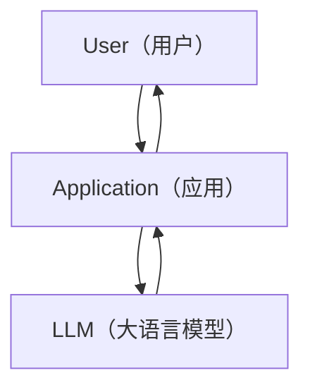
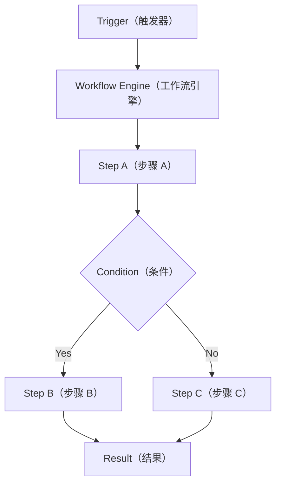
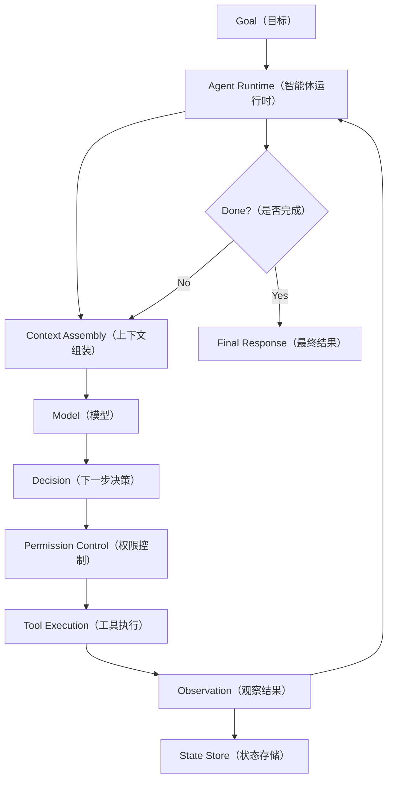

# Day 02：Chat API、Workflow、Agent 的区别

> 所属周：Week 01 - Agent 基础模型
> 建议节奏：Busy Mode（15-20 分钟）/ Standard Mode（45 分钟）/ Deep Mode（90 分钟）
> 导航：[`本周目录`](README.md) / [`总目录`](../README.md)
> 上一天：[`Day 01`](../week-01-agent-basics/day-01-ai-agent-runtime.md) ｜ 下一天：[`Day 03`](../week-01-agent-basics/day-03-react-reasoning-and-acting.md)

## 1. 今日核心目标

今天解决一个非常关键的问题：

> `Chat API（聊天接口）`、`Workflow（工作流）`、`Agent（智能体）` 到底有什么区别？

学完今天，你应该能做到：

- 判断一个 AI 需求应该用 `Chat API`、`Workflow`，还是 `Agent`。
- 解释为什么很多生产系统不是纯 Agent，而是 `Workflow + Agent` 的混合架构。
- 说清楚 `Deterministic Flow（确定性流程）` 和 `Dynamic Planning（动态规划）` 的区别。
- 理解为什么 Agent 更灵活，但也更难测试、更难控制、更需要权限与审计。
- 从 Java / Spring Boot 后端系统的角度理解三者的工程边界。

## 2. 今日不追求掌握的内容

今天先不深入：

- `ReAct（Reasoning and Acting，推理与行动）` 的具体循环，Day 03 会讲。
- `Tool Schema（工具结构定义）`，Week 03 会讲。
- `Permission Pipeline（权限管线）`，Week 05 会讲。
- `Agent Evaluation（智能体评估）`，Week 08 会讲。

今天重点是先建立架构判断能力。

## 3. 学习时间安排

### Busy Mode（忙碌模式，15-20 分钟）

只完成：

- 阅读第 4、5、6、7 节。
- 完成第 15 节前 3 个自测问题。
- 写下 3 条你认为最重要的区别。

### Standard Mode（标准模式，45 分钟）

建议节奏：

| 时间 | 内容 |
|------|------|
| 0-10 分钟 | 理解三种模式的核心定义 |
| 10-20 分钟 | 对比控制流、状态、风险 |
| 20-30 分钟 | 看业务场景判断方法 |
| 30-40 分钟 | 学 Java / 后端类比 |
| 40-45 分钟 | 完成自测和今日输出 |

### Deep Mode（深度模式，90 分钟）

额外完成：

- 为你熟悉的一个业务系统画出 `Workflow + Agent` 混合架构。
- 写 3 个“不能交给纯 Agent 做”的业务场景。
- 写 3 个“Workflow 很难做，但 Agent 更合适”的场景。
- 用伪代码实现一个最小的 Workflow 和一个最小的 Agent Loop。

## 4. 最小心智模型

先记住一句话：

> `Chat API` 负责回答，`Workflow` 负责按预设流程执行，`Agent` 负责根据目标和观察结果动态决定下一步。

三者的最小模型：

```text
Chat API:
User Input（用户输入）
  -> Model（模型）
  -> Text Response（文本响应）

Workflow:
Trigger（触发）
  -> Step A（步骤 A）
  -> Step B（步骤 B）
  -> Step C（步骤 C）
  -> Result（结果）

Agent:
Goal（目标）
  -> Think / Decide（思考 / 决策）
  -> Act（行动）
  -> Observe（观察）
  -> Think / Decide（再次决策）
  -> Stop or Continue（停止或继续）
```

最关键的区别在于：

- `Chat API` 的控制权主要在调用方。
- `Workflow` 的控制权主要在预设流程。
- `Agent` 的控制权部分交给模型和 Runtime 的动态决策。

## 5. Chat API（聊天接口）

### 5.1 定义

`Chat API（聊天接口）` 是最基础的 LLM 使用方式。

它的典型形态是：

```text
messages + model + parameters -> response
```

例如：

```text
User:
解释一下 Redis 缓存穿透。

Model:
Redis 缓存穿透是指请求查询一个不存在的数据……
```

它主要产出：

- 回答
- 摘要
- 翻译
- 分类结果
- 代码片段
- 文档草稿
- 建议

这些产物大部分是 `Text（文本）` 或结构化文本。

### 5.2 Chat API 的特点

Chat API 的特点：

- 一次请求，一次响应。
- 默认不执行外部动作。
- 默认不改变文件、数据库、浏览器、Git 等外部状态。
- 任务边界比较清楚。
- 风险相对低。
- 适合嵌入到普通应用中。

从工程角度看，它像一个普通服务调用：

```java
String answer = llmClient.chat(messages);
```

调用方准备输入，模型返回输出。

### 5.3 Chat API 的局限

Chat API 本身不擅长：

- 多步执行。
- 自主调用工具。
- 长任务恢复。
- 权限判断。
- 状态持久化。
- 真实验证任务是否完成。
- 根据外部结果持续修正行动。

例如你问：

```text
帮我修复这个项目里的测试失败。
```

如果只是 Chat API，它最多给你一段建议。它不会天然：

- 进入项目目录。
- 运行测试。
- 读取失败日志。
- 修改文件。
- 再次运行测试。
- 判断修复是否真实完成。

这些能力需要 `Agent Runtime（智能体运行时）`。

### 5.4 Chat API 适合什么

适合：

- 文本问答。
- 内容生成。
- 代码解释。
- 简单分类。
- 总结会议纪要。
- 生成 SQL 草稿。
- 根据用户输入生成结构化 JSON。
- 单次、低风险、无外部副作用的任务。

不适合单独承担：

- 修改生产数据。
- 自动执行 Shell 命令。
- 自动发起支付、退款、履约。
- 长时间无人值守任务。
- 需要大量工具调用和状态恢复的任务。

## 6. Workflow（工作流）

### 6.1 定义

`Workflow（工作流）` 是预先定义好的步骤执行流程。

它的关键特征是：

> 流程路径主要由开发者提前设计，运行时按照规则执行。

例如：

```text
提交请假申请
  -> 直属领导审批
  -> HR 审批
  -> 更新考勤系统
  -> 通知申请人
```

或者：

```text
用户支付成功
  -> 锁定库存
  -> 生成订单
  -> 发送出票消息
  -> 通知用户
```

### 6.2 Workflow 的特点

Workflow 的特点：

- 步骤提前定义。
- 分支条件提前定义。
- 状态可建模。
- 可预测性强。
- 可测试性强。
- 可审计性强。
- 适合稳定业务流程。

典型概念：

- `Step（步骤）`
- `Transition（状态迁移）`
- `Condition（条件）`
- `Retry（重试）`
- `Timeout（超时）`
- `Compensation（补偿）`
- `Audit Log（审计日志）`
- `State Machine（状态机）`

### 6.3 Deterministic Flow（确定性流程）

Workflow 通常是 `Deterministic Flow（确定性流程）`。

`Deterministic（确定性）` 的意思是：

> 在相同输入和相同状态下，流程会走向相同或高度可预测的路径。

例如：

```text
if paymentStatus == PAID:
    createTicketOrder()
else:
    waitPayment()
```

这里的路径由代码规则决定，而不是由模型临时判断。

### 6.4 Workflow 适合什么

适合：

- 订单状态流转。
- 审批流。
- 支付后履约。
- 财务结算。
- 定时同步任务。
- CI/CD Pipeline。
- 消息消费链路。
- 退款审批。
- 标准化客服工单处理。

只要满足这些特点，优先考虑 Workflow：

- 规则明确。
- 流程稳定。
- 风险较高。
- 需要强审计。
- 出错后需要补偿。
- 不能接受模型自由发挥。

### 6.5 Workflow 的局限

Workflow 不擅长：

- 处理开放式问题。
- 探索未知代码库。
- 根据不完整信息制定计划。
- 处理无法提前穷举的路径。
- 对非结构化文本进行复杂理解。
- 在模糊目标下动态选择工具。

例如：

```text
帮我分析这个陌生项目为什么启动慢。
```

这个任务很难提前写成固定流程，因为 Agent 可能需要：

- 看配置。
- 看依赖。
- 看启动日志。
- 看数据库连接。
- 看缓存初始化。
- 看 Bean 创建耗时。
- 根据发现继续深入。

这类任务更接近 Agent 的领域。

## 7. Agent（智能体）

### 7.1 定义

`Agent（智能体）` 是面向目标、能根据观察结果动态选择行动的系统。

它通常运行在 `Agent Runtime（智能体运行时）` 中。

最小循环：

```text
Goal（目标）
  -> Decision（决策）
  -> Action（动作）
  -> Observation（观察结果）
  -> Next Decision（下一步决策）
```

Agent 的关键不是“用了 LLM”，而是：

> LLM 参与了下一步行动的选择。

### 7.2 Dynamic Planning（动态规划）

Agent 的核心能力是 `Dynamic Planning（动态规划）`。

这里的 `Planning（规划）` 不是算法课里的动态规划，而是指：

> 根据当前目标、上下文、工具结果和状态，动态推断下一步应该做什么。

例如：

```text
用户目标：
帮我排查测试失败。

Agent:
1. 先运行测试。
2. 观察失败日志。
3. 根据日志定位相关文件。
4. 阅读代码。
5. 修改逻辑。
6. 再运行测试。
7. 如果还有失败，继续分析。
8. 如果通过，总结结果。
```

这条路径不是一开始完全写死的，而是由每次 `Observation（观察结果）` 推动。

### 7.3 Agent 的特点

Agent 的特点：

- 目标驱动。
- 路径不完全预设。
- 可以调用工具。
- 可以多轮迭代。
- 可以根据结果修正计划。
- 可以处理开放式任务。
- 需要 Runtime 控制权限、状态、上下文和日志。

Agent 的强项：

- 代码修改。
- 故障排查。
- 资料研究。
- 多文件阅读。
- 浏览器自动化。
- 非结构化信息分析。
- 复杂任务拆解。
- 半自动开发助手。

### 7.4 Agent 的风险

Agent 更灵活，也更危险。

主要风险：

- `Non-determinism（非确定性）`：同样输入不一定每次走同样路径。
- `Hallucination（幻觉）`：模型可能编造不存在的事实。
- `Unsafe Action（不安全动作）`：模型可能提出危险命令。
- `Context Pollution（上下文污染）`：无关或恶意内容影响决策。
- `Prompt Injection（提示词注入）`：工具返回内容试图操控模型。
- `Permission Bypass（权限绕过）`：模型试图做未授权操作。
- `Looping（循环）`：反复执行无效动作。
- `Partial Completion（部分完成）`：只完成一部分却声称完成。

所以生产级 Agent 不能只是：

```text
while not done:
    ask model what to do
    execute whatever model says
```

而必须有：

- 权限控制。
- 工具白名单。
- 执行记录。
- 停止条件。
- 上下文预算。
- 错误恢复。
- 用户确认。
- 结果验证。

## 8. 三者对比表

| 维度 | Chat API | Workflow | Agent |
|------|----------|----------|-------|
| 中文 | 聊天接口 | 工作流 | 智能体 |
| 核心产物 | 文本 / JSON | 流程结果 / 状态迁移 | 状态变化 / 工具执行结果 / 文本总结 |
| 控制流来源 | 调用方 | 预设流程 | 模型 + Runtime |
| 步骤是否固定 | 通常无多步骤 | 固定或半固定 | 动态变化 |
| 是否调用工具 | 默认不调用 | 调用预设节点 | 动态选择工具 |
| 是否改变外部状态 | 通常不改变 | 经常改变 | 经常改变 |
| 可预测性 | 高 | 很高 | 中低 |
| 灵活性 | 低到中 | 中 | 高 |
| 测试难度 | 低 | 中 | 高 |
| 审计要求 | 中 | 高 | 很高 |
| 适合任务 | 问答、总结、生成 | 稳定业务流程 | 开放式复杂任务 |
| 主要风险 | 回答不准确 | 流程设计缺陷 | 错误行动、权限、安全、循环 |

## 9. 用架构图理解

### 9.1 Chat API 架构



特点：

- `Application` 决定什么时候调用模型。
- `LLM` 返回文本。
- 外部动作通常由应用代码自己控制。

### 9.2 Workflow 架构



特点：

- 流程由开发者定义。
- 条件分支明确。
- 每一步可测试、可审计。

### 9.3 Agent 架构



特点：

- 模型参与下一步决策。
- 工具结果会反过来影响下一步。
- Runtime 必须约束模型行为。

## 10. 什么时候用 Chat API

适合使用 Chat API 的判断标准：

- 用户只是要一个回答。
- 不需要执行外部动作。
- 不需要多步工具调用。
- 错误成本较低。
- 调用方可以自己完成校验。
- 输出可以由用户人工判断。

例子：

- “解释什么是 Agent Runtime。”
- “把这段中文翻译成英文。”
- “帮我总结这篇文档。”
- “根据这段日志判断可能原因。”
- “把这段需求整理成用户故事。”

工程建议：

> 如果需求可以通过一次模型调用得到有价值结果，先不要上 Agent。

因为 Agent 会引入更多复杂度：

- 状态管理。
- 工具权限。
- 执行循环。
- 错误恢复。
- 日志审计。

## 11. 什么时候用 Workflow

适合使用 Workflow 的判断标准：

- 流程稳定。
- 规则明确。
- 步骤可枚举。
- 分支条件清晰。
- 业务风险较高。
- 需要幂等、补偿、审计。
- 需要和数据库、MQ、支付、库存等系统交互。

例子：

- 订单支付成功后的履约流程。
- 退款审批。
- CI/CD 发布流水线。
- 每天凌晨同步报表。
- 用户注册后的欢迎邮件和权益发放。
- 售后单状态流转。

工程建议：

> 高风险、强规则、强审计的业务主流程，优先用 Workflow，不要交给纯 Agent 自由决策。

例如支付退款不应该让模型自由决定：

```text
模型觉得可以退款，所以直接退款。
```

正确方式应该是：

```text
模型可以辅助分析原因。
正式退款必须走确定性的业务流程和权限审批。
```

## 12. 什么时候用 Agent

适合使用 Agent 的判断标准：

- 目标明确，但路径不明确。
- 需要探索未知信息。
- 需要多次调用工具。
- 每一步都依赖上一轮结果。
- 输入大多是非结构化内容。
- 很难提前穷举所有流程分支。
- 用户接受一定程度的人机协作。

例子：

- 分析陌生代码库。
- 修复测试失败。
- 调研一个技术方案。
- 生成并维护学习资料。
- 操作浏览器完成资料收集。
- 对大量日志进行定位和归因。
- 根据当前项目结构生成改造方案。

工程建议：

> Agent 适合做探索、分析、辅助执行；关键状态变更要经过 Runtime 策略和业务系统校验。

## 13. 为什么生产系统常用 Workflow + Agent

很多真实系统不会选择“纯 Chat API”或“纯 Agent”，而会使用混合架构：

```text
Chat API:
负责理解、生成、摘要。

Workflow:
负责确定性流程、状态迁移、审计和补偿。

Agent:
负责探索、规划、工具调用和复杂任务推进。
```

### 13.1 混合架构例子：智能客服退款

```text
用户：
我要退款。

Agent:
理解用户诉求，收集订单号、退款原因、异常信息。

Workflow:
校验订单状态、售后规则、退款金额、审批链路。

Chat API:
生成给用户看的解释话术。
```

这里不能让 Agent 直接操作退款状态。

更合理的边界是：

- Agent 负责理解和辅助收集信息。
- Workflow 负责正式退款流程。
- Chat API 负责生成自然语言回复。

### 13.2 混合架构例子：代码助手

```text
Agent:
读取代码、运行测试、分析失败、修改文件。

Workflow:
提交前强制执行 lint、test、security scan。

Chat API:
生成变更说明和 PR 描述。
```

这里 Agent 有灵活性，但最终合入质量由确定性流程兜底。

## 14. Java / Spring Boot 后端类比

### 14.1 Chat API 像普通 Client 调用

```java
public String explain(String question) {
    return llmClient.chat(question);
}
```

特点：

- 输入问题。
- 输出回答。
- 业务系统自己决定如何使用结果。

### 14.2 Workflow 像订单状态机

```java
public void handlePaymentSuccess(Long orderId) {
    Order order = orderRepository.findById(orderId);

    if (!order.canPaySuccess()) {
        throw new BizException("Invalid order status");
    }

    order.markPaid();
    inventoryService.lock(order);
    ticketService.createTicketOrder(order);
    mqProducer.sendOrderPaidEvent(orderId);
}
```

这里的流程是业务代码定义好的。

模型最多可以辅助解释，但不能自由跳过状态校验。

### 14.3 Agent 像会动态决策的应用服务

伪代码：

```java
public AgentResult run(Goal goal) {
    AgentState state = stateStore.create(goal);

    while (!state.isDone()) {
        Context context = contextAssembler.assemble(state);
        ModelDecision decision = modelClient.decide(context);

        PermissionResult permission = permissionService.check(decision);
        if (!permission.isAllowed()) {
            state.addObservation(permission.toObservation());
            continue;
        }

        ToolResult result = toolExecutor.execute(decision.getToolCall());
        Observation observation = observationMapper.toObservation(result);
        state.apply(observation);
    }

    return state.toResult();
}
```

关键区别：

- Workflow 的下一步主要由代码规则决定。
- Agent 的下一步由模型结合上下文决定。
- Runtime 必须在中间做权限、安全、日志和状态控制。

## 15. 场景判断练习

### 15.1 自动生成周报

如果输入只是固定格式数据，输出一段周报：

```text
更适合 Chat API 或 Workflow + Chat API。
```

原因：

- 数据来源固定。
- 生成格式固定。
- 不需要动态探索。

如果要求 Agent 自动去多个系统收集信息、判断重点、追问缺失数据：

```text
可以引入 Agent。
```

### 15.2 分析陌生代码库并提出重构建议

更适合 Agent。

原因：

- 不知道先看哪些文件。
- 需要搜索、阅读、总结。
- 每一步依赖上一轮发现。
- 路径很难提前固定。

但最终落地重构仍应有 Workflow 兜底：

- 跑测试。
- 跑 lint。
- 人工 review。
- CI 校验。

### 15.3 支付成功后出票

更适合 Workflow。

原因：

- 业务规则明确。
- 状态必须严格。
- 不能让模型自由判断是否出票。
- 需要幂等、补偿、审计。

Agent 可以辅助排查失败原因，但不应该主导核心状态流转。

### 15.4 修复一个测试失败

更适合 Agent。

原因：

- 需要运行测试。
- 需要看失败日志。
- 需要定位代码。
- 需要修改并再次验证。

但必须有 Runtime 限制：

- 不能随便删除文件。
- 不能跳过测试。
- 不能修改无关模块。
- 最终必须用测试结果验证。

## 16. 常见误区

### 误区 1：用了 LLM 就是 Agent

错误。

如果只是：

```text
输入 -> 模型 -> 输出
```

这只是 Chat API 应用。

Agent 至少要有：

- 目标。
- 状态。
- 工具。
- 观察结果。
- 多步决策。

### 误区 2：Agent 可以替代所有 Workflow

错误。

Agent 适合开放任务，不适合替代强规则业务主流程。

订单、库存、支付、退款、履约这类系统，需要确定性和审计。

### 误区 3：Workflow 不需要 LLM

不完全对。

Workflow 里可以使用 LLM，但 LLM 应该作为某个节点，而不是替代整个流程。

例如：

```text
Step 1: 收集用户反馈
Step 2: LLM 判断反馈类别
Step 3: 根据类别进入不同工单流程
Step 4: 人工或系统处理
```

这里 LLM 是节点，不是流程本身。

### 误区 4：Agent 越自主越好

错误。

生产系统中 Agent 的自主性必须被约束。

好的 Agent 系统不是“模型想干什么就干什么”，而是：

```text
模型提出动作
Runtime 检查权限
工具执行动作
系统记录证据
结果反馈给模型
```

## 17. 今日输出

请完成下面三个输出。

### 17.1 三列表格

自己补充一张表：

| 项目 | Chat API | Workflow | Agent |
|------|----------|----------|-------|
| 输入 |  |  |  |
| 输出 |  |  |  |
| 控制流 |  |  |  |
| 是否适合高风险业务 |  |  |  |
| 典型场景 |  |  |  |
| 主要风险 |  |  |  |

### 17.2 场景归类

判断下面场景更适合哪种模式：

- 翻译一段英文文档。
- 支付成功后创建出票单。
- 分析线上错误日志并定位可能代码位置。
- 每天 9 点生成日报并发送邮件。
- 帮用户根据模糊需求修改一个代码项目。
- 根据用户评价判断情绪倾向。

### 17.3 一句话总结

用自己的话完成：

```text
Chat API 是……
Workflow 是……
Agent 是……
```

## 18. 自测问题

1. 为什么说 Chat API 的主要产物通常是文本？
2. Workflow 为什么比 Agent 更适合订单、支付、退款这类业务流程？
3. Agent 为什么更适合分析陌生代码库？
4. 一个 Workflow 中能不能使用 LLM？如果可以，LLM 应该处在什么位置？
5. 一个 Agent 最终说“完成了”，为什么还需要验证外部状态？
6. `Dynamic Planning（动态规划）` 和 `Deterministic Flow（确定性流程）` 的核心区别是什么？
7. 为什么生产系统常用 `Workflow + Agent`，而不是纯 Agent？

## 19. 参考答案要点

### 19.1 Chat API 的主要产物为什么是文本

因为 Chat API 的基本调用模型是：

```text
messages -> model -> response
```

它默认不会改变外部系统状态。即使输出代码、SQL、方案，本质上仍然是文本，是否执行由外部应用或用户决定。

### 19.2 Workflow 为什么适合高风险业务

因为 Workflow 的流程、状态、分支、补偿、审计都可以提前设计。

对于订单、支付、退款，系统更需要：

- 可预测。
- 可回滚。
- 可审计。
- 可测试。
- 可追责。

而不是模型动态决定下一步。

### 19.3 Agent 为什么适合陌生代码库分析

因为路径不明确。

Agent 可以根据每次工具返回结果继续调整：

- 先看目录结构。
- 再看启动入口。
- 再看配置。
- 再搜索关键类。
- 再总结调用链。

这类任务很难提前写成固定流程。

### 19.4 Workflow 中可以使用 LLM 吗

可以。

但 LLM 应该是 Workflow 的一个节点，而不是绕过 Workflow 的控制权。

例如：

```text
Workflow Step:
调用 LLM 对客服文本分类。

Next Step:
根据分类结果进入确定性处理流程。
```

### 19.5 为什么要验证 Agent 完成

因为 Agent 的自然语言声明不等于事实。

必须检查：

- Transcript（执行记录）里是否真的执行过。
- Observation（观察结果）是否支持结论。
- 外部系统状态是否真的变化。
- 是否有失败、跳过或副作用。

## 20. 今日总结

今天最重要的结论：

> `Chat API` 解决“生成回答”，`Workflow` 解决“按规则执行流程”，`Agent` 解决“在不确定环境中动态推进目标”。

更工程化的判断：

```text
能一次回答的，用 Chat API。
能预设流程的，用 Workflow。
路径不明确、需要边观察边行动的，用 Agent。
高风险状态变化，必须用 Workflow 或确定性系统兜底。
```


## 1. 今日核心问题（标准化补充）

> Chat API、Workflow、Agent 应该如何分工？

这一节用于和后续周的学习结构对齐，帮助你快速进入当天主题。

## 5. 核心概念拆解（标准化补充）

- Chat API（聊天接口）：输入 messages，输出文本，默认不改变外部状态。
- Workflow（工作流）：按预设流程执行，适合确定性和高风险业务。
- Agent（智能体）：根据目标和 Observation 动态选择下一步。
- Hybrid Architecture（混合架构）：Agent 负责探索，Workflow 负责确定性落地。

## 9. 今日实践任务（标准化补充）

给 5 个业务场景判断应该使用 Chat API、Workflow、Agent 还是混合架构。

## 10. 自测问题与参考答案（标准化补充）

### Q1：为什么 Workflow 更适合支付退款？

因为支付退款需要确定状态机、幂等、审计和补偿，不能让模型自由决定。

### Q2：Agent 更适合什么任务？

适合路径不确定、需要搜索阅读、边观察边行动的开放任务。

## 11. 常见坑（标准化补充）

- 用了 LLM 就认为是 Agent。
- 把高风险业务流程交给 Agent 自由规划。
- 忽略 Workflow + Agent 的组合价值。

## 12. 今日总结（标准化补充）

第二天要建立场景判断能力：能回答的不一定要执行，能预设流程的不应该交给 Agent 自由发挥。

## 13. 补充深度学习内容

企业落地时，Agent 通常不是替代业务系统，而是作为探索、分析和辅助执行层存在。真正的订单、支付、退款、库存状态变化，仍应该由确定性 Workflow 或领域状态机控制。

## 今日笔记

### 预习问题

- `Chat API（聊天接口）`、`Workflow（工作流）`、`Agent（智能体）` 到底有什么区别？
- `Chat API、Workflow、Agent 的区别` 在 Agent Runtime 的哪个模块落地？
- 如果忽略 `Chat API、Workflow、Agent 的区别`，会造成什么工程风险？

### 主动回忆

1. 今日主题是 `Chat API、Workflow、Agent 的区别`，核心问题是：`Chat API（聊天接口）`、`Workflow（工作流）`、`Agent（智能体）` 到底有什么区别？
2. 关键概念包括：定义、Chat API 的特点、Chat API 的局限。
3. 工程判断要落到 Runtime：谁负责决策、谁负责执行、谁负责记录、谁负责验证。

### 费曼输出

用 5 句话给一个 Java 后端同事讲清楚今天主题：

1. `Chat API、Workflow、Agent 的区别` 不是孤立术语，它要解决的是 Agent 从“会回答”走向“可执行、可控制、可验证”的问题。
2. 模型可以参与推理和生成候选动作，但 Runtime 必须负责边界、状态、权限、工具执行和审计。
3. 如果没有结构化设计，Agent 很容易出现假成功、重复行动、上下文污染或不可追踪失败。
4. 后端视角下，可以把它类比成服务编排、状态机、权限网关、审计日志或可观测性体系中的一个环节。
5. 学完今天，至少要能说清楚它的输入、输出、失败模式、验证方式和最小实现方案。

### 3 条要点

- 定义：先理解定义，再追问它在 Runtime 中由哪个组件负责。
- Chat API 的特点：不要只停留在 prompt 层，要落实到 Schema、状态、策略、日志或流程里。
- Agent 适合做探索、分析、辅助执行；关键状态变更要经过 Runtime 策略和业务系统校验。

### Java / 后端类比

- 像后端系统先划清 Controller、Service、Gateway、DB 的职责边界；Agent 也要先划清 LLM、Runtime、Tool、State 的边界。

### 今日小练习

**练习目标**：把 `Chat API、Workflow、Agent 的区别` 从概念理解推进到可落地的工程设计。

**任务说明**：为 6 个业务场景判断应该使用 Chat API、Workflow、Agent 还是 Workflow + Agent，并写出理由。

**操作步骤**：

1. 先用 3 句话写清楚这个练习要解决的核心问题。
2. 列出涉及的关键概念：`定义`、`Chat API 的特点`、`Chat API 的局限`。
3. 写出最小数据结构或流程图，优先使用表格、伪代码或 Mermaid。
4. 补充异常情况：失败、超时、权限不足、输入不完整、结果无法验证。
5. 写出最终输出物，并说明它如何被 Runtime 记录、验证或复用。

**建议输出物**：

```text
标题：Chat API、Workflow、Agent 的区别 小练习
目标：
输入：
核心流程：
关键数据结构：
失败场景：
验证方式：
还需要补充的问题：
```

**自检标准**：

- 能说清楚这个设计属于 Runtime 的哪个模块。
- 能区分模型建议、Runtime 决策、工具执行和状态变化。
- 至少包含 1 个失败场景和 1 个验证方式。
- 输出物能在 10 分钟内复述给一个 Java 后端同事。

### 还没想清楚的问题

- `Chat API、Workflow、Agent 的区别` 的最小可用实现需要哪些类、字段或接口？
- 这个能力上线后，失败时我应该通过哪些日志、Trace 或状态字段定位问题？

### 间隔复习

- D+1：不看资料，用 3 句话复述 `Chat API、Workflow、Agent 的区别` 的核心思想。
- D+3：补画一张小图，标出它和 Runtime 其他模块的关系。
- D+7：用一个 Java 后端场景重新解释它，并检查是否能说出风险和验证方式。
