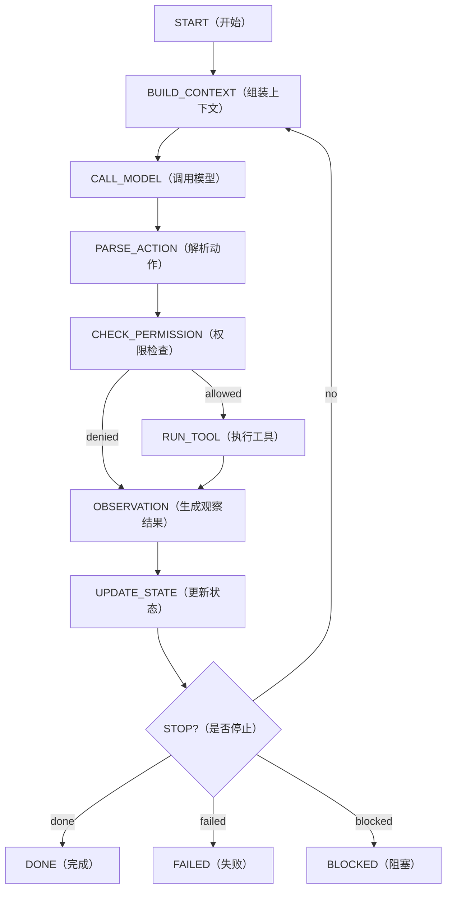

# Day 08：Agentic Loop（智能体主循环）结构

> 所属周：Week 02 - Runtime 主循环实现  
> 建议节奏：Busy Mode（15-20 分钟）/ Standard Mode（45 分钟）/ Deep Mode（90 分钟）  
> 导航：[`本周目录`](README.md) / [`总目录`](../README.md) / [`本周 QA`](week-02-qa-summary.md)  
> 上一天：[`Day 07`](../week-01-agent-basics/day-07-week-01-review.md) ｜ 下一天：[`Day 09`](../week-02-agentic-loop/day-09-context-assembly.md)

## 1. 今日核心问题

> Agent Runtime 的主循环到底循环什么？

今天的学习目标不是背概念，而是把 `Agentic Loop（智能体主循环）结构` 放到 Agent Runtime 的工程链路里理解。

学完今天，你应该能做到：

- 用自己的话解释：Agent Loop、Goal、Observation、Stop Condition。
- 说明这个主题在 Runtime 中属于哪个模块。
- 说出至少 3 个工程风险。
- 用 Java / Spring Boot 后端系统做一个类比。
- 完成一个可以沉淀到项目设计里的小输出。

## 2. 今日不追求掌握的内容

今天先不追求完整实现生产系统，也不追求读论文。重点是建立工程判断：

- 这个模块解决什么问题。
- 它和 Runtime 其他模块如何协作。
- 如果设计不好，会造成什么线上风险。
- 最小可行版本应该做到什么程度。

## 3. 学习时间安排

| 模式 | 时间 | 做什么 |
|------|------|--------|
| Busy Mode | 15-20 分钟 | 阅读第 4、5、8 节，完成 2 个自测问题 |
| Standard Mode | 45 分钟 | 完整阅读，写 3 条要点和一个后端类比 |
| Deep Mode | 90 分钟 | 完成实践任务，补充类图、表结构或流程图 |

## 4. 最小心智模型

可以先记住这句话：

> Agent Runtime 的主循环到底循环什么？ 这个问题的答案，最终都要落到“如何让 Agent 更可控、更准确、更可验证”。

从 Runtime 视角看，今天主题和下面链路有关：

```text
User Goal
-> Context / State
-> Model Decision
-> Runtime Control
-> Tool / Memory / Permission / Trace
-> Observation
-> Next Step
```

不要只问“模型会不会”，要问：

- Runtime 给模型看了什么？
- 模型输出如何被解析和校验？
- 工具或状态是否真的发生变化？
- 失败时有没有记录和恢复？
- 最终结论有没有证据？

## 5. 核心概念拆解

### 5.1 Agent Loop（智能体循环）

围绕目标不断执行“组装上下文、模型决策、执行动作、观察结果、更新状态”的闭环。

它解决的问题：普通 Chat API 是一次问答，Agent Loop 把复杂任务拆成多个可观察、可执行、可恢复的步骤。

工程落点：通常落在 `AgentRuntime.run()`、`AgentStep`、`Transcript`、`StateStore`、`ToolExecutor` 这些核心对象上。

忽略后果：如果没有 Loop，模型只能“说应该做什么”，但 Runtime 不知道下一步该执行、等待、重试还是停止。

### 5.2 Goal（目标）

用户真正想完成的任务，不等于用户输入的每个字。

它解决的问题：把零散自然语言转成 Runtime 可以追踪的任务边界，例如“修复测试失败”比“看看这个报错”更适合作为目标。

工程落点：可以存到 `TaskState.goal`，并在每一轮上下文组装时放在高优先级位置。

忽略后果：Agent 可能被中间日志、工具输出或历史对话带偏，最后完成了一个看似相关但不是用户真正要的任务。

### 5.3 Observation（观察结果）

工具执行后的事实反馈，是下一轮决策依据。

它解决的问题：让模型不只依赖猜测，而是根据真实工具结果继续推理。

工程落点：每次工具调用后生成 `Observation`，写入 `Transcript`，必要时更新 `StateStore`，再进入下一轮上下文。

忽略后果：模型可能声称“测试通过”“文件已修改”，但系统里没有任何工具结果能证明这些状态真的发生。

### 5.4 Stop Condition（停止条件）

判断任务完成、失败、取消、超时或需要用户确认的规则。

它解决的问题：防止 Agent 无限循环、过早宣布完成，或者在需要人工确认时继续执行。

工程落点：可以设计 `StopConditionEvaluator`，基于目标、步骤数、工具结果、权限状态和验证结果判断任务状态。

忽略后果：Agent 可能一直调用工具，也可能没有验证就说完成，最终让用户无法信任执行结果。

## 6. 工程含义

今天主题的工程含义可以分成 5 层：

1. **边界**：明确模型、Runtime、工具、状态、用户各自负责什么。
2. **结构**：用接口、Schema、状态机、表结构或日志结构把能力固定下来。
3. **安全**：对高风险动作设置权限、审批、沙箱或只读限制。
4. **可恢复**：失败后能重试、降级、停止或交给用户处理。
5. **可验证**：最终结论必须能从工具结果、日志、状态或测试中找到证据。

## 7. Java / 后端类比

像一个带状态的 Spring Batch Job：每一步根据上一步结果决定下一步，而不是 Controller 调一次 Service 就结束。

你可以用下面的问题检查自己是否真的理解：

- 如果把它做成一个 Spring Bean，它的输入输出是什么？
- 它应该依赖哪些组件，不应该依赖哪些组件？
- 它的失败异常应该抛出、重试、降级还是记录？
- 它会不会影响数据库、Redis、MQ、ES 或外部系统状态？

## 8. 设计清单

学习今天主题时，至少检查这些设计点：

- 是否有清晰的输入和输出。
- 是否有结构化数据，而不是只靠自然语言。
- 是否能被记录到 Transcript / Trace。
- 是否能区分成功、失败、拒绝、超时和部分成功。
- 是否需要权限控制。
- 是否需要幂等或重试。
- 是否会污染上下文或 Memory。
- 是否能被测试和回放。

## 9. 今日实践任务

写一个 30 行以内的 `AgentRuntime.run()` 伪代码，并标出每一步可能失败的位置。

建议输出格式：

```text
目标：
输入：
输出：
核心流程：
异常情况：
需要记录的日志：
需要用户确认的场景：
```

## 10. 自测问题与参考答案

### Q1：Agent Runtime 的主循环到底循环什么？

先抓住本质：围绕目标不断执行“组装上下文、模型决策、执行动作、观察结果、更新状态”的闭环。 这个问题要落到工程实现上，而不是停留在术语解释。

### Q2：今天主题在 Java 后端里可以类比成什么？

像一个带状态的 Spring Batch Job：每一步根据上一步结果决定下一步，而不是 Controller 调一次 Service 就结束。

### Q3：今天最容易出错的工程点是什么？

把模型输出当成可信事实或可直接执行动作。正确做法是让 Runtime 做校验、记录、权限和验证。

### Q4：学完今天应该产出什么？

写一个 30 行以内的 `AgentRuntime.run()` 伪代码，并标出每一步可能失败的位置。

## 11. 常见坑

- 只会解释概念，但说不出它在 Runtime 里的位置。
- 只相信模型输出，没有结构化校验。
- 没有考虑失败、超时、权限和审计。
- 把所有信息都塞进上下文，导致模型被噪声干扰。
- 没有最终验证，却在回答里声称任务完成。

## 12. 今日总结

今天真正要记住的是：

> Agent 工程化不是让模型“更自由”，而是让模型的推理能力被 Runtime 安全、结构化、可追踪地使用。

## 13. 补充深度学习内容

### 13.1 Agentic Loop 不是 while 循环这么简单

从代码形态上看，Agentic Loop 很像：

```java
while (!state.shouldStop()) {
    context = assembleContext(state);
    output = callModel(context);
    action = parseAction(output);
    observation = executeAction(action);
    state.apply(observation);
}
```

但生产级 Runtime 不能只写成一个简单 `while`。真正复杂的是每一步都有工程边界：

| 阶段 | 关键问题 | Runtime 必须做什么 |
|------|----------|-------------------|
| `Goal Intake` | 用户目标是否明确？ | 解析目标、识别约束、必要时追问 |
| `Context Assembly` | 模型本轮该看什么？ | 选择规则、状态、记忆、工具结果 |
| `Model Invocation` | 用哪个模型、怎么调用？ | 模型路由、超时、重试、成本记录 |
| `Action Parsing` | 输出是否可执行？ | 解析工具调用、校验参数 |
| `Permission Check` | 动作是否安全？ | 风险分类、权限判断、人工确认 |
| `Tool Execution` | 工具如何执行？ | 调度、超时、取消、结果收集 |
| `Observation Mapping` | 结果如何反馈？ | 摘要、脱敏、证据保留 |
| `State Update` | 状态如何变化？ | 更新轮次、状态、错误、产物 |
| `Stop Check` | 是否继续？ | done、failed、blocked、timeout |

核心思想：

> Agent Loop 是一个受控任务执行循环，不是模型自由行动循环。

### 13.2 一个更完整的 Runtime 主循环

```java
public AgentResult run(AgentTask task) {
    AgentState state = stateStore.start(task);

    while (true) {
        StopDecision stop = stopPolicy.check(state);
        if (stop.shouldStop()) {
            return resultBuilder.build(state, stop);
        }

        AgentContext context = contextAssembler.assemble(state);
        ModelOutput modelOutput = modelClient.invoke(context);
        AgentDecision decision = decisionParser.parse(modelOutput);

        PermissionDecision permission = permissionService.decide(decision, state);
        if (!permission.isAllowed()) {
            Observation denied = Observation.permissionDenied(permission);
            state.apply(denied);
            traceRecorder.recordDenied(decision, permission);
            continue;
        }

        ToolResult toolResult = toolExecutor.execute(decision.toToolCall());
        Observation observation = observationMapper.map(toolResult);

        state.apply(observation);
        traceRecorder.recordStep(state, decision, observation);
    }
}
```

这段伪代码里有几个关键点：

- `stopPolicy.check(state)` 放在循环开头，防止已经失败或取消的任务继续执行。
- `decisionParser.parse(modelOutput)` 说明模型输出不是直接动作。
- `permissionService.decide(...)` 说明模型没有执行权。
- `Observation.permissionDenied(...)` 说明拒绝动作也要反馈给模型。
- `traceRecorder.recordStep(...)` 说明每轮都必须可追踪。

### 13.3 Agent Loop 的状态迁移



注意这里 `denied` 不是异常终止。很多时候权限拒绝只是一个 Observation，模型可以基于它选择更安全的方案。

### 13.4 最小核心类设计

```java
class AgentTask {
    String taskId;
    String userId;
    String goal;
    Map<String, Object> constraints;
}

class AgentState {
    String taskId;
    AgentStatus status;
    int turn;
    List<AgentStep> steps;
    String stopReason;
}

class AgentStep {
    int stepNo;
    AgentDecision decision;
    Observation observation;
    StepStatus status;
}

class Observation {
    String status;
    String summary;
    List<String> evidence;
    String errorCode;
    String rawRef;
}
```

你可以把这些类类比成订单系统里的 `Order`、`OrderStatus`、`OrderEvent`、`OrderLog`。

### 13.5 今日要重点掌握的失败模式

1. 没有最大轮数：Agent 重复搜索、重复读文件、成本失控。
2. 没有状态机：失败后继续执行，取消后继续写文件。
3. 没有权限检查：模型输出危险命令后直接执行。
4. 没有 Observation：工具失败后模型不知道真实结果。
5. 没有 Trace：最终无法解释 Agent 为什么这么做。

### 13.6 今日小练习参考答案方向

你可以把今日输出写成：

```text
AgentRuntime.run()
1. 创建任务状态
2. 检查停止条件
3. 组装上下文
4. 调用模型
5. 解析模型输出
6. 校验工具参数
7. 检查权限
8. 执行工具
9. 整理 Observation
10. 更新状态和 Trace
11. 回到第 2 步
```

完成标准不是代码能运行，而是你能解释每一步为什么不能省略。

## 今日笔记

### 预习问题

- Agent Runtime 的主循环到底循环什么？
- `Agentic Loop（智能体主循环）结构` 在 Agent Runtime 的哪个模块落地？
- 如果忽略 `Agentic Loop（智能体主循环）结构`，会造成什么工程风险？

### 主动回忆

1. 今日主题是 `Agentic Loop（智能体主循环）结构`，核心问题是：Agent Runtime 的主循环到底循环什么？
2. 关键概念包括：Agent Loop（智能体循环）、Goal（目标）、Observation（观察结果）。
3. 工程判断要落到 Runtime：谁负责决策、谁负责执行、谁负责记录、谁负责验证。

### 费曼输出

用 5 句话给一个 Java 后端同事讲清楚今天主题：

1. `Agentic Loop（智能体主循环）结构` 不是孤立术语，它要解决的是 Agent 从“会回答”走向“可执行、可控制、可验证”的问题。
2. 模型可以参与推理和生成候选动作，但 Runtime 必须负责边界、状态、权限、工具执行和审计。
3. 如果没有结构化设计，Agent 很容易出现假成功、重复行动、上下文污染或不可追踪失败。
4. 后端视角下，可以把它类比成服务编排、状态机、权限网关、审计日志或可观测性体系中的一个环节。
5. 学完今天，至少要能说清楚它的输入、输出、失败模式、验证方式和最小实现方案。

### 3 条要点

- Agent Loop（智能体循环）：先理解定义，再追问它在 Runtime 中由哪个组件负责。
- Goal（目标）：不要只停留在 prompt 层，要落实到 Schema、状态、策略、日志或流程里。
- Agent 工程化不是让模型“更自由”，而是让模型的推理能力被 Runtime 安全、结构化、可追踪地使用。

### Java / 后端类比

- 像一个带状态的 Spring Batch / Saga 流程：每一步根据上一步结果决定下一步，并且必须有停止条件。

### 今日小练习

**练习目标**：把 `Agentic Loop（智能体主循环）结构` 从概念理解推进到可落地的工程设计。

**任务说明**：写一个 30 行以内的 AgentRuntime.run() 伪代码，并标出每一步可能失败的位置。

**操作步骤**：

1. 先用 3 句话写清楚这个练习要解决的核心问题。
2. 列出涉及的关键概念：`Agent Loop（智能体循环）`、`Goal（目标）`、`Observation（观察结果）`。
3. 写出最小数据结构或流程图，优先使用表格、伪代码或 Mermaid。
4. 补充异常情况：失败、超时、权限不足、输入不完整、结果无法验证。
5. 写出最终输出物，并说明它如何被 Runtime 记录、验证或复用。

**建议输出物**：

```text
标题：Agentic Loop（智能体主循环）结构 小练习
目标：
输入：
核心流程：
关键数据结构：
失败场景：
验证方式：
还需要补充的问题：
```

**自检标准**：

- 能说清楚这个设计属于 Runtime 的哪个模块。
- 能区分模型建议、Runtime 决策、工具执行和状态变化。
- 至少包含 1 个失败场景和 1 个验证方式。
- 输出物能在 10 分钟内复述给一个 Java 后端同事。

### 还没想清楚的问题

- `Agentic Loop（智能体主循环）结构` 的最小可用实现需要哪些类、字段或接口？
- 这个能力上线后，失败时我应该通过哪些日志、Trace 或状态字段定位问题？

### 间隔复习

- D+1：不看资料，用 3 句话复述 `Agentic Loop（智能体主循环）结构` 的核心思想。
- D+3：补画一张小图，标出它和 Runtime 其他模块的关系。
- D+7：用一个 Java 后端场景重新解释它，并检查是否能说出风险和验证方式。
