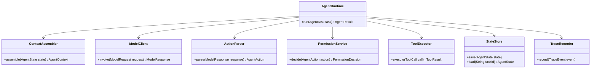

# Day 14：Week 2 复盘：最小 Runtime

> 所属周：Week 02 - Runtime 主循环实现  
> 建议节奏：Busy Mode（15-20 分钟）/ Standard Mode（45 分钟）/ Deep Mode（90 分钟）  
> 导航：[`本周目录`](README.md) / [`总目录`](../README.md) / [`本周 QA`](week-02-qa-summary.md)  
> 上一天：[`Day 13`](../week-02-agentic-loop/day-13-error-recovery.md) ｜ 下一天：[`Day 15`](../week-03-tool-system/day-15-tool-interface.md)

## 1. 今日核心问题

> 如何串起一个最小可运行的 Agent Runtime？

今天的学习目标不是背概念，而是把 `Week 2 复盘：最小 Runtime` 放到 Agent Runtime 的工程链路里理解。

学完今天，你应该能做到：

- 用自己的话解释：Runtime Skeleton、Trace First、Safety First、Evidence。
- 说明这个主题在 Runtime 中属于哪个模块。
- 说出至少 3 个工程风险。
- 用 Java / Spring Boot 后端系统做一个类比。
- 完成一个可以沉淀到项目设计里的小输出。

## 2. 今日不追求掌握的内容

今天先不追求完整实现生产系统，也不追求读论文。重点是建立工程判断：

- 这个模块解决什么问题。
- 它和 Runtime 其他模块如何协作。
- 如果设计不好，会造成什么线上风险。
- 最小可行版本应该做到什么程度。

## 3. 学习时间安排

| 模式 | 时间 | 做什么 |
|------|------|--------|
| Busy Mode | 15-20 分钟 | 阅读第 4、5、8 节，完成 2 个自测问题 |
| Standard Mode | 45 分钟 | 完整阅读，写 3 条要点和一个后端类比 |
| Deep Mode | 90 分钟 | 完成实践任务，补充类图、表结构或流程图 |

## 4. 最小心智模型

可以先记住这句话：

> 如何串起一个最小可运行的 Agent Runtime？ 这个问题的答案，最终都要落到“如何让 Agent 更可控、更准确、更可验证”。

从 Runtime 视角看，今天主题和下面链路有关：

```text
User Goal
-> Context / State
-> Model Decision
-> Runtime Control
-> Tool / Memory / Permission / Trace
-> Observation
-> Next Step
```

不要只问“模型会不会”，要问：

- Runtime 给模型看了什么？
- 模型输出如何被解析和校验？
- 工具或状态是否真的发生变化？
- 失败时有没有记录和恢复？
- 最终结论有没有证据？

## 5. 核心概念拆解

### 5.1 Runtime Skeleton（运行时骨架）

用少量核心接口串起上下文、模型、动作、工具、状态和日志。

它解决的问题：把 Agent 从“调用一次模型”提升为“可持续执行任务的运行系统”。

工程落点：至少包括 `ContextAssembler`、`ModelAdapter`、`ActionParser`、`ToolExecutor`、`StateStore`、`TraceLogger`。

忽略后果：系统会变成一堆散落的 prompt 和工具调用，很难测试、恢复和扩展。

### 5.2 Trace First（记录优先）

先能记录每一步，再追求智能化。

它解决的问题：Agent 执行链路长，如果没有记录，就无法知道它为什么这么做。

工程落点：每轮模型输入摘要、模型输出、动作解析、权限结果、工具结果、状态变化都写入 Trace。

忽略后果：线上失败无法复盘，也无法评估模型、工具、上下文到底哪一层出了问题。

### 5.3 Safety First（安全优先）

先限制动作范围，再逐步扩展能力。

它解决的问题：模型提出动作不代表动作安全，Runtime 必须控制真实世界副作用。

工程落点：`PermissionControl`、`RiskPolicy`、`ApprovalFlow` 应在工具执行前生效，而不是执行后补日志。

忽略后果：Agent 可能误删文件、误发消息、误查敏感数据、误执行生产命令。

### 5.4 Evidence（证据）

最终结论必须来自工具结果或可验证状态。

它解决的问题：区分“模型认为完成”和“系统事实证明完成”。

工程落点：完成判断应绑定测试结果、文件 diff、数据库状态、API 响应、日志或人工确认。

忽略后果：最终报告会变成不可验证的自然语言承诺，用户很难信任 Agent。

## 6. 工程含义

今天主题的工程含义可以分成 5 层：

1. **边界**：明确模型、Runtime、工具、状态、用户各自负责什么。
2. **结构**：用接口、Schema、状态机、表结构或日志结构把能力固定下来。
3. **安全**：对高风险动作设置权限、审批、沙箱或只读限制。
4. **可恢复**：失败后能重试、降级、停止或交给用户处理。
5. **可验证**：最终结论必须能从工具结果、日志、状态或测试中找到证据。

## 7. Java / 后端类比

像搭建一个最小订单流程：先有状态、日志和边界，再逐步补业务能力。

你可以用下面的问题检查自己是否真的理解：

- 如果把它做成一个 Spring Bean，它的输入输出是什么？
- 它应该依赖哪些组件，不应该依赖哪些组件？
- 它的失败异常应该抛出、重试、降级还是记录？
- 它会不会影响数据库、Redis、MQ、ES 或外部系统状态？

## 8. 设计清单

学习今天主题时，至少检查这些设计点：

- 是否有清晰的输入和输出。
- 是否有结构化数据，而不是只靠自然语言。
- 是否能被记录到 Transcript / Trace。
- 是否能区分成功、失败、拒绝、超时和部分成功。
- 是否需要权限控制。
- 是否需要幂等或重试。
- 是否会污染上下文或 Memory。
- 是否能被测试和回放。

## 9. 今日实践任务

输出一个最小 Runtime 类图和主流程伪代码。

建议输出格式：

```text
目标：
输入：
输出：
核心流程：
异常情况：
需要记录的日志：
需要用户确认的场景：
```

## 10. 自测问题与参考答案

### Q1：如何串起一个最小可运行的 Agent Runtime？

先抓住本质：用少量核心接口串起上下文、模型、动作、工具、状态和日志。 这个问题要落到工程实现上，而不是停留在术语解释。

### Q2：今天主题在 Java 后端里可以类比成什么？

像搭建一个最小订单流程：先有状态、日志和边界，再逐步补业务能力。

### Q3：今天最容易出错的工程点是什么？

把模型输出当成可信事实或可直接执行动作。正确做法是让 Runtime 做校验、记录、权限和验证。

### Q4：学完今天应该产出什么？

输出一个最小 Runtime 类图和主流程伪代码。

## 11. 常见坑

- 只会解释概念，但说不出它在 Runtime 里的位置。
- 只相信模型输出，没有结构化校验。
- 没有考虑失败、超时、权限和审计。
- 把所有信息都塞进上下文，导致模型被噪声干扰。
- 没有最终验证，却在回答里声称任务完成。

## 12. 今日总结

今天真正要记住的是：

> Agent 工程化不是让模型“更自由”，而是让模型的推理能力被 Runtime 安全、结构化、可追踪地使用。

## 13. 补充深度学习内容

### 13.1 Week 2 的主线

这一周你要把 Agent Runtime 理解成一个可实现的后端执行系统，而不是一个抽象概念。

完整链路：

```text
AgentTask
-> AgentState
-> ContextAssembler
-> ModelClient
-> ActionParser
-> PermissionService
-> ToolExecutor
-> ObservationMapper
-> StateStore
-> TraceRecorder
-> StopPolicy
-> AgentResult
```

### 13.2 最小 Runtime 模块职责

| 模块 | 职责 |
|------|------|
| `AgentRuntime` | 主循环编排 |
| `ContextAssembler` | 组装模型输入 |
| `ModelClient` | 调用模型 |
| `ActionParser` | 解析模型输出 |
| `PermissionService` | 决定动作是否允许 |
| `ToolExecutor` | 执行工具 |
| `ObservationMapper` | 整理工具结果 |
| `StateStore` | 保存任务状态 |
| `TraceRecorder` | 记录执行轨迹 |
| `StopPolicy` | 判断是否停止 |

### 13.3 类图草案



### 13.4 最小数据库表

```sql
agent_task(
  id,
  user_id,
  goal,
  status,
  stop_reason,
  created_at,
  updated_at
)

agent_step(
  id,
  task_id,
  step_no,
  action_type,
  tool_name,
  input_summary,
  output_summary,
  status,
  error_code,
  created_at
)
```

先有这两张表，就能回答：

- Agent 做到了哪一步？
- 哪一步失败了？
- 为什么停止？
- 有没有工具执行证据？

### 13.5 Week 2 复盘问题

1. Runtime 主循环为什么不能交给模型自己控制？
2. 上下文组装为什么不是简单拼字符串？
3. Model Adapter 为什么重要？
4. 模型输出为什么必须经过 Action Parser？
5. Stop Condition 为什么是安全机制？
6. 哪些错误可以重试，哪些不能？
7. Agent 最终回答如何和 `stopReason` 对齐？

### 13.6 Week 2 最终输出模板

```text
我的最小 Agent Runtime 设计

目标：
  支持一个 Agent 任务多轮执行。

核心模块：
  AgentRuntime、ContextAssembler、ModelClient、ActionParser、
  PermissionService、ToolExecutor、StateStore、TraceRecorder。

核心状态：
  RUNNING、DONE_VERIFIED、FAILED、BLOCKED、CANCELLED、MAX_TURNS_REACHED。

关键限制：
  - 最大轮数 10。
  - 工具调用必须先校验。
  - 高风险动作需要人工确认。
  - 每一步写入 Trace。
  - 最终回答必须说明验证状态。
```

这份输出如果能写清楚，就说明 Week 2 的学习已经过关。

## 今日笔记

### 预习问题

- 如何串起一个最小可运行的 Agent Runtime？
- `Week 2 复盘：最小 Runtime` 在 Agent Runtime 的哪个模块落地？
- 如果忽略 `Week 2 复盘：最小 Runtime`，会造成什么工程风险？

### 主动回忆

1. 今日主题是 `Week 2 复盘：最小 Runtime`，核心问题是：如何串起一个最小可运行的 Agent Runtime？
2. 关键概念包括：Runtime Skeleton（运行时骨架）、Trace First（记录优先）、Safety First（安全优先）。
3. 工程判断要落到 Runtime：谁负责决策、谁负责执行、谁负责记录、谁负责验证。

### 费曼输出

用 5 句话给一个 Java 后端同事讲清楚今天主题：

1. `Week 2 复盘：最小 Runtime` 不是孤立术语，它要解决的是 Agent 从“会回答”走向“可执行、可控制、可验证”的问题。
2. 模型可以参与推理和生成候选动作，但 Runtime 必须负责边界、状态、权限、工具执行和审计。
3. 如果没有结构化设计，Agent 很容易出现假成功、重复行动、上下文污染或不可追踪失败。
4. 后端视角下，可以把它类比成服务编排、状态机、权限网关、审计日志或可观测性体系中的一个环节。
5. 学完今天，至少要能说清楚它的输入、输出、失败模式、验证方式和最小实现方案。

### 3 条要点

- Runtime Skeleton（运行时骨架）：先理解定义，再追问它在 Runtime 中由哪个组件负责。
- Trace First（记录优先）：不要只停留在 prompt 层，要落实到 Schema、状态、策略、日志或流程里。
- Agent 工程化不是让模型“更自由”，而是让模型的推理能力被 Runtime 安全、结构化、可追踪地使用。

### Java / 后端类比

- 像一个带状态的 Spring Batch / Saga 流程：每一步根据上一步结果决定下一步，并且必须有停止条件。

### 今日小练习

**练习目标**：把 `Week 2 复盘：最小 Runtime` 从概念理解推进到可落地的工程设计。

**任务说明**：输出一个最小 Runtime 类图和主流程伪代码。

**操作步骤**：

1. 先用 3 句话写清楚这个练习要解决的核心问题。
2. 列出涉及的关键概念：`Runtime Skeleton（运行时骨架）`、`Trace First（记录优先）`、`Safety First（安全优先）`。
3. 写出最小数据结构或流程图，优先使用表格、伪代码或 Mermaid。
4. 补充异常情况：失败、超时、权限不足、输入不完整、结果无法验证。
5. 写出最终输出物，并说明它如何被 Runtime 记录、验证或复用。

**建议输出物**：

```text
标题：Week 2 复盘：最小 Runtime 小练习
目标：
输入：
核心流程：
关键数据结构：
失败场景：
验证方式：
还需要补充的问题：
```

**自检标准**：

- 能说清楚这个设计属于 Runtime 的哪个模块。
- 能区分模型建议、Runtime 决策、工具执行和状态变化。
- 至少包含 1 个失败场景和 1 个验证方式。
- 输出物能在 10 分钟内复述给一个 Java 后端同事。

### 还没想清楚的问题

- `Week 2 复盘：最小 Runtime` 的最小可用实现需要哪些类、字段或接口？
- 这个能力上线后，失败时我应该通过哪些日志、Trace 或状态字段定位问题？

### 间隔复习

- D+1：不看资料，用 3 句话复述 `Week 2 复盘：最小 Runtime` 的核心思想。
- D+3：补画一张小图，标出它和 Runtime 其他模块的关系。
- D+7：用一个 Java 后端场景重新解释它，并检查是否能说出风险和验证方式。
