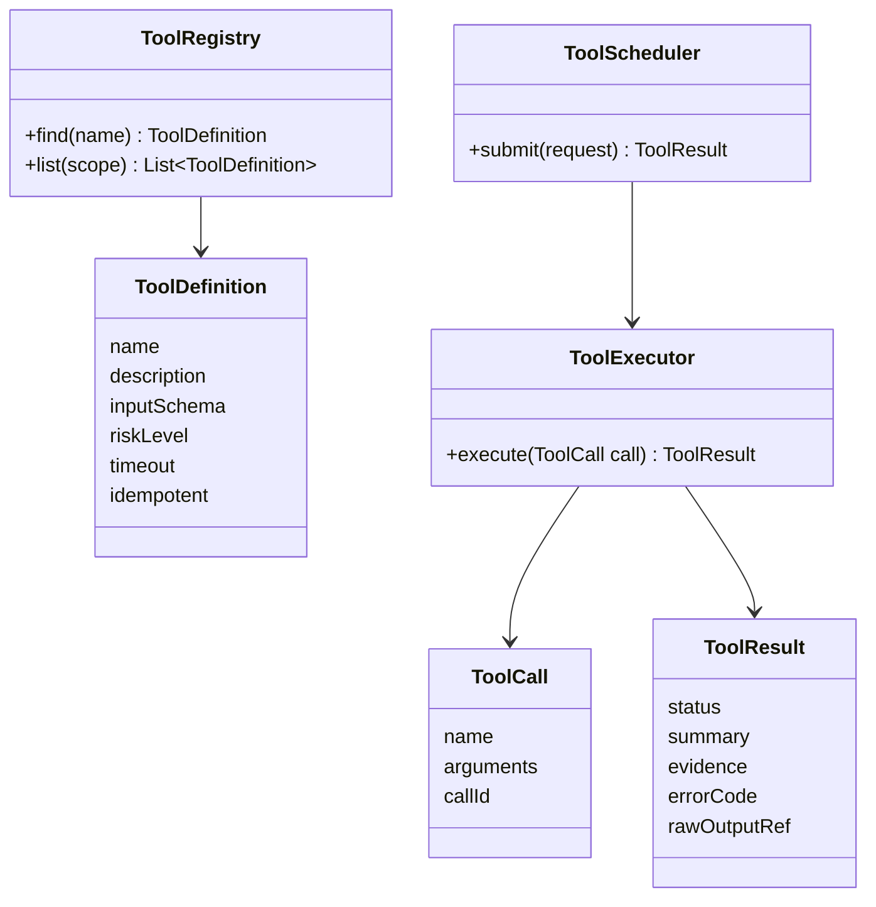

# Day 21：Week 3 复盘：工具系统闭环

> 所属周：Week 03 - Tool System 工程实现  
> 建议节奏：Busy Mode（15-20 分钟）/ Standard Mode（45 分钟）/ Deep Mode（90 分钟）  
> 导航：[`本周目录`](README.md) / [`总目录`](../README.md) / [`本周 QA`](week-03-qa-summary.md)  
> 上一天：[`Day 20`](../week-03-tool-system/day-20-tool-error-handling.md) ｜ 下一天：[`Day 22`](../week-04-context-management/day-22-context-window.md)

## 1. 今日核心问题

> 如何设计一套生产可用的 Tool System？

今天的学习目标不是背概念，而是把 `Week 3 复盘：工具系统闭环` 放到 Agent Runtime 的工程链路里理解。

学完今天，你应该能做到：

- 用自己的话解释：Tool Registry、Execution Boundary、Auditability、Least Privilege。
- 说明这个主题在 Runtime 中属于哪个模块。
- 说出至少 3 个工程风险。
- 用 Java / Spring Boot 后端系统做一个类比。
- 完成一个可以沉淀到项目设计里的小输出。

## 2. 今日不追求掌握的内容

今天先不追求完整实现生产系统，也不追求读论文。重点是建立工程判断：

- 这个模块解决什么问题。
- 它和 Runtime 其他模块如何协作。
- 如果设计不好，会造成什么线上风险。
- 最小可行版本应该做到什么程度。

## 3. 学习时间安排

| 模式 | 时间 | 做什么 |
|------|------|--------|
| Busy Mode | 15-20 分钟 | 阅读第 4、5、8 节，完成 2 个自测问题 |
| Standard Mode | 45 分钟 | 完整阅读，写 3 条要点和一个后端类比 |
| Deep Mode | 90 分钟 | 完成实践任务，补充类图、表结构或流程图 |

## 4. 最小心智模型

可以先记住这句话：

> 如何设计一套生产可用的 Tool System？ 这个问题的答案，最终都要落到“如何让 Agent 更可控、更准确、更可验证”。

从 Runtime 视角看，今天主题和下面链路有关：

```text
User Goal
-> Context / State
-> Model Decision
-> Runtime Control
-> Tool / Memory / Permission / Trace
-> Observation
-> Next Step
```

不要只问“模型会不会”，要问：

- Runtime 给模型看了什么？
- 模型输出如何被解析和校验？
- 工具或状态是否真的发生变化？
- 失败时有没有记录和恢复？
- 最终结论有没有证据？

## 5. 核心概念拆解

### 5.1 Tool Registry（工具注册表）

集中管理工具定义、版本和权限。

进一步理解这个概念时，建议追问三件事：

- 它解决的问题：避免 Agent 在缺少结构、缺少证据或缺少边界的情况下行动。
- 工程落点：它通常会落到接口、Schema、状态字段、策略规则、日志字段或执行流程中。
- 忽略后果：模型可能继续基于错误前提行动，造成假成功、越权、上下文污染或不可追踪失败。

### 5.2 Execution Boundary（执行边界）

模型不能越过 Runtime 直接执行。

进一步理解这个概念时，建议追问三件事：

- 它解决的问题：避免 Agent 在缺少结构、缺少证据或缺少边界的情况下行动。
- 工程落点：它通常会落到接口、Schema、状态字段、策略规则、日志字段或执行流程中。
- 忽略后果：模型可能继续基于错误前提行动，造成假成功、越权、上下文污染或不可追踪失败。

### 5.3 Auditability（可审计）

每次调用都可追踪。

进一步理解这个概念时，建议追问三件事：

- 它解决的问题：避免 Agent 在缺少结构、缺少证据或缺少边界的情况下行动。
- 工程落点：它通常会落到接口、Schema、状态字段、策略规则、日志字段或执行流程中。
- 忽略后果：模型可能继续基于错误前提行动，造成假成功、越权、上下文污染或不可追踪失败。

### 5.4 Least Privilege（最小权限）

工具默认只暴露必要能力。

进一步理解这个概念时，建议追问三件事：

- 它解决的问题：避免 Agent 在缺少结构、缺少证据或缺少边界的情况下行动。
- 工程落点：它通常会落到接口、Schema、状态字段、策略规则、日志字段或执行流程中。
- 忽略后果：模型可能继续基于错误前提行动，造成假成功、越权、上下文污染或不可追踪失败。

## 6. 工程含义

今天主题的工程含义可以分成 5 层：

1. **边界**：明确模型、Runtime、工具、状态、用户各自负责什么。
2. **结构**：用接口、Schema、状态机、表结构或日志结构把能力固定下来。
3. **安全**：对高风险动作设置权限、审批、沙箱或只读限制。
4. **可恢复**：失败后能重试、降级、停止或交给用户处理。
5. **可验证**：最终结论必须能从工具结果、日志、状态或测试中找到证据。

## 7. Java / 后端类比

像企业内部开放平台：工具是能力接口，必须有权限、审计和限流。

你可以用下面的问题检查自己是否真的理解：

- 如果把它做成一个 Spring Bean，它的输入输出是什么？
- 它应该依赖哪些组件，不应该依赖哪些组件？
- 它的失败异常应该抛出、重试、降级还是记录？
- 它会不会影响数据库、Redis、MQ、ES 或外部系统状态？

## 8. 设计清单

学习今天主题时，至少检查这些设计点：

- 是否有清晰的输入和输出。
- 是否有结构化数据，而不是只靠自然语言。
- 是否能被记录到 Transcript / Trace。
- 是否能区分成功、失败、拒绝、超时和部分成功。
- 是否需要权限控制。
- 是否需要幂等或重试。
- 是否会污染上下文或 Memory。
- 是否能被测试和回放。

## 9. 今日实践任务

输出 Tool System 类图和工具调用时序图。

建议输出格式：

```text
目标：
输入：
输出：
核心流程：
异常情况：
需要记录的日志：
需要用户确认的场景：
```

## 10. 自测问题与参考答案

### Q1：如何设计一套生产可用的 Tool System？

先抓住本质：集中管理工具定义、版本和权限。 这个问题要落到工程实现上，而不是停留在术语解释。

### Q2：今天主题在 Java 后端里可以类比成什么？

像企业内部开放平台：工具是能力接口，必须有权限、审计和限流。

### Q3：今天最容易出错的工程点是什么？

把模型输出当成可信事实或可直接执行动作。正确做法是让 Runtime 做校验、记录、权限和验证。

### Q4：学完今天应该产出什么？

输出 Tool System 类图和工具调用时序图。

## 11. 常见坑

- 只会解释概念，但说不出它在 Runtime 里的位置。
- 只相信模型输出，没有结构化校验。
- 没有考虑失败、超时、权限和审计。
- 把所有信息都塞进上下文，导致模型被噪声干扰。
- 没有最终验证，却在回答里声称任务完成。

## 12. 今日总结

今天真正要记住的是：

> Agent 工程化不是让模型“更自由”，而是让模型的推理能力被 Runtime 安全、结构化、可追踪地使用。

## 13. 补充深度学习内容

### 13.1 Week 3 的主线

这一周的核心是：

> Tool System 把模型的“行动意图”变成安全、受控、可审计的系统能力。

完整链路：

```text
ToolDefinition
-> ToolRegistry
-> ToolCall
-> Schema Validation
-> Risk Classification
-> Permission Check
-> Scheduler
-> ToolExecutor
-> ToolResult
-> Observation
-> Transcript
```

### 13.2 Tool System 核心类图



### 13.3 一套生产工具系统至少要支持

1. 工具注册和版本管理。
2. Tool Schema 校验。
3. 风险等级和权限策略。
4. 工具执行超时。
5. 输出大小限制。
6. 错误分类和重试策略。
7. Trace / Transcript 记录。
8. Sensitive Data Redaction（敏感数据脱敏）。
9. 并发和资源锁。
10. 人工审批接入。

### 13.4 最小工具集建议

如果你要做 AI Coding Agent，第一版只需要：

```text
read_file
list_directory
search_code
run_test
write_file_with_diff_preview
```

不要一开始开放：

```text
delete_file
curl
ssh
database_write
git_push
send_email
```

第一版只做“可控、可观察、可回滚”的能力。

### 13.5 Week 3 复盘问题

1. 为什么 Tool 不是普通函数？
2. Tool Schema 解决什么问题，解决不了什么问题？
3. Tool Result 和 Observation 有什么区别？
4. 哪些工具可以并发，哪些不行？
5. Tool Scheduler 为什么需要超时和限流？
6. 工具失败为什么必须结构化？
7. 写操作为什么不能盲目重试？

### 13.6 Week 3 最终输出模板

```text
我的 Tool System 设计

核心类：
  ToolDefinition
  ToolRegistry
  ToolCall
  ToolExecutor
  ToolResult
  ToolScheduler

基础工具：
  read_file
  search_code
  run_test
  write_file

安全策略：
  只读工具自动执行
  写工具需要 diff preview
  高风险工具人工确认
  非幂等工具不自动重试
  所有工具调用写入 Transcript
```

如果你能把这份设计讲清楚，Week 3 就算真正学到了工程层面。

## 今日笔记

### 预习问题

- 如何设计一套生产可用的 Tool System？
- `Week 3 复盘：工具系统闭环` 在 Agent Runtime 的哪个模块落地？
- 如果忽略 `Week 3 复盘：工具系统闭环`，会造成什么工程风险？

### 主动回忆

1. 今日主题是 `Week 3 复盘：工具系统闭环`，核心问题是：如何设计一套生产可用的 Tool System？
2. 关键概念包括：Tool Registry（工具注册表）、Execution Boundary（执行边界）、Auditability（可审计）。
3. 工程判断要落到 Runtime：谁负责决策、谁负责执行、谁负责记录、谁负责验证。

### 费曼输出

用 5 句话给一个 Java 后端同事讲清楚今天主题：

1. `Week 3 复盘：工具系统闭环` 不是孤立术语，它要解决的是 Agent 从“会回答”走向“可执行、可控制、可验证”的问题。
2. 模型可以参与推理和生成候选动作，但 Runtime 必须负责边界、状态、权限、工具执行和审计。
3. 如果没有结构化设计，Agent 很容易出现假成功、重复行动、上下文污染或不可追踪失败。
4. 后端视角下，可以把它类比成服务编排、状态机、权限网关、审计日志或可观测性体系中的一个环节。
5. 学完今天，至少要能说清楚它的输入、输出、失败模式、验证方式和最小实现方案。

### 3 条要点

- Tool Registry（工具注册表）：先理解定义，再追问它在 Runtime 中由哪个组件负责。
- Execution Boundary（执行边界）：不要只停留在 prompt 层，要落实到 Schema、状态、策略、日志或流程里。
- Agent 工程化不是让模型“更自由”，而是让模型的推理能力被 Runtime 安全、结构化、可追踪地使用。

### Java / 后端类比

- 像给内部服务设计 API：接口、参数、返回值、错误码、权限和审计都要清楚。

### 今日小练习

**练习目标**：把 `Week 3 复盘：工具系统闭环` 从概念理解推进到可落地的工程设计。

**任务说明**：设计最小工具系统闭环：ToolRegistry、ToolSchema、ToolExecutor、ToolResult、Observation。

**操作步骤**：

1. 先用 3 句话写清楚这个练习要解决的核心问题。
2. 列出涉及的关键概念：`Tool Registry（工具注册表）`、`Execution Boundary（执行边界）`、`Auditability（可审计）`。
3. 写出最小数据结构或流程图，优先使用表格、伪代码或 Mermaid。
4. 补充异常情况：失败、超时、权限不足、输入不完整、结果无法验证。
5. 写出最终输出物，并说明它如何被 Runtime 记录、验证或复用。

**建议输出物**：

```text
标题：Week 3 复盘：工具系统闭环 小练习
目标：
输入：
核心流程：
关键数据结构：
失败场景：
验证方式：
还需要补充的问题：
```

**自检标准**：

- 能说清楚这个设计属于 Runtime 的哪个模块。
- 能区分模型建议、Runtime 决策、工具执行和状态变化。
- 至少包含 1 个失败场景和 1 个验证方式。
- 输出物能在 10 分钟内复述给一个 Java 后端同事。

### 还没想清楚的问题

- `Week 3 复盘：工具系统闭环` 的最小可用实现需要哪些类、字段或接口？
- 这个能力上线后，失败时我应该通过哪些日志、Trace 或状态字段定位问题？

### 间隔复习

- D+1：不看资料，用 3 句话复述 `Week 3 复盘：工具系统闭环` 的核心思想。
- D+3：补画一张小图，标出它和 Runtime 其他模块的关系。
- D+7：用一个 Java 后端场景重新解释它，并检查是否能说出风险和验证方式。
