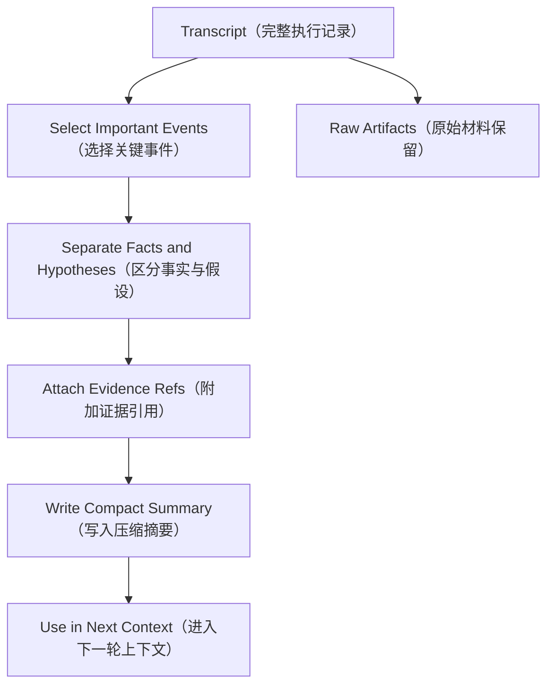

# Day 25：Context Compaction（上下文压缩）

> 所属周：Week 04 - Context Engineering 与 Memory  
> 建议节奏：Busy Mode（15-20 分钟）/ Standard Mode（45 分钟）/ Deep Mode（90 分钟）  
> 导航：[`本周目录`](README.md) / [`总目录`](../README.md) / [`本周 QA`](week-04-qa-summary.md)  
> 上一天：[`Day 24`](../week-04-context-management/day-24-tool-result-budget.md) ｜ 下一天：[`Day 26`](../week-04-context-management/day-26-prompt-cache.md)

## 1. 今日核心问题

> 长任务如何压缩历史而不丢关键事实？

今天的学习目标不是背概念，而是把 `Context Compaction（上下文压缩）` 放到 Agent Runtime 的工程链路里理解。

学完今天，你应该能做到：

- 用自己的话解释：Compaction、Decision Record、Milestone、Open Issue。
- 说明这个主题在 Runtime 中属于哪个模块。
- 说出至少 3 个工程风险。
- 用 Java / Spring Boot 后端系统做一个类比。
- 完成一个可以沉淀到项目设计里的小输出。

## 2. 今日不追求掌握的内容

今天先不追求完整实现生产系统，也不追求读论文。重点是建立工程判断：

- 这个模块解决什么问题。
- 它和 Runtime 其他模块如何协作。
- 如果设计不好，会造成什么线上风险。
- 最小可行版本应该做到什么程度。

## 3. 学习时间安排

| 模式 | 时间 | 做什么 |
|------|------|--------|
| Busy Mode | 15-20 分钟 | 阅读第 4、5、8 节，完成 2 个自测问题 |
| Standard Mode | 45 分钟 | 完整阅读，写 3 条要点和一个后端类比 |
| Deep Mode | 90 分钟 | 完成实践任务，补充类图、表结构或流程图 |

## 4. 最小心智模型

可以先记住这句话：

> 长任务如何压缩历史而不丢关键事实？ 这个问题的答案，最终都要落到“如何让 Agent 更可控、更准确、更可验证”。

从 Runtime 视角看，今天主题和下面链路有关：

```text
User Goal
-> Context / State
-> Model Decision
-> Runtime Control
-> Tool / Memory / Permission / Trace
-> Observation
-> Next Step
```

不要只问“模型会不会”，要问：

- Runtime 给模型看了什么？
- 模型输出如何被解析和校验？
- 工具或状态是否真的发生变化？
- 失败时有没有记录和恢复？
- 最终结论有没有证据？

## 5. 核心概念拆解

### 5.1 Compaction（压缩）

把长历史变成任务摘要。

进一步理解这个概念时，建议追问三件事：

- 它解决的问题：避免 Agent 在缺少结构、缺少证据或缺少边界的情况下行动。
- 工程落点：它通常会落到接口、Schema、状态字段、策略规则、日志字段或执行流程中。
- 忽略后果：模型可能继续基于错误前提行动，造成假成功、越权、上下文污染或不可追踪失败。

### 5.2 Decision Record（决策记录）

记录为什么选择某个方向。

进一步理解这个概念时，建议追问三件事：

- 它解决的问题：避免 Agent 在缺少结构、缺少证据或缺少边界的情况下行动。
- 工程落点：它通常会落到接口、Schema、状态字段、策略规则、日志字段或执行流程中。
- 忽略后果：模型可能继续基于错误前提行动，造成假成功、越权、上下文污染或不可追踪失败。

### 5.3 Milestone（里程碑）

记录已完成阶段和验证结果。

进一步理解这个概念时，建议追问三件事：

- 它解决的问题：避免 Agent 在缺少结构、缺少证据或缺少边界的情况下行动。
- 工程落点：它通常会落到接口、Schema、状态字段、策略规则、日志字段或执行流程中。
- 忽略后果：模型可能继续基于错误前提行动，造成假成功、越权、上下文污染或不可追踪失败。

### 5.4 Open Issue（未解决问题）

保留还需要处理的事项。

进一步理解这个概念时，建议追问三件事：

- 它解决的问题：避免 Agent 在缺少结构、缺少证据或缺少边界的情况下行动。
- 工程落点：它通常会落到接口、Schema、状态字段、策略规则、日志字段或执行流程中。
- 忽略后果：模型可能继续基于错误前提行动，造成假成功、越权、上下文污染或不可追踪失败。

## 6. 工程含义

今天主题的工程含义可以分成 5 层：

1. **边界**：明确模型、Runtime、工具、状态、用户各自负责什么。
2. **结构**：用接口、Schema、状态机、表结构或日志结构把能力固定下来。
3. **安全**：对高风险动作设置权限、审批、沙箱或只读限制。
4. **可恢复**：失败后能重试、降级、停止或交给用户处理。
5. **可验证**：最终结论必须能从工具结果、日志、状态或测试中找到证据。

## 7. Java / 后端类比

像项目周报：不记录每句话，而记录进度、决策、风险和下一步。

你可以用下面的问题检查自己是否真的理解：

- 如果把它做成一个 Spring Bean，它的输入输出是什么？
- 它应该依赖哪些组件，不应该依赖哪些组件？
- 它的失败异常应该抛出、重试、降级还是记录？
- 它会不会影响数据库、Redis、MQ、ES 或外部系统状态？

## 8. 设计清单

学习今天主题时，至少检查这些设计点：

- 是否有清晰的输入和输出。
- 是否有结构化数据，而不是只靠自然语言。
- 是否能被记录到 Transcript / Trace。
- 是否能区分成功、失败、拒绝、超时和部分成功。
- 是否需要权限控制。
- 是否需要幂等或重试。
- 是否会污染上下文或 Memory。
- 是否能被测试和回放。

## 9. 今日实践任务

写一个 Agent 长任务压缩模板。

建议输出格式：

```text
目标：
输入：
输出：
核心流程：
异常情况：
需要记录的日志：
需要用户确认的场景：
```

## 10. 自测问题与参考答案

### Q1：长任务如何压缩历史而不丢关键事实？

先抓住本质：把长历史变成任务摘要。 这个问题要落到工程实现上，而不是停留在术语解释。

### Q2：今天主题在 Java 后端里可以类比成什么？

像项目周报：不记录每句话，而记录进度、决策、风险和下一步。

### Q3：今天最容易出错的工程点是什么？

把模型输出当成可信事实或可直接执行动作。正确做法是让 Runtime 做校验、记录、权限和验证。

### Q4：学完今天应该产出什么？

写一个 Agent 长任务压缩模板。

## 11. 常见坑

- 只会解释概念，但说不出它在 Runtime 里的位置。
- 只相信模型输出，没有结构化校验。
- 没有考虑失败、超时、权限和审计。
- 把所有信息都塞进上下文，导致模型被噪声干扰。
- 没有最终验证，却在回答里声称任务完成。

## 12. 今日总结

今天真正要记住的是：

> Agent 工程化不是让模型“更自由”，而是让模型的推理能力被 Runtime 安全、结构化、可追踪地使用。

## 13. 补充深度学习内容

### 13.1 Context Compaction 解决什么问题

`Context Compaction（上下文压缩）` 是长任务 Agent 的必备能力。

Agent 处理复杂任务时会产生很多中间信息：

- 用户目标变化。
- 多轮计划调整。
- 多次工具调用。
- 多个失败假设。
- 多次测试结果。
- 文件修改记录。
- 权限确认记录。

如果每一轮都把完整历史塞回模型，很快会出现：

- token 超限。
- 模型被旧信息干扰。
- 关键事实淹没在噪声里。
- 成本和延迟上升。
- 历史中敏感信息反复暴露。

Compaction 的目标不是“压缩得更短”，而是：

> 把可继续执行任务所需的事实、决策、证据和风险保留下来。

### 13.2 压缩应该保留什么

好的压缩摘要至少包含：

```text
1. Goal：当前用户目标
2. Constraints：明确约束和禁止事项
3. Decisions：已经做出的关键决策
4. Actions Done：已执行动作
5. Evidence：关键证据与 rawRef
6. Current State：当前状态
7. Open Issues：未解决问题
8. Next Step：下一步建议
9. Risks：风险和注意事项
```

注意：不要把推测写成事实。

错误写法：

```text
支付失败是因为 Redis 缓存问题。
```

更安全的写法：

```text
当前假设：支付失败可能与 Redis 缓存有关。证据是 PaymentServiceTest 的错误信息提到 cache miss，但还未验证 DB 状态。
```

### 13.3 压缩类型

| 类型 | 适用场景 | 内容 |
|------|----------|------|
| Rolling Summary（滚动摘要） | 普通长对话 | 持续更新当前摘要 |
| Milestone Summary（里程碑摘要） | 完成阶段性任务 | 记录阶段结果和下一阶段 |
| Decision Record（决策记录） | 架构或方案选择 | 背景、选择、理由、影响 |
| Evidence Summary（证据摘要） | 排障、代码修改 | 工具结果、日志、测试证据 |
| Handoff Summary（交接摘要） | 中断恢复 | 已做、未做、下一步、风险 |

AI Coding Agent 特别依赖 `Handoff Summary（交接摘要）`，因为长任务经常会因为上下文耗尽、中断、重启而恢复。

### 13.4 压缩流程设计



压缩摘要不应该替代 Transcript。Transcript 是完整事实，Summary 是给模型继续工作的简明视图。

### 13.5 Java 实现思路

可以定义：

```java
public class CompactionRequest {
    private String taskId;
    private List<TranscriptEvent> events;
    private CompactionPolicy policy;
    private int maxTokens;
}

public class CompactContext {
    private String goal;
    private List<String> constraints;
    private List<String> decisions;
    private List<String> completedActions;
    private List<EvidenceRef> evidenceRefs;
    private List<String> openIssues;
    private List<String> nextSteps;
}
```

核心策略：

- 新事实覆盖旧事实，但保留变更记录。
- 失败假设如果被验证为错误，要标记为 rejected。
- 工具结果要保留 rawRef。
- 用户最新明确指令优先级最高。
- 敏感信息压缩时也要脱敏。

### 13.6 今日输出模板：压缩摘要

```text
Goal:
- 修复 OrderServiceTest 中取消已支付订单的失败用例。

Constraints:
- 不改变订单状态语义。
- 不绕过领域模型。
- 不改无关模块。

Facts:
- 最新测试失败：Expected REFUNDING but was CANCELED。
- 相关文件：OrderService.java、OrderStatus.java。

Hypotheses:
- 可能是取消流程没有区分已支付和未支付订单，未验证。

Decisions:
- 先阅读领域模型，不直接改 Mapper。

Open Issues:
- 需要确认已支付订单取消后是否必须进入退款流程。

Next Step:
- 搜索现有退款状态流转和相关测试。
```

## 今日笔记

### 预习问题

- 长任务如何压缩历史而不丢关键事实？
- `Context Compaction（上下文压缩）` 在 Agent Runtime 的哪个模块落地？
- 如果忽略 `Context Compaction（上下文压缩）`，会造成什么工程风险？

### 主动回忆

1. 今日主题是 `Context Compaction（上下文压缩）`，核心问题是：长任务如何压缩历史而不丢关键事实？
2. 关键概念包括：Compaction（压缩）、Decision Record（决策记录）、Milestone（里程碑）。
3. 工程判断要落到 Runtime：谁负责决策、谁负责执行、谁负责记录、谁负责验证。

### 费曼输出

用 5 句话给一个 Java 后端同事讲清楚今天主题：

1. `Context Compaction（上下文压缩）` 不是孤立术语，它要解决的是 Agent 从“会回答”走向“可执行、可控制、可验证”的问题。
2. 模型可以参与推理和生成候选动作，但 Runtime 必须负责边界、状态、权限、工具执行和审计。
3. 如果没有结构化设计，Agent 很容易出现假成功、重复行动、上下文污染或不可追踪失败。
4. 后端视角下，可以把它类比成服务编排、状态机、权限网关、审计日志或可观测性体系中的一个环节。
5. 学完今天，至少要能说清楚它的输入、输出、失败模式、验证方式和最小实现方案。

### 3 条要点

- Compaction（压缩）：先理解定义，再追问它在 Runtime 中由哪个组件负责。
- Decision Record（决策记录）：不要只停留在 prompt 层，要落实到 Schema、状态、策略、日志或流程里。
- Agent 工程化不是让模型“更自由”，而是让模型的推理能力被 Runtime 安全、结构化、可追踪地使用。

### Java / 后端类比

- 像查询系统做数据选择和缓存：不是数据越多越好，而是相关、可信、最新、可追溯最重要。

### 今日小练习

**练习目标**：把 `Context Compaction（上下文压缩）` 从概念理解推进到可落地的工程设计。

**任务说明**：写一个长任务 Context Compaction 模板，区分事实、假设、决策、未完成项。

**操作步骤**：

1. 先用 3 句话写清楚这个练习要解决的核心问题。
2. 列出涉及的关键概念：`Compaction（压缩）`、`Decision Record（决策记录）`、`Milestone（里程碑）`。
3. 写出最小数据结构或流程图，优先使用表格、伪代码或 Mermaid。
4. 补充异常情况：失败、超时、权限不足、输入不完整、结果无法验证。
5. 写出最终输出物，并说明它如何被 Runtime 记录、验证或复用。

**建议输出物**：

```text
标题：Context Compaction（上下文压缩） 小练习
目标：
输入：
核心流程：
关键数据结构：
失败场景：
验证方式：
还需要补充的问题：
```

**自检标准**：

- 能说清楚这个设计属于 Runtime 的哪个模块。
- 能区分模型建议、Runtime 决策、工具执行和状态变化。
- 至少包含 1 个失败场景和 1 个验证方式。
- 输出物能在 10 分钟内复述给一个 Java 后端同事。

### 还没想清楚的问题

- `Context Compaction（上下文压缩）` 的最小可用实现需要哪些类、字段或接口？
- 这个能力上线后，失败时我应该通过哪些日志、Trace 或状态字段定位问题？

### 间隔复习

- D+1：不看资料，用 3 句话复述 `Context Compaction（上下文压缩）` 的核心思想。
- D+3：补画一张小图，标出它和 Runtime 其他模块的关系。
- D+7：用一个 Java 后端场景重新解释它，并检查是否能说出风险和验证方式。
