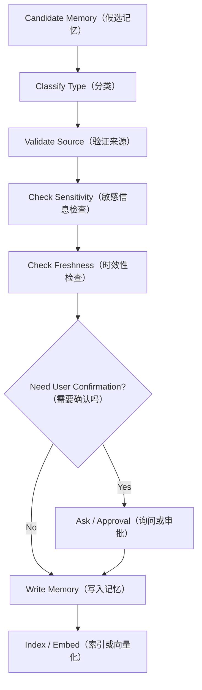

# Day 27：Memory Write Policy（记忆写入策略）

> 所属周：Week 04 - Context Engineering 与 Memory  
> 建议节奏：Busy Mode（15-20 分钟）/ Standard Mode（45 分钟）/ Deep Mode（90 分钟）  
> 导航：[`本周目录`](README.md) / [`总目录`](../README.md) / [`本周 QA`](week-04-qa-summary.md)  
> 上一天：[`Day 26`](../week-04-context-management/day-26-prompt-cache.md) ｜ 下一天：[`Day 28`](../week-04-context-management/day-28-week-04-review.md)

## 1. 今日核心问题

> 什么信息可以长期记住，什么必须忘掉？

今天的学习目标不是背概念，而是把 `Memory Write Policy（记忆写入策略）` 放到 Agent Runtime 的工程链路里理解。

学完今天，你应该能做到：

- 用自己的话解释：Working Memory、Episodic Memory、Semantic Memory、Memory Pollution。
- 说明这个主题在 Runtime 中属于哪个模块。
- 说出至少 3 个工程风险。
- 用 Java / Spring Boot 后端系统做一个类比。
- 完成一个可以沉淀到项目设计里的小输出。

## 2. 今日不追求掌握的内容

今天先不追求完整实现生产系统，也不追求读论文。重点是建立工程判断：

- 这个模块解决什么问题。
- 它和 Runtime 其他模块如何协作。
- 如果设计不好，会造成什么线上风险。
- 最小可行版本应该做到什么程度。

## 3. 学习时间安排

| 模式 | 时间 | 做什么 |
|------|------|--------|
| Busy Mode | 15-20 分钟 | 阅读第 4、5、8 节，完成 2 个自测问题 |
| Standard Mode | 45 分钟 | 完整阅读，写 3 条要点和一个后端类比 |
| Deep Mode | 90 分钟 | 完成实践任务，补充类图、表结构或流程图 |

## 4. 最小心智模型

可以先记住这句话：

> 什么信息可以长期记住，什么必须忘掉？ 这个问题的答案，最终都要落到“如何让 Agent 更可控、更准确、更可验证”。

从 Runtime 视角看，今天主题和下面链路有关：

```text
User Goal
-> Context / State
-> Model Decision
-> Runtime Control
-> Tool / Memory / Permission / Trace
-> Observation
-> Next Step
```

不要只问“模型会不会”，要问：

- Runtime 给模型看了什么？
- 模型输出如何被解析和校验？
- 工具或状态是否真的发生变化？
- 失败时有没有记录和恢复？
- 最终结论有没有证据？

## 5. 核心概念拆解

### 5.1 Working Memory（工作记忆）

当前任务临时信息。

进一步理解这个概念时，建议追问三件事：

- 它解决的问题：避免 Agent 在缺少结构、缺少证据或缺少边界的情况下行动。
- 工程落点：它通常会落到接口、Schema、状态字段、策略规则、日志字段或执行流程中。
- 忽略后果：模型可能继续基于错误前提行动，造成假成功、越权、上下文污染或不可追踪失败。

### 5.2 Episodic Memory（情景记忆）

历史事件和执行经历。

进一步理解这个概念时，建议追问三件事：

- 它解决的问题：避免 Agent 在缺少结构、缺少证据或缺少边界的情况下行动。
- 工程落点：它通常会落到接口、Schema、状态字段、策略规则、日志字段或执行流程中。
- 忽略后果：模型可能继续基于错误前提行动，造成假成功、越权、上下文污染或不可追踪失败。

### 5.3 Semantic Memory（语义记忆）

长期稳定知识和偏好。

进一步理解这个概念时，建议追问三件事：

- 它解决的问题：避免 Agent 在缺少结构、缺少证据或缺少边界的情况下行动。
- 工程落点：它通常会落到接口、Schema、状态字段、策略规则、日志字段或执行流程中。
- 忽略后果：模型可能继续基于错误前提行动，造成假成功、越权、上下文污染或不可追踪失败。

### 5.4 Memory Pollution（记忆污染）

错误或临时信息被长期保留。

进一步理解这个概念时，建议追问三件事：

- 它解决的问题：避免 Agent 在缺少结构、缺少证据或缺少边界的情况下行动。
- 工程落点：它通常会落到接口、Schema、状态字段、策略规则、日志字段或执行流程中。
- 忽略后果：模型可能继续基于错误前提行动，造成假成功、越权、上下文污染或不可追踪失败。

## 6. 工程含义

今天主题的工程含义可以分成 5 层：

1. **边界**：明确模型、Runtime、工具、状态、用户各自负责什么。
2. **结构**：用接口、Schema、状态机、表结构或日志结构把能力固定下来。
3. **安全**：对高风险动作设置权限、审批、沙箱或只读限制。
4. **可恢复**：失败后能重试、降级、停止或交给用户处理。
5. **可验证**：最终结论必须能从工具结果、日志、状态或测试中找到证据。

## 7. Java / 后端类比

像数据库主数据维护：只有稳定、确认、可复用的信息才应该入库。

你可以用下面的问题检查自己是否真的理解：

- 如果把它做成一个 Spring Bean，它的输入输出是什么？
- 它应该依赖哪些组件，不应该依赖哪些组件？
- 它的失败异常应该抛出、重试、降级还是记录？
- 它会不会影响数据库、Redis、MQ、ES 或外部系统状态？

## 8. 设计清单

学习今天主题时，至少检查这些设计点：

- 是否有清晰的输入和输出。
- 是否有结构化数据，而不是只靠自然语言。
- 是否能被记录到 Transcript / Trace。
- 是否能区分成功、失败、拒绝、超时和部分成功。
- 是否需要权限控制。
- 是否需要幂等或重试。
- 是否会污染上下文或 Memory。
- 是否能被测试和回放。

## 9. 今日实践任务

写 8 条 Memory 写入规则和 8 条禁止写入规则。

建议输出格式：

```text
目标：
输入：
输出：
核心流程：
异常情况：
需要记录的日志：
需要用户确认的场景：
```

## 10. 自测问题与参考答案

### Q1：什么信息可以长期记住，什么必须忘掉？

先抓住本质：当前任务临时信息。 这个问题要落到工程实现上，而不是停留在术语解释。

### Q2：今天主题在 Java 后端里可以类比成什么？

像数据库主数据维护：只有稳定、确认、可复用的信息才应该入库。

### Q3：今天最容易出错的工程点是什么？

把模型输出当成可信事实或可直接执行动作。正确做法是让 Runtime 做校验、记录、权限和验证。

### Q4：学完今天应该产出什么？

写 8 条 Memory 写入规则和 8 条禁止写入规则。

## 11. 常见坑

- 只会解释概念，但说不出它在 Runtime 里的位置。
- 只相信模型输出，没有结构化校验。
- 没有考虑失败、超时、权限和审计。
- 把所有信息都塞进上下文，导致模型被噪声干扰。
- 没有最终验证，却在回答里声称任务完成。

## 12. 今日总结

今天真正要记住的是：

> Agent 工程化不是让模型“更自由”，而是让模型的推理能力被 Runtime 安全、结构化、可追踪地使用。

## 13. 补充深度学习内容

### 13.1 Memory 不是“什么都记住”

`Memory（记忆）` 是 Agent 在当前请求之外保留信息的能力。

它的价值是：

- 记住用户长期偏好。
- 记住项目稳定规则。
- 复用历史经验。
- 支持长任务恢复。
- 降低重复询问。

它的风险也很大：

- 记住错误信息。
- 记住过期状态。
- 记住敏感数据。
- 把一次性事件当成长期规则。
- 让模型基于旧记忆做错误决策。

所以 Memory 的核心不是“写入能力”，而是 `Memory Write Policy（记忆写入策略）`。

### 13.2 三类 Memory

| 类型 | 中文 | 生命周期 | 示例 |
|------|------|----------|------|
| Working Memory | 工作记忆 | 当前任务内 | 当前计划、临时变量、当前文件 |
| Episodic Memory | 情景记忆 | 历史事件 | 上次修复过某个测试失败 |
| Semantic Memory | 语义记忆 | 长期知识 | 用户偏好 Java 风格、项目架构规则 |

工程上建议分开存储，不要混在一张“memory”表里只靠文本区分。

### 13.3 什么可以写入长期 Memory

适合写入：

- 用户明确确认的长期偏好。
- 稳定项目规则。
- 可复用的技术决策。
- 已验证的业务规则。
- 长期有效的工作流约定。

不适合写入：

- 一次性日志。
- 临时错误。
- 未验证假设。
- 密码、token、cookie。
- 某次工具调用的完整输出。
- 可能很快变化的状态。

判断标准：

```text
是否长期有效？
是否已被确认或验证？
是否未来任务会复用？
是否安全合规？
是否有来源和更新时间？
```

如果有一个问题答不上来，就不要自动写入长期 Memory。

### 13.4 Memory 写入流程



关键点：

- Memory 写入应被记录到 Trace。
- 高影响记忆需要用户确认。
- Memory 应有过期时间或版本。
- Memory 应能被删除、更新、审计。

### 13.5 数据表设计建议

```sql
CREATE TABLE agent_memory (
    id BIGINT PRIMARY KEY,
    tenant_id BIGINT NOT NULL,
    user_id BIGINT NOT NULL,
    memory_type VARCHAR(32) NOT NULL,
    scope_type VARCHAR(32) NOT NULL,
    scope_id VARCHAR(128) NOT NULL,
    content TEXT NOT NULL,
    source_type VARCHAR(32) NOT NULL,
    source_ref VARCHAR(255),
    confidence DECIMAL(5,4),
    status VARCHAR(32) NOT NULL,
    expires_at DATETIME NULL,
    created_at DATETIME NOT NULL,
    updated_at DATETIME NOT NULL
);
```

字段解释：

- `memory_type`：working / episodic / semantic。
- `scope_type`：user / repo / project / tenant。
- `source_ref`：来源引用，方便追溯。
- `confidence`：可信度，不是事实真理值。
- `status`：active / deprecated / deleted。
- `expires_at`：避免永久污染。

### 13.6 Memory 与 RAG 的区别

`RAG（Retrieval-Augmented Generation，检索增强生成）` 通常检索外部知识库。

`Memory` 更偏 Agent 自己沉淀的个性化或任务历史信息。

区别：

| 维度 | RAG | Memory |
|------|-----|--------|
| 来源 | 文档、知识库、代码库 | 用户偏好、历史任务、经验 |
| 更新 | 文档更新驱动 | 交互和任务执行驱动 |
| 风险 | 召回错误、引用错误 | 长期污染、隐私风险 |
| 关键能力 | chunk、embedding、rerank、citation | write policy、expiry、scope、audit |

### 13.7 今日输出模板：Memory 写入规则

```text
可自动写入：
- 用户明确说“以后都按这个规则”
- 项目 AGENTS.md 中稳定规则摘要
- 已完成任务的高层经验总结

需要确认后写入：
- 用户工作偏好
- 团队流程约定
- 可能影响后续执行的项目规则

禁止写入：
- token / password / cookie
- 一次性日志
- 未验证错误原因
- 用户临时情绪表达
- 敏感生产数据

写入字段：
- content
- memoryType
- scope
- sourceRef
- confidence
- expiresAt
```

## 今日笔记

### 预习问题

- 什么信息可以长期记住，什么必须忘掉？
- `Memory Write Policy（记忆写入策略）` 在 Agent Runtime 的哪个模块落地？
- 如果忽略 `Memory Write Policy（记忆写入策略）`，会造成什么工程风险？

### 主动回忆

1. 今日主题是 `Memory Write Policy（记忆写入策略）`，核心问题是：什么信息可以长期记住，什么必须忘掉？
2. 关键概念包括：Working Memory（工作记忆）、Episodic Memory（情景记忆）、Semantic Memory（语义记忆）。
3. 工程判断要落到 Runtime：谁负责决策、谁负责执行、谁负责记录、谁负责验证。

### 费曼输出

用 5 句话给一个 Java 后端同事讲清楚今天主题：

1. `Memory Write Policy（记忆写入策略）` 不是孤立术语，它要解决的是 Agent 从“会回答”走向“可执行、可控制、可验证”的问题。
2. 模型可以参与推理和生成候选动作，但 Runtime 必须负责边界、状态、权限、工具执行和审计。
3. 如果没有结构化设计，Agent 很容易出现假成功、重复行动、上下文污染或不可追踪失败。
4. 后端视角下，可以把它类比成服务编排、状态机、权限网关、审计日志或可观测性体系中的一个环节。
5. 学完今天，至少要能说清楚它的输入、输出、失败模式、验证方式和最小实现方案。

### 3 条要点

- Working Memory（工作记忆）：先理解定义，再追问它在 Runtime 中由哪个组件负责。
- Episodic Memory（情景记忆）：不要只停留在 prompt 层，要落实到 Schema、状态、策略、日志或流程里。
- Agent 工程化不是让模型“更自由”，而是让模型的推理能力被 Runtime 安全、结构化、可追踪地使用。

### Java / 后端类比

- 像查询系统做数据选择和缓存：不是数据越多越好，而是相关、可信、最新、可追溯最重要。

### 今日小练习

**练习目标**：把 `Memory Write Policy（记忆写入策略）` 从概念理解推进到可落地的工程设计。

**任务说明**：写一份 Memory 写入规则，区分自动写入、确认后写入和禁止写入。

**操作步骤**：

1. 先用 3 句话写清楚这个练习要解决的核心问题。
2. 列出涉及的关键概念：`Working Memory（工作记忆）`、`Episodic Memory（情景记忆）`、`Semantic Memory（语义记忆）`。
3. 写出最小数据结构或流程图，优先使用表格、伪代码或 Mermaid。
4. 补充异常情况：失败、超时、权限不足、输入不完整、结果无法验证。
5. 写出最终输出物，并说明它如何被 Runtime 记录、验证或复用。

**建议输出物**：

```text
标题：Memory Write Policy（记忆写入策略） 小练习
目标：
输入：
核心流程：
关键数据结构：
失败场景：
验证方式：
还需要补充的问题：
```

**自检标准**：

- 能说清楚这个设计属于 Runtime 的哪个模块。
- 能区分模型建议、Runtime 决策、工具执行和状态变化。
- 至少包含 1 个失败场景和 1 个验证方式。
- 输出物能在 10 分钟内复述给一个 Java 后端同事。

### 还没想清楚的问题

- `Memory Write Policy（记忆写入策略）` 的最小可用实现需要哪些类、字段或接口？
- 这个能力上线后，失败时我应该通过哪些日志、Trace 或状态字段定位问题？

### 间隔复习

- D+1：不看资料，用 3 句话复述 `Memory Write Policy（记忆写入策略）` 的核心思想。
- D+3：补画一张小图，标出它和 Runtime 其他模块的关系。
- D+7：用一个 Java 后端场景重新解释它，并检查是否能说出风险和验证方式。
