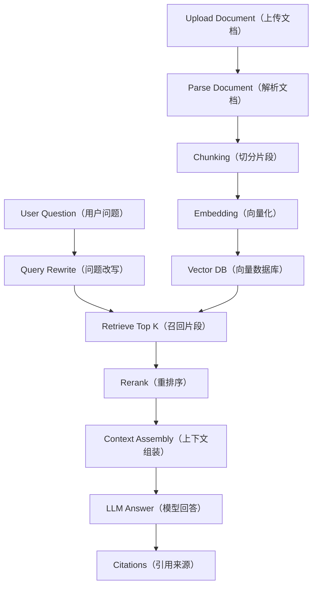
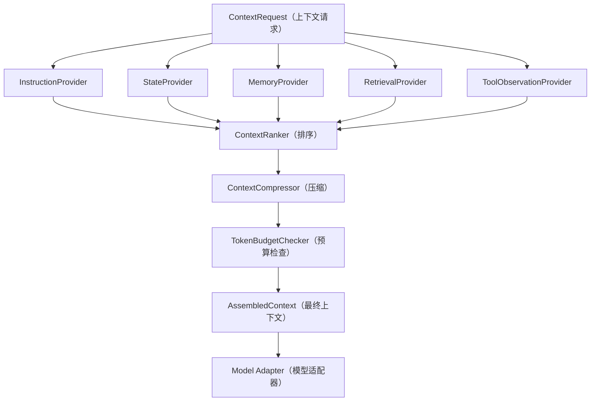

# Day 28：Week 4 复盘：知识库 Agent 上下文系统

> 所属周：Week 04 - Context Engineering 与 Memory  
> 建议节奏：Busy Mode（15-20 分钟）/ Standard Mode（45 分钟）/ Deep Mode（90 分钟）  
> 导航：[`本周目录`](README.md) / [`总目录`](../README.md) / [`本周 QA`](week-04-qa-summary.md)  
> 上一天：[`Day 27`](../week-04-context-management/day-27-memory-write-policy.md) ｜ 下一天：[`Day 29`](../week-05-permission-system/day-29-ai-action-authorization.md)

## 1. 今日核心问题

> 如何设计一个可引用来源的个人知识库 Agent？

今天的学习目标不是背概念，而是把 `Week 4 复盘：知识库 Agent 上下文系统` 放到 Agent Runtime 的工程链路里理解。

学完今天，你应该能做到：

- 用自己的话解释：RAG、Embedding、Chunk、Source Citation。
- 说明这个主题在 Runtime 中属于哪个模块。
- 说出至少 3 个工程风险。
- 用 Java / Spring Boot 后端系统做一个类比。
- 完成一个可以沉淀到项目设计里的小输出。

## 2. 今日不追求掌握的内容

今天先不追求完整实现生产系统，也不追求读论文。重点是建立工程判断：

- 这个模块解决什么问题。
- 它和 Runtime 其他模块如何协作。
- 如果设计不好，会造成什么线上风险。
- 最小可行版本应该做到什么程度。

## 3. 学习时间安排

| 模式 | 时间 | 做什么 |
|------|------|--------|
| Busy Mode | 15-20 分钟 | 阅读第 4、5、8 节，完成 2 个自测问题 |
| Standard Mode | 45 分钟 | 完整阅读，写 3 条要点和一个后端类比 |
| Deep Mode | 90 分钟 | 完成实践任务，补充类图、表结构或流程图 |

## 4. 最小心智模型

可以先记住这句话：

> 如何设计一个可引用来源的个人知识库 Agent？ 这个问题的答案，最终都要落到“如何让 Agent 更可控、更准确、更可验证”。

从 Runtime 视角看，今天主题和下面链路有关：

```text
User Goal
-> Context / State
-> Model Decision
-> Runtime Control
-> Tool / Memory / Permission / Trace
-> Observation
-> Next Step
```

不要只问“模型会不会”，要问：

- Runtime 给模型看了什么？
- 模型输出如何被解析和校验？
- 工具或状态是否真的发生变化？
- 失败时有没有记录和恢复？
- 最终结论有没有证据？

## 5. 核心概念拆解

### 5.1 RAG（检索增强生成）

先检索相关资料，再基于资料回答。

进一步理解这个概念时，建议追问三件事：

- 它解决的问题：避免 Agent 在缺少结构、缺少证据或缺少边界的情况下行动。
- 工程落点：它通常会落到接口、Schema、状态字段、策略规则、日志字段或执行流程中。
- 忽略后果：模型可能继续基于错误前提行动，造成假成功、越权、上下文污染或不可追踪失败。

### 5.2 Embedding（向量化）

把文本转为向量用于语义检索。

进一步理解这个概念时，建议追问三件事：

- 它解决的问题：避免 Agent 在缺少结构、缺少证据或缺少边界的情况下行动。
- 工程落点：它通常会落到接口、Schema、状态字段、策略规则、日志字段或执行流程中。
- 忽略后果：模型可能继续基于错误前提行动，造成假成功、越权、上下文污染或不可追踪失败。

### 5.3 Chunk（文本块）

文档切分后的检索单元。

进一步理解这个概念时，建议追问三件事：

- 它解决的问题：避免 Agent 在缺少结构、缺少证据或缺少边界的情况下行动。
- 工程落点：它通常会落到接口、Schema、状态字段、策略规则、日志字段或执行流程中。
- 忽略后果：模型可能继续基于错误前提行动，造成假成功、越权、上下文污染或不可追踪失败。

### 5.4 Source Citation（来源引用）

回答必须能追溯来源。

进一步理解这个概念时，建议追问三件事：

- 它解决的问题：避免 Agent 在缺少结构、缺少证据或缺少边界的情况下行动。
- 工程落点：它通常会落到接口、Schema、状态字段、策略规则、日志字段或执行流程中。
- 忽略后果：模型可能继续基于错误前提行动，造成假成功、越权、上下文污染或不可追踪失败。

## 6. 工程含义

今天主题的工程含义可以分成 5 层：

1. **边界**：明确模型、Runtime、工具、状态、用户各自负责什么。
2. **结构**：用接口、Schema、状态机、表结构或日志结构把能力固定下来。
3. **安全**：对高风险动作设置权限、审批、沙箱或只读限制。
4. **可恢复**：失败后能重试、降级、停止或交给用户处理。
5. **可验证**：最终结论必须能从工具结果、日志、状态或测试中找到证据。

## 7. Java / 后端类比

像 ES 搜索 + 业务聚合：先召回相关文档，再组织给用户看的答案。

你可以用下面的问题检查自己是否真的理解：

- 如果把它做成一个 Spring Bean，它的输入输出是什么？
- 它应该依赖哪些组件，不应该依赖哪些组件？
- 它的失败异常应该抛出、重试、降级还是记录？
- 它会不会影响数据库、Redis、MQ、ES 或外部系统状态？

## 8. 设计清单

学习今天主题时，至少检查这些设计点：

- 是否有清晰的输入和输出。
- 是否有结构化数据，而不是只靠自然语言。
- 是否能被记录到 Transcript / Trace。
- 是否能区分成功、失败、拒绝、超时和部分成功。
- 是否需要权限控制。
- 是否需要幂等或重试。
- 是否会污染上下文或 Memory。
- 是否能被测试和回放。

## 9. 今日实践任务

输出知识库 Agent 的 RAG 架构图。

建议输出格式：

```text
目标：
输入：
输出：
核心流程：
异常情况：
需要记录的日志：
需要用户确认的场景：
```

## 10. 自测问题与参考答案

### Q1：如何设计一个可引用来源的个人知识库 Agent？

先抓住本质：先检索相关资料，再基于资料回答。 这个问题要落到工程实现上，而不是停留在术语解释。

### Q2：今天主题在 Java 后端里可以类比成什么？

像 ES 搜索 + 业务聚合：先召回相关文档，再组织给用户看的答案。

### Q3：今天最容易出错的工程点是什么？

把模型输出当成可信事实或可直接执行动作。正确做法是让 Runtime 做校验、记录、权限和验证。

### Q4：学完今天应该产出什么？

输出知识库 Agent 的 RAG 架构图。

## 11. 常见坑

- 只会解释概念，但说不出它在 Runtime 里的位置。
- 只相信模型输出，没有结构化校验。
- 没有考虑失败、超时、权限和审计。
- 把所有信息都塞进上下文，导致模型被噪声干扰。
- 没有最终验证，却在回答里声称任务完成。

## 12. 今日总结

今天真正要记住的是：

> Agent 工程化不是让模型“更自由”，而是让模型的推理能力被 Runtime 安全、结构化、可追踪地使用。

## 13. 补充深度学习内容

### 13.1 第四周主线

第四周的核心不是“怎么写更好的 prompt”，而是：

> 如何让模型在每一步只看到必要、可信、最新、可追溯的信息。

本周知识链路：

```text
Context Window
-> Token Budget
-> Context Pollution Control
-> Tool Result Compression
-> Context Compaction
-> Prompt Cache
-> Memory Write Policy
-> RAG Context Assembly
```

如果你未来要实现 Agent Runtime，第四周对应的就是 `Context Assembly（上下文组装）` 和 `Memory Store（记忆存储）` 两个核心模块。

### 13.2 个人知识库 Agent 的 RAG 流程



关键点：

- 文档原文不等于上下文。
- 召回片段不等于最终证据。
- 答案必须带引用来源。
- 无来源的结论要降级表达。
- 用户偏好和文档知识要分开管理。

### 13.3 Context Assembly 优先级

一个可落地的优先级：

```text
1. System / Safety Rules
2. Current User Goal
3. Current Task State
4. Verified Tool Observations
5. Retrieved Evidence with Source
6. Relevant Memory
7. Conversation Summary
8. Optional Background
```

低优先级内容在 token 不够时先被压缩或丢弃。

### 13.4 Context Block 设计

建议所有上下文都先转成 `ContextBlock`：

```java
public class ContextBlock {
    private String id;
    private String type;
    private String content;
    private String source;
    private String sourceRef;
    private int priority;
    private double relevanceScore;
    private double trustScore;
    private Instant createdAt;
    private int tokenEstimate;
}
```

然后由 `ContextAssembler` 排序、过滤、压缩、装配。

这比直接拼 prompt 字符串更可维护，也更容易测试。

### 13.5 第四周最小工程设计

你应该能画出这个模块：



### 13.6 本周复盘问题

请用自己的话回答：

1. 为什么 Context Engineering 比 Prompt Engineering 更接近工程核心？
2. 工具结果很长时，为什么不能完整塞回上下文？
3. Memory 写入为什么必须克制？
4. RAG 为什么必须保留引用来源？
5. 如何区分事实、假设、旧状态和外部不可信内容？
6. 如果上下文超限，你会按什么顺序裁剪？
7. Prompt Cache 的最大风险是什么？
8. Context Compaction 为什么不能替代 Transcript？

### 13.7 本周最终输出

建议你输出一个 `context-system-design.md`，内容包括：

```text
1. Context Block 数据结构
2. Token Budget 策略
3. 上下文污染治理规则
4. 工具结果压缩规则
5. Context Compaction 模板
6. Prompt Cache 分层
7. Memory 写入策略
8. RAG 引用来源设计
```

## 今日笔记

### 预习问题

- 如何设计一个可引用来源的个人知识库 Agent？
- `Week 4 复盘：知识库 Agent 上下文系统` 在 Agent Runtime 的哪个模块落地？
- 如果忽略 `Week 4 复盘：知识库 Agent 上下文系统`，会造成什么工程风险？

### 主动回忆

1. 今日主题是 `Week 4 复盘：知识库 Agent 上下文系统`，核心问题是：如何设计一个可引用来源的个人知识库 Agent？
2. 关键概念包括：RAG（检索增强生成）、Embedding（向量化）、Chunk（文本块）。
3. 工程判断要落到 Runtime：谁负责决策、谁负责执行、谁负责记录、谁负责验证。

### 费曼输出

用 5 句话给一个 Java 后端同事讲清楚今天主题：

1. `Week 4 复盘：知识库 Agent 上下文系统` 不是孤立术语，它要解决的是 Agent 从“会回答”走向“可执行、可控制、可验证”的问题。
2. 模型可以参与推理和生成候选动作，但 Runtime 必须负责边界、状态、权限、工具执行和审计。
3. 如果没有结构化设计，Agent 很容易出现假成功、重复行动、上下文污染或不可追踪失败。
4. 后端视角下，可以把它类比成服务编排、状态机、权限网关、审计日志或可观测性体系中的一个环节。
5. 学完今天，至少要能说清楚它的输入、输出、失败模式、验证方式和最小实现方案。

### 3 条要点

- RAG（检索增强生成）：先理解定义，再追问它在 Runtime 中由哪个组件负责。
- Embedding（向量化）：不要只停留在 prompt 层，要落实到 Schema、状态、策略、日志或流程里。
- Agent 工程化不是让模型“更自由”，而是让模型的推理能力被 Runtime 安全、结构化、可追踪地使用。

### Java / 后端类比

- 像查询系统做数据选择和缓存：不是数据越多越好，而是相关、可信、最新、可追溯最重要。

### 今日小练习

**练习目标**：把 `Week 4 复盘：知识库 Agent 上下文系统` 从概念理解推进到可落地的工程设计。

**任务说明**：画一个带引用来源的 RAG Context Assembly 流程图。

**操作步骤**：

1. 先用 3 句话写清楚这个练习要解决的核心问题。
2. 列出涉及的关键概念：`RAG（检索增强生成）`、`Embedding（向量化）`、`Chunk（文本块）`。
3. 写出最小数据结构或流程图，优先使用表格、伪代码或 Mermaid。
4. 补充异常情况：失败、超时、权限不足、输入不完整、结果无法验证。
5. 写出最终输出物，并说明它如何被 Runtime 记录、验证或复用。

**建议输出物**：

```text
标题：Week 4 复盘：知识库 Agent 上下文系统 小练习
目标：
输入：
核心流程：
关键数据结构：
失败场景：
验证方式：
还需要补充的问题：
```

**自检标准**：

- 能说清楚这个设计属于 Runtime 的哪个模块。
- 能区分模型建议、Runtime 决策、工具执行和状态变化。
- 至少包含 1 个失败场景和 1 个验证方式。
- 输出物能在 10 分钟内复述给一个 Java 后端同事。

### 还没想清楚的问题

- `Week 4 复盘：知识库 Agent 上下文系统` 的最小可用实现需要哪些类、字段或接口？
- 这个能力上线后，失败时我应该通过哪些日志、Trace 或状态字段定位问题？

### 间隔复习

- D+1：不看资料，用 3 句话复述 `Week 4 复盘：知识库 Agent 上下文系统` 的核心思想。
- D+3：补画一张小图，标出它和 Runtime 其他模块的关系。
- D+7：用一个 Java 后端场景重新解释它，并检查是否能说出风险和验证方式。
