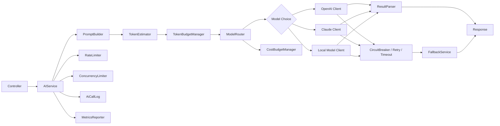
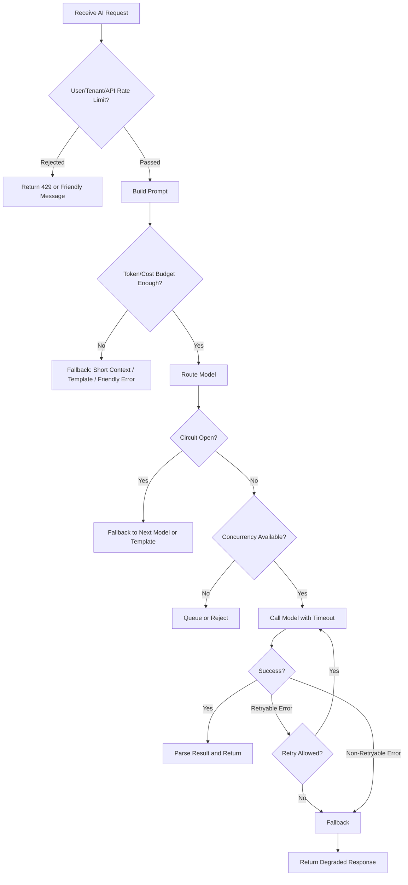
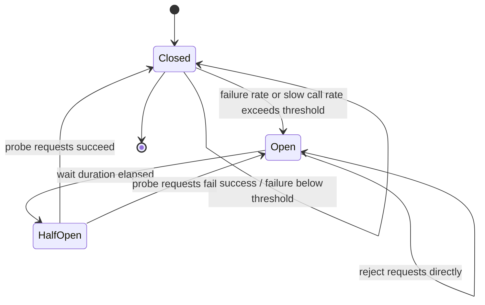
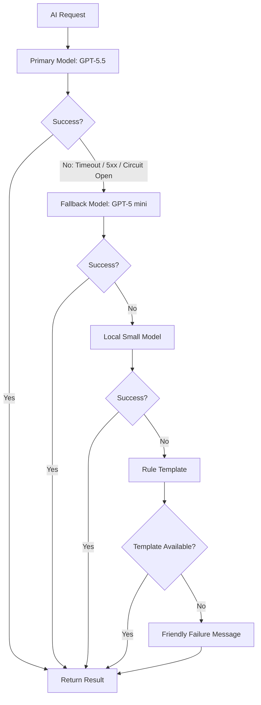

# AI 推理调用稳定性治理：从原理到实战

> 适用对象：Java 后端开发、后端架构师、AI 应用服务开发者  
> 技术栈参考：Java 8、Spring Boot 2.x、Redis、Resilience4j、Sentinel、Micrometer/Prometheus、OpenFeign/OkHttp/WebClient

---

## 目录

1. [业务背景：为什么 AI 推理调用更需要稳定性治理](#1-业务背景为什么-ai-推理调用更需要稳定性治理)
2. [核心治理目标](#2-核心治理目标)
3. [核心概念详解](#3-核心概念详解)
4. [AI 推理调用链路中的治理点](#4-ai-推理调用链路中的治理点)
5. [重点一：AI 推理限流设计](#5-重点一ai-推理限流设计)
6. [重点二：AI 推理降级设计](#6-重点二ai-推理降级设计)
7. [重点三：AI 推理熔断设计](#7-重点三ai-推理熔断设计)
8. [Retry 重试策略设计](#8-retry-重试策略设计)
9. [Java 工程落地方案](#9-java-工程落地方案)
10. [Mermaid 架构图](#10-mermaid-架构图)
11. [生产环境最佳实践 Checklist](#11-生产环境最佳实践-checklist)
12. [推荐默认参数](#12-推荐默认参数)
13. [AI 推理调用稳定性治理学习路线图](#13-ai-推理调用稳定性治理学习路线图)

---

# 1. 业务背景：为什么 AI 推理调用更需要稳定性治理

普通 HTTP/RPC 调用通常有以下特征：

- 响应时间相对稳定；
- 资源成本相对固定；
- 输入输出大小通常可控；
- 业务结果大多是确定性的；
- 重试、超时、限流策略比较成熟。

但 AI 推理调用不一样。它既是一次远程调用，也是一次高成本计算任务，还可能涉及上下文拼接、Token 消耗、模型路由、结果解析、内容安全和成本预算。

## 1.1 AI 推理调用的特殊风险

| 风险点 | 说明 | 生产影响 |
|---|---|---|
| 模型响应慢 | 大模型推理耗时可能从几秒到几十秒 | 请求线程被占满，用户等待变长 |
| Token 成本高 | 输入越长、输出越长，成本越高 | 少量异常请求也可能造成明显费用浪费 |
| 上游服务可能限流 | 第三方模型服务通常有 RPM/TPM/并发限制 | 高峰期大量 429，业务不可用 |
| 大模型偶发超时 | 网络、排队、模型负载都会导致超时 | 请求堆积，线程池耗尽 |
| 并发不可控 | 用户可能批量提交文档、日志、客服会话 | 瞬时流量放大，压垮 AI 调用层 |
| 输入输出长度不稳定 | 一篇文档、一个日志、一个多轮会话差异巨大 | Token 预算、响应时间、成本都不可预测 |
| 不同模型价格和能力差异大 | 高级模型效果好但贵，便宜模型快但能力弱 | 需要按场景路由和降级 |
| 用户请求容易堆积 | AI 请求慢，队列更容易变长 | 排队延迟变高，最终雪崩 |
| AI 结果不是强确定性 | 同样输入可能产生不同输出 | 重试不一定得到相同结果，还可能增加成本 |

## 1.2 AI 调用失败不是简单的“接口失败”

在普通接口里，失败通常是：

```text
调用失败 -> 返回错误 -> 用户重试
```

在 AI 推理里，失败可能有很多层：

```text
Prompt 太长
Token 预算不足
租户额度耗尽
模型被上游限流
模型响应超时
结果 JSON 解析失败
内容不符合业务约束
输出质量低于预期
```

所以 AI 推理服务不能只做一个简单的 `HttpClient.post()`，而应该设计成一个完整的“推理网关 / 推理治理层”。

---

# 2. 核心治理目标

AI 推理调用稳定性治理的目标不是“永远不失败”，而是：

1. **保护系统**：防止慢调用、重试风暴、队列堆积拖垮主业务。
2. **保护用户体验**：失败时有可接受的降级结果，而不是长时间卡死。
3. **保护预算**：控制 Token、模型、租户、用户、任务维度的成本。
4. **保护上游模型服务**：不要在上游异常时继续施压。
5. **保护可观测性**：每一次 AI 调用都能追踪、分析、复盘。
6. **保护业务正确性**：不同业务场景选择不同模型、不同超时、不同降级策略。

核心原则：

```text
先限流，再排队；
先预算，再调用；
先超时，再重试；
先熔断，再降级；
先脱敏，再记录；
先监控，再优化。
```

---

# 3. 核心概念详解

## 3.1 限流 Rate Limiting

### 定义

限流是指限制某个维度在单位时间内可以发起的请求数量、Token 数、并发数或成本额度。

常见限流维度：

- 用户级限流；
- 租户级限流；
- 接口级限流；
- 模型级限流；
- Token 级限流；
- 成本级限流；
- 并发级限流；
- 队列长度限流。

### 解决什么问题

限流主要解决“流量进入过快”的问题。

在 AI 推理调用中，限流可以防止：

- 用户刷接口；
- 某个租户打爆模型额度；
- 高峰期 AI 请求拖垮业务线程池；
- 上游模型服务返回大量 429；
- Token 成本失控。

### 适合什么场景

- 高频用户请求；
- 多租户 SaaS；
- 模型服务有 RPM/TPM 限制；
- AI 成本需要精细控制；
- 文档总结、日志分析、客服生成等容易批量触发的场景。

### 不适合什么场景

- 低频管理后台操作，限流过严反而影响体验；
- 强实时核心交易链路，不应依赖 AI 实时调用；
- 明确需要全量处理的离线任务，应该用队列和批处理，而不是简单拒绝。

### 常见错误用法

| 错误 | 问题 |
|---|---|
| 只按 QPS 限流 | AI 成本主要和 Token、模型、输出长度有关，QPS 不够 |
| 只做本地限流 | 多实例部署下总流量仍可能超限 |
| 只限接口，不限模型 | 某个贵模型可能被打爆 |
| 失败后无限重试 | 限流被重试绕过，形成重试风暴 |
| 限流失败直接报 500 | 应返回明确的 429 或友好提示 |

### 在 AI 推理调用中的特殊点

AI 限流不能只看请求数，还要看：

```text
预计输入 Token
预计输出 Token
模型单价
用户等级
租户预算
任务优先级
当前模型排队情况
当前并发数
```

例如：

```text
请求 A：生成一句商品文案，300 tokens
请求 B：总结 10 万字文档，100000 tokens
```

这两个请求的 QPS 都是 1，但资源消耗完全不同。

### Java 后端实现思路

- 单机限流：`Semaphore`、Guava RateLimiter、Resilience4j RateLimiter；
- 分布式限流：Redis + Lua、Sentinel 集群流控、网关层限流；
- Token 限流：Prompt 构建前估算 Token；
- 成本限流：调用前预扣预算，调用后按实际 Token 修正；
- 并发限流：模型维度、租户维度分别使用信号量。

---

## 3.2 降级 Degradation / Fallback

### 定义

降级是指当主路径不可用、成本过高或延迟过大时，使用较低成本、较低质量或较弱功能的备选方案返回结果。

### 解决什么问题

降级主要解决“服务不可用时如何保底”的问题。

AI 场景下，降级可以避免用户看到：

```text
系统繁忙，请稍后再试
```

而是返回：

```text
当前高级模型繁忙，已使用快速模型生成简版结果。
```

### 适合什么场景

- 商品文案生成；
- 客服回复建议；
- 文档摘要；
- 日志初步分析；
- 推荐类、辅助类、非强事务类功能。

### 不适合什么场景

- 法务、医疗、金融等高风险回答；
- 需要强准确性的业务决策；
- AI 结果直接触发资金、订单、库存变更；
- 低质量结果会造成严重误导的场景。

### 常见错误用法

| 错误 | 问题 |
|---|---|
| 降级不提示用户 | 用户误以为还是高级模型结果 |
| 降级链路过长 | 每一层都调用失败，反而拖慢整体响应 |
| 所有异常都降级 | 参数错误、鉴权失败不应该降级 |
| 降级结果无质量约束 | 返回低质量甚至错误内容 |
| 降级不记录日志 | 后续无法评估降级比例和业务影响 |

### 在 AI 推理调用中的特殊点

AI 降级不只是“返回缓存”，而可以有很多层：

```text
高级模型 -> 便宜模型 -> 本地小模型 -> 规则模板 -> 友好失败提示
```

也可以降级上下文：

```text
完整文档总结 -> 分段摘要 -> 只摘要标题和关键段落 -> 提示用户异步处理
```

### Java 后端实现思路

- 定义 `FallbackService`；
- 每种业务场景定义独立降级策略；
- 降级结果必须带 `degraded=true`、`fallbackLevel`、`fallbackReason`；
- 与熔断器结合，熔断打开后直接进入降级；
- 降级链路要设置总超时，避免降级也拖垮系统。

---

## 3.3 熔断 Circuit Breaker

### 定义

熔断是指当某个依赖服务错误率、慢调用比例或超时比例过高时，暂时停止调用该依赖，快速失败或直接走降级。

### 解决什么问题

熔断主要解决“依赖已经异常时，不要继续请求它”的问题。

它可以防止：

- 上游模型服务故障导致本系统线程池被拖死；
- 大量超时请求堆积；
- 重试风暴继续冲击上游；
- 一个模型异常影响整个 AI 平台。

### 适合什么场景

- 第三方模型 API；
- 本地模型服务；
- RAG 检索服务；
- 向量数据库；
- 结果后处理服务；
- 任何可能慢、失败、限流的外部依赖。

### 不适合什么场景

- 本地纯内存计算；
- 极低频调用；
- 没有可替代降级方案且必须强依赖的核心链路；
- 错误样本太少时，不应过早熔断。

### 常见错误用法

| 错误 | 问题 |
|---|---|
| 所有错误都计入熔断 | 400 参数错误不代表上游故障 |
| 熔断窗口太小 | 短暂抖动就熔断，误伤正常请求 |
| 熔断时间太长 | 上游恢复后仍长时间不可用 |
| 半开探测请求太多 | 刚恢复又被打挂 |
| 熔断后没有降级 | 用户只看到失败 |

### 在 AI 推理调用中的特殊点

AI 熔断最好按以下维度拆分：

```text
provider + model + region + tenant + scenario
```

例如：

```text
openai:gpt-5.5:us-east:document-summary
claude:sonnet:global:customer-reply
local:qwen-small:internal:log-analysis
```

不要只做一个全局熔断器，否则一个模型故障会影响所有 AI 功能。

### Java 后端实现思路

- 使用 Resilience4j CircuitBreaker；
- 或使用 Sentinel DegradeRule；
- 每个模型维护独立熔断器；
- 429、502、503、timeout 可以计入熔断；
- 400、401、403、PromptTooLong 通常不计入熔断；
- 熔断打开后由 `FallbackService` 接管。

---

## 3.4 超时 Timeout

### 定义

超时是指为一次调用设置最大等待时间，超过时间后主动中止或返回失败。

### 解决什么问题

超时主要解决“慢请求无限等待”的问题。

在 AI 调用里，如果没有超时：

```text
用户请求一直等待
Tomcat 线程被占用
连接池被占用
业务线程池耗尽
队列持续堆积
最终系统雪崩
```

### 适合什么场景

所有远程调用都应该有超时，AI 调用尤其需要。

### 不适合什么场景

没有“不适合设置超时”的远程调用。区别只在于超时时间长短。

### 常见错误用法

| 错误 | 问题 |
|---|---|
| 不设置超时 | 最危险，容易拖垮线程池 |
| 所有场景同一个超时 | 文案生成和长文档总结耗时不同 |
| 只设置连接超时 | 读超时、整体超时也必须设置 |
| 超时后继续后台运行 | 仍然消耗资源和成本 |
| 超时太长 | 用户体验差，熔断不敏感 |

### 在 AI 推理调用中的特殊点

AI 超时建议分层：

```text
Controller 总超时
AIService 业务超时
ModelClient HTTP 超时
单模型调用超时
降级链路总超时
队列等待超时
```

并按场景配置：

| 场景 | 建议超时 |
|---|---:|
| 商品文案生成 | 10-20 秒 |
| 客服回复生成 | 5-15 秒 |
| 日志分析 | 15-30 秒 |
| 文档总结 | 30-120 秒，长任务建议异步 |

### Java 后端实现思路

- OkHttp/Apache HttpClient 设置 connect/read/write timeout；
- Resilience4j TimeLimiter；
- Future + timeout；
- 异步任务使用队列等待超时；
- Controller 层设置整体响应 SLA。

---

## 3.5 重试 Retry

### 定义

重试是指调用失败后，再次尝试执行同一个请求，以应对临时性故障。

### 解决什么问题

重试主要解决“瞬时失败”的问题，例如网络抖动、连接中断、临时 502/503。

### 适合什么场景

- 网络抖动；
- 连接超时；
- 502 Bad Gateway；
- 503 Service Unavailable；
- 部分 429 临时限流；
- 读类、生成建议类、幂等类任务。

### 不适合什么场景

- 参数错误；
- Prompt 太长；
- 鉴权失败；
- 余额不足；
- 明确业务失败；
- 非幂等任务；
- 已经产生副作用的工具调用。

### 常见错误用法

| 错误 | 问题 |
|---|---|
| 无限重试 | 直接放大故障 |
| 立即重试 | 同一时间大量请求再次冲击上游 |
| 对所有错误重试 | 400、401、余额不足重试无意义 |
| 不加 jitter | 多实例同时重试，形成尖峰 |
| 不计算成本 | 每次重试都可能产生 Token 成本 |

### 在 AI 推理调用中的特殊点

AI 重试要特别谨慎，因为：

- 重试可能产生新的 Token 成本；
- AI 输出不是强确定性，重试结果可能不同；
- 如果是工具调用或写操作，可能产生副作用；
- 重试会和熔断、限流、成本预算相互影响。

### Java 后端实现思路

- Resilience4j Retry；
- 自定义 RetryPolicy；
- 指数退避 + jitter；
- 只对可重试异常重试；
- 重试前检查熔断器和预算；
- 重试次数默认 0-1 次，最多 2 次。

---

## 3.6 隔离 Bulkhead

### 定义

隔离是指将不同业务、不同租户、不同模型、不同资源池拆开，避免某一类请求占满全部资源。

### 解决什么问题

隔离主要解决“局部故障扩散”的问题。

例如：

```text
长文档总结请求占满线程池
导致客服回复、商品文案也不可用
```

### 适合什么场景

- 长任务和短任务混合；
- 高价值租户和普通租户混合；
- 多模型、多供应商；
- 本地模型 GPU 资源有限；
- 有同步任务和异步任务。

### 不适合什么场景

- 流量很小，拆分资源池反而增加复杂度；
- 没有清晰业务优先级时，过早隔离会浪费资源。

### 常见错误用法

| 错误 | 问题 |
|---|---|
| 所有 AI 请求共用一个线程池 | 长任务拖垮短任务 |
| 所有模型共用一个连接池 | 一个模型慢导致全部慢 |
| 队列无限长 | 表面不丢请求，实际延迟雪崩 |
| 高低优先级不区分 | 重要任务被低价值任务挤掉 |

### 在 AI 推理调用中的特殊点

AI 隔离建议至少按以下维度考虑：

```text
短文本生成线程池
长文档总结线程池
客服实时回复线程池
离线批处理线程池
本地模型连接池
第三方模型连接池
高价值租户配额池
普通租户配额池
```

### Java 后端实现思路

- 不同业务使用不同 `ThreadPoolExecutor`；
- 不同模型使用不同 HTTP 连接池；
- Resilience4j Bulkhead / ThreadPoolBulkhead；
- Sentinel 线程数隔离；
- Redis 队列或 MQ 做异步削峰。

---

# 4. AI 推理调用链路中的治理点

## 4.1 典型调用链

```text
Controller
  -> AIService
  -> PromptBuilder
  -> ModelRouter
  -> OpenAI / Claude / 本地模型
  -> ResultParser
  -> Response
```

典型场景：

- 生成一段商品文案；
- 分析一段日志；
- 总结一篇文档；
- 调用 AI 生成客服回复。

## 4.2 各治理能力应该放在哪里

| 治理能力 | 推荐位置 | 原因 |
|---|---|---|
| 用户级限流 | Gateway / Controller / AIService 前置 | 越早拒绝越省资源 |
| 租户级限流 | Gateway / AIService | 多租户配额隔离 |
| 接口级限流 | Controller / Sentinel 资源名 | 不同接口风险不同 |
| Token 预算 | PromptBuilder 前后 | Prompt 构建前估算，构建后校验 |
| 成本预算 | ModelRouter 前 | 模型选择前就要判断预算 |
| 并发限流 | AIService / ModelRouter / AiClient | 控制本系统和模型并发 |
| 队列削峰 | AIService 入口或异步任务层 | 长任务不要占用同步线程 |
| 超时 | Controller、AIService、AiClient | 分层超时，防止无限等待 |
| 重试 | AiClient 内部 | 只对远程瞬时失败重试 |
| 熔断 | AiClient / ModelRouter | 按 provider + model 维度熔断 |
| 降级 | AIService / FallbackService | 主路径失败后统一兜底 |
| 日志 | 全链路 | 必须记录 traceId、模型、Token、成本、耗时 |
| 指标 | AIService / AiClient / FallbackService | 监控成功率、延迟、成本、降级率 |

## 4.3 调用流程建议

```text
1. Controller 接收请求，生成 traceId/requestId
2. 校验用户、租户、接口权限
3. 做用户级/租户级/接口级限流
4. 进入 AIService
5. PromptBuilder 构建 Prompt，并估算 inputTokens
6. TokenBudgetManager 校验 token 和成本预算
7. ModelRouter 选择模型
8. 并发限流 / 队列判断
9. AiClient 带超时、重试、熔断调用模型
10. ResultParser 解析输出
11. 如果失败，FallbackService 按策略降级
12. 记录 AiCallLog
13. 上报 Metrics
14. 返回 Response
```

## 4.4 日志应该记录什么

日志分两类：

### 业务日志

```text
traceId
requestId
userIdHash
tenantId
scenario
apiName
promptVersion
modelProvider
modelName
inputTokens
outputTokens
estimatedCost
actualCost
latencyMs
status
errorCode
fallbackLevel
degraded
retryCount
circuitState
queueWaitMs
```

### 调试日志

```text
promptHash
promptTemplateId
promptTemplateVersion
modelParamsHash
resultLength
parserStatus
upstreamHttpStatus
upstreamRequestId
```

注意：生产环境不要直接记录完整 Prompt、用户隐私、原始文档、客服聊天内容。需要脱敏或只记录 hash。

## 4.5 指标应该监控什么

| 指标 | 类型 | 说明 |
|---|---|---|
| ai_requests_total | Counter | AI 请求总数 |
| ai_success_total | Counter | 成功数 |
| ai_failure_total | Counter | 失败数 |
| ai_latency_ms | Histogram | 总耗时 |
| ai_model_latency_ms | Histogram | 模型调用耗时 |
| ai_input_tokens_total | Counter | 输入 Token 总量 |
| ai_output_tokens_total | Counter | 输出 Token 总量 |
| ai_cost_total | Counter | 成本累计 |
| ai_rate_limited_total | Counter | 被限流次数 |
| ai_retry_total | Counter | 重试次数 |
| ai_circuit_open_total | Counter | 熔断打开次数 |
| ai_fallback_total | Counter | 降级次数 |
| ai_queue_size | Gauge | 当前队列长度 |
| ai_inflight_requests | Gauge | 当前并发数 |
| ai_budget_remaining | Gauge | 剩余额度 |

---

# 5. 重点一：AI 推理限流设计

AI 推理限流要从“请求数限流”升级为“资源消耗限流”。

## 5.1 按用户限流

### 目标

防止单个用户频繁调用 AI 能力。

### 示例规则

```yaml
user:
  copywriting:
    qps: 0.5
    burst: 3
  log-analysis:
    qps: 0.2
    burst: 1
```

### Key 设计

```text
ai:rl:user:{userId}:{scenario}
```

## 5.2 按租户限流

### 目标

防止某个租户打爆公共模型额度。

### 示例规则

```yaml
tenant:
  default:
    qps: 20
    maxConcurrent: 50
    dailyCostUsd: 100
  vip:
    qps: 100
    maxConcurrent: 200
    dailyCostUsd: 1000
```

### Key 设计

```text
ai:rl:tenant:{tenantId}:{scenario}
ai:budget:tenant:{tenantId}:daily:{yyyyMMdd}
```

## 5.3 按接口限流

### 目标

不同接口风险不同，不能一刀切。

例如：

| 接口 | 风险 | 限流策略 |
|---|---|---|
| 商品文案生成 | 短文本，高频 | 用户级 + 接口级 QPS |
| 日志分析 | 输入可能很长 | Token 限流 + 并发限流 |
| 文档总结 | 长任务 | 队列削峰 + 异步任务 |
| 客服回复 | 实时性强 | 短超时 + 优先级队列 |

### Key 设计

```text
ai:rl:api:{apiName}
```

## 5.4 按模型限流

### 目标

保护某个模型的上游额度和并发。

### 示例

```yaml
models:
  gpt-5.5:
    rpm: 300
    tpm: 500000
    maxConcurrent: 50
  gpt-5-mini:
    rpm: 1000
    tpm: 2000000
    maxConcurrent: 200
  local-small:
    rpm: 500
    maxConcurrent: 20
```

### Key 设计

```text
ai:rl:model:{provider}:{model}:rpm
ai:rl:model:{provider}:{model}:tpm
ai:concurrent:model:{provider}:{model}
```

## 5.5 按 Token 预算限流

### 目标

AI 成本和耗时主要由 Token 决定，因此必须限制 Token。

### 控制点

```text
maxInputTokens
maxOutputTokens
maxTotalTokens
userDailyTokens
tenantDailyTokens
modelTpm
```

### 示例

```java
public class TokenEstimate {
    private int inputTokens;
    private int maxOutputTokens;

    public int totalReservedTokens() {
        return inputTokens + maxOutputTokens;
    }
}
```

调用前先估算：

```text
预计消耗 = inputTokens + maxOutputTokens
```

调用后再修正：

```text
实际消耗 = actualInputTokens + actualOutputTokens
```

## 5.6 按并发数限流

### 目标

控制同时进行中的 AI 调用数量，防止慢请求占满线程池。

### 示例

```java
public class LocalConcurrencyLimiter {

    private final Semaphore semaphore;

    public LocalConcurrencyLimiter(int maxConcurrent) {
        this.semaphore = new Semaphore(maxConcurrent);
    }

    public boolean tryAcquire() {
        return semaphore.tryAcquire();
    }

    public void release() {
        semaphore.release();
    }
}
```

使用方式：

```java
if (!concurrencyLimiter.tryAcquire()) {
    throw new AiRateLimitedException("AI concurrent limit exceeded");
}

try {
    return aiClient.call(request);
} finally {
    concurrencyLimiter.release();
}
```

## 5.7 按队列长度限流

### 目标

队列可以削峰，但不能无限长。

### 常见策略

```text
队列未满：进入队列
队列接近满：只允许高优先级任务进入
队列已满：拒绝低优先级任务
等待超时：任务失败或转异步
```

### 示例

```java
public class AiTaskQueue {

    private final BlockingQueue<AiTask> queue;

    public AiTaskQueue(int maxQueueSize) {
        this.queue = new ArrayBlockingQueue<>(maxQueueSize);
    }

    public boolean offer(AiTask task) {
        return queue.offer(task);
    }
}
```

## 5.8 按成本预算限流

### 目标

成本治理是 AI 系统区别于普通系统的重要能力。

### 预算维度

```text
用户日预算
租户日预算
接口日预算
模型日预算
项目月预算
全局月预算
```

### 成本估算

```text
estimatedCost = inputTokens * inputPrice + maxOutputTokens * outputPrice
```

价格单位建议统一为：

```text
pricePer1KTokens
或者
pricePer1MTokens
```

不要在代码里写死模型价格，必须配置化。

---

## 5.9 QPS 限流、并发限流、Token 限流、成本限流的区别

| 类型 | 控制对象 | 适合解决 | AI 场景例子 |
|---|---|---|---|
| QPS 限流 | 单位时间请求数 | 防刷、防突刺 | 每个用户每秒最多 1 次 |
| 并发限流 | 同时执行数 | 防慢请求堆积 | 某模型最多 50 个并发 |
| Token 限流 | Token 消耗量 | 防长输入、长输出 | 租户每天最多 1000 万 tokens |
| 成本限流 | 金额预算 | 防费用失控 | 租户每天最多 100 美元 |
| 队列限流 | 等待任务数 | 防削峰队列爆炸 | 文档总结队列最多 1000 个 |

---

## 5.10 滑动窗口、令牌桶、漏桶

### 固定窗口

```text
每分钟最多 100 次
```

优点：简单。  
缺点：窗口边界可能出现突刺。

### 滑动窗口

```text
任意连续 60 秒最多 100 次
```

优点：更平滑。  
缺点：实现成本更高。

适合：用户级、租户级、接口级精确限流。

### 令牌桶 Token Bucket

```text
桶里按固定速率生成令牌
请求拿到令牌才可以通过
桶允许一定突发流量
```

适合：允许短时间突发，但长期速率受控。

### 漏桶 Leaky Bucket

```text
请求进入桶
桶按固定速率流出
桶满则拒绝
```

适合：平滑请求速度，保护下游。

### AI 场景推荐

| 场景 | 推荐算法 |
|---|---|
| 用户 QPS | 滑动窗口 / 令牌桶 |
| 租户 QPS | 滑动窗口 / 令牌桶 |
| 模型 RPM | 令牌桶 |
| 模型 TPM | Token Bucket，permit=预计 tokens |
| 并发数 | Semaphore |
| 队列削峰 | Bounded Queue |
| 成本预算 | Redis Counter + TTL |

---

## 5.11 Redis 分布式限流示例

### Lua 滑动窗口思路

```lua
-- KEYS[1] = rate limit key
-- ARGV[1] = nowMillis
-- ARGV[2] = windowMillis
-- ARGV[3] = limit
-- ARGV[4] = requestId

local key = KEYS[1]
local now = tonumber(ARGV[1])
local window = tonumber(ARGV[2])
local limit = tonumber(ARGV[3])
local requestId = ARGV[4]

redis.call('ZREMRANGEBYSCORE', key, 0, now - window)
local count = redis.call('ZCARD', key)

if count < limit then
    redis.call('ZADD', key, now, requestId)
    redis.call('PEXPIRE', key, window * 2)
    return 1
else
    return 0
end
```

### Java 调用接口设计

```java
public interface DistributedRateLimiter {

    RateLimitResult tryAcquire(String key, int limit, long windowMillis, int permits);
}
```

### RateLimitResult

```java
public class RateLimitResult {

    private boolean allowed;
    private String reason;
    private long retryAfterMillis;

    public static RateLimitResult allowed() {
        RateLimitResult result = new RateLimitResult();
        result.allowed = true;
        return result;
    }

    public static RateLimitResult rejected(String reason, long retryAfterMillis) {
        RateLimitResult result = new RateLimitResult();
        result.allowed = false;
        result.reason = reason;
        result.retryAfterMillis = retryAfterMillis;
        return result;
    }
}
```

---

## 5.12 Token 预算管理示例

```java
public interface TokenBudgetManager {

    BudgetCheckResult checkAndReserve(TokenBudgetRequest request);

    void confirmUsage(String reservationId, TokenUsage actualUsage);

    void release(String reservationId);
}
```

```java
public class TokenBudgetRequest {
    private String tenantId;
    private String userId;
    private String scenario;
    private String model;
    private int estimatedInputTokens;
    private int maxOutputTokens;
    private long estimatedCostMicros;
}
```

### 调用前预扣

```java
BudgetCheckResult budget = tokenBudgetManager.checkAndReserve(request);
if (!budget.isAllowed()) {
    throw new AiQuotaExceededException(budget.getReason());
}
```

### 调用后修正

```java
tokenBudgetManager.confirmUsage(
    budget.getReservationId(),
    new TokenUsage(actualInputTokens, actualOutputTokens, actualCostMicros)
);
```

### 调用失败释放

```java
tokenBudgetManager.release(budget.getReservationId());
```

---

## 5.13 本地限流和分布式限流的区别

| 对比项 | 本地限流 | 分布式限流 |
|---|---|---|
| 作用范围 | 单个 JVM 实例 | 所有实例共享 |
| 实现复杂度 | 低 | 中高 |
| 性能 | 高 | 依赖 Redis/集群组件 |
| 精确度 | 多实例下不精确 | 更精确 |
| 适合场景 | 单机并发保护、线程池保护 | 用户、租户、模型、成本全局限流 |
| 风险 | 扩容后总流量放大 | Redis 故障会影响限流判断 |

生产建议：

```text
本地限流：保护当前实例资源
分布式限流：保护全局额度和上游服务
两者都要有
```

---

# 6. 重点二：AI 推理降级设计

## 6.1 降级目标

降级不是为了“假装成功”，而是为了在失败、拥塞、高成本时给出可接受的替代结果。

降级结果必须满足：

```text
可解释
可追踪
可控质量
不误导用户
不破坏业务正确性
```

---

## 6.2 常见降级策略

### 1. 高级模型降级到便宜模型

```text
GPT-5.5 -> GPT-5 mini
Claude 高级模型 -> Claude 快速模型
```

适合：

- 商品文案；
- 客服建议；
- 普通摘要；
- 非关键生成类任务。

不适合：

- 高准确率推理；
- 复杂代码分析；
- 高风险业务判断。

### 2. 长上下文降级为短上下文

```text
完整文档 + 历史上下文
-> 只取关键段落
-> 只取标题和摘要
-> 只取用户当前问题
```

适合：

- 文档总结；
- 多轮对话；
- 日志分析；
- RAG 场景。

### 3. 实时推理降级为异步任务

```text
同步等待结果
-> 返回任务 ID
-> 后台处理
-> 站内信/邮件/轮询获取结果
```

适合：

- 长文档总结；
- 批量日志分析；
- 大文件处理；
- 低实时性报表。

### 4. AI 生成降级为规则模板

```text
AI 生成客服回复
-> 根据工单类型使用模板回复
```

例如：

```text
您好，我们已收到您的问题，会尽快为您处理。当前系统繁忙，建议您补充订单号和问题描述。
```

### 5. 精准回答降级为粗略摘要

```text
详细分析 10 条原因
-> 返回 3 条可能原因
```

适合：

- 日志分析；
- 运营分析；
- 文档摘要。

### 6. 多轮对话降级为单轮回答

```text
当前问题 + 历史 20 轮
-> 当前问题 + 最近 2 轮
-> 仅当前问题
```

### 7. RAG 检索失败时降级为基础回答

```text
RAG 检索 + 引用答案
-> 无引用基础回答
-> 提示用户无法检索知识库
```

必须提示：

```text
当前未能检索到知识库内容，以下回答基于通用信息生成，仅供参考。
```

### 8. 直接返回友好提示

当所有降级都不适合时，直接返回：

```text
当前 AI 服务繁忙，请稍后再试。您也可以缩短输入内容或切换为异步处理。
```

---

## 6.3 多模型降级链路设计

示例：

```text
GPT-5.5
  -> GPT-5 mini
  -> 本地小模型
  -> 规则模板
  -> 友好失败提示
```

### Java 示例

```java
public class FallbackPlan {

    private List<ModelCandidate> candidates;
    private boolean allowTemplateFallback;
    private boolean allowFriendlyError;
}
```

```java
public class ModelCandidate {
    private String provider;
    private String model;
    private int maxInputTokens;
    private int maxOutputTokens;
    private long timeoutMillis;
    private int priority;
}
```

```java
public class FallbackService {

    public AiResponse fallback(AiRequest request, AiException cause) {
        if (cause instanceof AiTokenTooLargeException) {
            return fallbackToShortContext(request, cause);
        }

        if (cause instanceof AiCircuitOpenException) {
            return fallbackToCheaperModel(request, cause);
        }

        if (cause instanceof AiQuotaExceededException) {
            return fallbackToTemplate(request, cause);
        }

        return friendlyFailure(request, cause);
    }
}
```

---

## 6.4 不同业务场景的降级方案

| 场景 | 主路径 | 降级 1 | 降级 2 | 最终兜底 |
|---|---|---|---|---|
| 商品文案生成 | 高级模型生成 | 便宜模型生成 | 模板生成 | 友好提示 |
| 日志分析 | 高级模型分析完整日志 | 截断日志分析 | 规则匹配异常关键字 | 提示用户缩短日志 |
| 文档总结 | 完整文档总结 | 分段摘要 | 异步任务 | 返回任务 ID |
| 客服回复 | 高级模型结合上下文 | 快速模型 | 规则模板 | 人工客服接管 |
| RAG 问答 | 检索 + 生成 | 无检索生成 | 返回相关文档列表 | 无法回答提示 |

---

## 6.5 降级响应设计

```java
public class AiResponse {
    private String content;
    private boolean success;
    private boolean degraded;
    private String fallbackLevel;
    private String fallbackReason;
    private String modelUsed;
    private String traceId;
}
```

示例返回：

```json
{
  "success": true,
  "degraded": true,
  "fallbackLevel": "CHEAPER_MODEL",
  "fallbackReason": "PRIMARY_MODEL_CIRCUIT_OPEN",
  "modelUsed": "gpt-5-mini",
  "content": "这是使用快速模型生成的简版结果..."
}
```

---

# 7. 重点三：AI 推理熔断设计

## 7.1 什么情况下需要熔断

以下情况应该触发熔断评估：

- 某模型连续超时；
- 某模型 5xx 错误率升高；
- 上游 429 大量出现；
- 平均延迟显著升高；
- 慢调用比例超过阈值；
- 本地模型服务 GPU 队列持续堆积；
- RAG 检索服务异常。

## 7.2 熔断的三种状态

### Closed 关闭

正常状态，请求正常调用上游。

```text
请求 -> 调用模型 -> 统计成功/失败
```

### Open 打开

熔断状态，请求不再调用上游，直接失败或走降级。

```text
请求 -> 不调用模型 -> 直接降级
```

### Half-Open 半开

探测恢复状态，只放少量请求访问上游。

```text
少量请求 -> 调用模型
成功率达标 -> 关闭熔断
失败率仍高 -> 重新打开熔断
```

## 7.3 熔断和限流的区别

| 对比项 | 限流 | 熔断 |
|---|---|---|
| 目的 | 控制进入系统的流量 | 保护异常依赖 |
| 触发原因 | 请求太多、额度不足 | 失败率高、超时多、慢调用多 |
| 作用方向 | 面向调用方 | 面向被调用方 |
| 典型结果 | 拒绝请求 / 排队 | 快速失败 / 降级 |
| AI 示例 | 用户每分钟最多 10 次 | GPT-5.5 超时率过高，暂停调用 |

## 7.4 熔断和降级的关系

```text
熔断负责判断“还要不要调用上游”
降级负责决定“不调用上游后怎么返回”
```

两者通常配合使用：

```text
模型错误率过高
-> 熔断器打开
-> ModelRouter 不再选择该模型
-> FallbackService 选择便宜模型或模板
```

## 7.5 上游状态码处理建议

| 状态/异常 | 是否重试 | 是否计入熔断 | 处理建议 |
|---|---:|---:|---|
| 429 Too Many Requests | 谨慎重试 | 是 | 遵守 Retry-After；降低模型权重；必要时熔断 |
| 500 Internal Error | 可重试 | 是 | 指数退避，达到阈值熔断 |
| 502 Bad Gateway | 可重试 | 是 | 短暂网关异常，可 1 次重试 |
| 503 Unavailable | 可重试 | 是 | 服务不可用，优先降级 |
| timeout | 可重试一次 | 是 | 计入慢调用和失败 |
| 400 Bad Request | 不重试 | 否 | 修正参数或 Prompt |
| 401 Unauthorized | 不重试 | 否 | 检查 API Key |
| 403 Forbidden | 不重试 | 否 | 检查权限 |
| 413 Payload Too Large | 不重试 | 否 | 缩短 Prompt |
| insufficient_quota | 不重试 | 否/按预算异常 | 切换模型或提示额度不足 |

## 7.6 熔断后如何恢复

恢复流程：

```text
Open 持续 waitDuration
-> 进入 Half-Open
-> 只允许 N 个探测请求
-> 探测成功率达标
-> 切换 Closed
-> 探测失败
-> 回到 Open
```

### 半开探测建议

- 探测请求数量：3-10；
- 探测请求优先使用低风险、短 Prompt；
- 半开期间不要放大流量；
- 半开失败要延长下一次探测时间；
- 恢复后逐步增加流量，不要立即全量。

---

## 7.7 Resilience4j 示例

### Maven 依赖示例

```xml
<dependency>
    <groupId>io.github.resilience4j</groupId>
    <artifactId>resilience4j-spring-boot2</artifactId>
    <version>${resilience4j.version}</version>
</dependency>
```

### 配置示例

```yaml
resilience4j:
  circuitbreaker:
    instances:
      ai-gpt55:
        slidingWindowType: COUNT_BASED
        slidingWindowSize: 50
        minimumNumberOfCalls: 20
        failureRateThreshold: 50
        slowCallRateThreshold: 60
        slowCallDurationThreshold: 30s
        waitDurationInOpenState: 30s
        permittedNumberOfCallsInHalfOpenState: 5
        automaticTransitionFromOpenToHalfOpenEnabled: true
```

### Java 使用思路

```java
public class CircuitBreakerAiClient implements AiClient {

    private final AiClient delegate;
    private final CircuitBreaker circuitBreaker;

    @Override
    public AiRawResponse call(AiModelRequest request) {
        Supplier<AiRawResponse> supplier = CircuitBreaker
                .decorateSupplier(circuitBreaker, () -> delegate.call(request));

        try {
            return supplier.get();
        } catch (CallNotPermittedException e) {
            throw new AiCircuitOpenException("AI model circuit open", e);
        }
    }
}
```

---

## 7.8 Sentinel 思路示例

### 资源名设计

```text
ai:model:{provider}:{model}
ai:scenario:{scenario}
ai:tenant:{tenantId}
```

### 降级规则思路

```java
DegradeRule rule = new DegradeRule();
rule.setResource("ai:model:openai:gpt-5.5");
rule.setGrade(RuleConstant.DEGRADE_GRADE_EXCEPTION_RATIO);
rule.setCount(0.5);          // 异常比例 50%
rule.setTimeWindow(30);      // 熔断 30 秒
rule.setMinRequestAmount(20);
```

### 调用思路

```java
Entry entry = null;
try {
    entry = SphU.entry("ai:model:openai:gpt-5.5");
    return aiClient.call(request);
} catch (BlockException e) {
    throw new AiCircuitOpenException("sentinel block", e);
} finally {
    if (entry != null) {
        entry.exit();
    }
}
```

---

# 8. Retry 重试策略设计

## 8.1 什么时候可以重试

| 场景 | 是否建议重试 | 说明 |
|---|---:|---|
| 网络抖动 | 是 | 典型瞬时故障 |
| 连接超时 | 是 | 可以重试一次 |
| 读超时 | 谨慎 | 可能上游仍在执行并产生成本 |
| 502 | 是 | 网关短暂异常 |
| 503 | 是 | 服务临时不可用 |
| 临时 429 | 谨慎 | 必须遵守 Retry-After，避免冲击上游 |

## 8.2 什么时候不能重试

| 场景 | 不重试原因 |
|---|---|
| 参数错误 | 重试仍然失败 |
| Prompt 太长 | 需要裁剪，不是重试 |
| 鉴权失败 | API Key/权限问题 |
| 余额不足 | 重试只会浪费请求 |
| 明确业务失败 | 业务条件不满足 |
| 非幂等任务 | 可能产生重复副作用 |
| 工具调用已执行 | 可能重复下单、重复发消息 |

## 8.3 最大重试次数

推荐：

```text
默认不重试或最多 1 次
关键读类场景最多 2 次
长文档、大 Token、高成本请求默认不重试
```

## 8.4 指数退避 + jitter

不要立即重试：

```text
第一次失败：等待 200ms-500ms
第二次失败：等待 500ms-1500ms
第三次失败：不再重试，进入降级
```

示例：

```java
public long nextBackoffMillis(int attempt) {
    long base = 200L;
    long max = 2000L;
    long exp = Math.min(max, base * (1L << attempt));
    long jitter = ThreadLocalRandom.current().nextLong(0, 200);
    return exp + jitter;
}
```

## 8.5 重试风暴

重试风暴的典型过程：

```text
上游开始变慢
-> 请求超时
-> 大量客户端立即重试
-> 上游压力翻倍
-> 更多超时
-> 熔断前系统已经被拖垮
```

避免方式：

```text
限制最大重试次数
指数退避
jitter 随机抖动
重试前检查熔断状态
重试前检查限流和预算
对长任务禁用重试
```

## 8.6 重试和熔断的配合

推荐顺序：

```text
限流/预算检查
-> 熔断器判断是否允许调用
-> 调用上游
-> 可重试异常时执行有限重试
-> 重试仍失败，记录失败并进入降级
```

注意：每次重试失败都应该计入熔断统计。

## 8.7 重试和成本控制的关系

AI 调用重试不只是时间成本，还有 Token 成本。

建议：

```text
每次重试前重新检查预算
重试预留额外 Token 成本
高成本请求默认不重试
输出已经开始流式返回后不重试
非幂等工具调用不重试
```

---

# 9. Java 工程落地方案

## 9.1 包结构

```text
com.company.ai
  ├── api
  │   ├── AiController.java
  │   └── dto
  │       ├── AiRequestDTO.java
  │       └── AiResponseDTO.java
  ├── application
  │   ├── AiInferenceService.java
  │   ├── AiInferenceServiceImpl.java
  │   └── AiScenarioService.java
  ├── prompt
  │   ├── PromptBuilder.java
  │   ├── PromptTemplateRepository.java
  │   └── TokenEstimator.java
  ├── routing
  │   ├── ModelRouter.java
  │   ├── ModelCandidate.java
  │   ├── ModelRoutingContext.java
  │   └── ModelRoutingPolicy.java
  ├── client
  │   ├── AiClient.java
  │   ├── OpenAiClient.java
  │   ├── ClaudeClient.java
  │   └── LocalModelClient.java
  ├── resilience
  │   ├── AiRateLimiter.java
  │   ├── DistributedRateLimiter.java
  │   ├── LocalConcurrencyLimiter.java
  │   ├── TokenBudgetManager.java
  │   ├── CostBudgetManager.java
  │   ├── AiCircuitBreakerRegistry.java
  │   ├── AiRetryPolicy.java
  │   └── QueueBufferManager.java
  ├── fallback
  │   ├── FallbackService.java
  │   ├── ModelFallbackService.java
  │   ├── TemplateFallbackService.java
  │   └── FriendlyFailureService.java
  ├── parser
  │   ├── ResultParser.java
  │   └── JsonResultParser.java
  ├── log
  │   ├── AiCallLog.java
  │   ├── AiCallLogRepository.java
  │   └── AiLogSanitizer.java
  ├── metrics
  │   ├── MetricsReporter.java
  │   └── MicrometerMetricsReporter.java
  ├── config
  │   ├── AiProperties.java
  │   ├── ModelProperties.java
  │   └── ResilienceProperties.java
  └── exception
      ├── AiException.java
      ├── AiRateLimitedException.java
      ├── AiQuotaExceededException.java
      ├── AiTokenTooLargeException.java
      ├── AiTimeoutException.java
      ├── AiCircuitOpenException.java
      ├── AiUpstreamException.java
      ├── AiAuthException.java
      ├── AiRetryableException.java
      └── AiParseException.java
```

---

## 9.2 类职责

| 类 | 职责 |
|---|---|
| AiInferenceService | AI 推理编排入口，负责整体流程 |
| PromptBuilder | 构建 Prompt，控制上下文长度 |
| TokenEstimator | 估算输入 Token 和最大输出 Token |
| ModelRouter | 根据场景、成本、能力、熔断状态选择模型 |
| AiClient | 封装模型供应商调用 |
| RateLimiter | 用户/租户/接口/模型限流 |
| TokenBudgetManager | Token 预算校验、预扣、修正 |
| CostBudgetManager | 成本预算校验、预扣、修正 |
| CircuitBreaker | 判断某模型是否可用 |
| FallbackService | 主路径失败后的降级处理 |
| ResultParser | 解析模型输出，校验结构 |
| AiCallLog | AI 调用日志模型 |
| MetricsReporter | 指标上报 |

---

## 9.3 核心接口设计

### AiInferenceService

```java
public interface AiInferenceService {

    AiResponse infer(AiRequest request);
}
```

### PromptBuilder

```java
public interface PromptBuilder {

    BuiltPrompt build(AiRequest request);
}
```

```java
public class BuiltPrompt {
    private String systemPrompt;
    private String userPrompt;
    private String promptVersion;
    private int estimatedInputTokens;
}
```

### ModelRouter

```java
public interface ModelRouter {

    ModelCandidate route(ModelRoutingContext context);

    List<ModelCandidate> fallbackCandidates(ModelRoutingContext context, ModelCandidate failedModel);
}
```

### AiClient

```java
public interface AiClient {

    AiRawResponse call(AiModelRequest request) throws AiException;
}
```

### FallbackService

```java
public interface FallbackService {

    AiResponse fallback(AiRequest request, BuiltPrompt prompt, AiException cause);
}
```

### MetricsReporter

```java
public interface MetricsReporter {

    void recordSuccess(AiCallLog log);

    void recordFailure(AiCallLog log);

    void recordFallback(AiCallLog log);

    void recordRateLimited(String dimension, String key);
}
```

---

## 9.4 核心调用流程伪代码

```java
public class AiInferenceServiceImpl implements AiInferenceService {

    private final PromptBuilder promptBuilder;
    private final ModelRouter modelRouter;
    private final AiClientFactory aiClientFactory;
    private final AiRateLimiter rateLimiter;
    private final TokenBudgetManager tokenBudgetManager;
    private final CostBudgetManager costBudgetManager;
    private final LocalConcurrencyLimiter concurrencyLimiter;
    private final FallbackService fallbackService;
    private final ResultParser resultParser;
    private final MetricsReporter metricsReporter;
    private final AiCallLogRepository logRepository;

    @Override
    public AiResponse infer(AiRequest request) {
        long start = System.currentTimeMillis();
        AiCallLog log = AiCallLog.start(request);

        try {
            // 1. 用户/租户/接口限流
            rateLimiter.checkUserLimit(request);
            rateLimiter.checkTenantLimit(request);
            rateLimiter.checkApiLimit(request);

            // 2. 构建 Prompt + 估算 Token
            BuiltPrompt prompt = promptBuilder.build(request);
            log.setPromptVersion(prompt.getPromptVersion());
            log.setEstimatedInputTokens(prompt.getEstimatedInputTokens());

            // 3. Token 和成本预算
            BudgetReservation tokenReservation = tokenBudgetManager.reserve(request, prompt);
            BudgetReservation costReservation = costBudgetManager.reserve(request, prompt);

            // 4. 模型路由
            ModelRoutingContext routingContext = ModelRoutingContext.of(request, prompt);
            ModelCandidate model = modelRouter.route(routingContext);
            log.setModel(model);

            // 5. 模型级限流和并发控制
            rateLimiter.checkModelLimit(model, prompt);

            if (!concurrencyLimiter.tryAcquire()) {
                throw new AiRateLimitedException("AI concurrent limit exceeded");
            }

            try {
                // 6. 调用模型：内部包含超时、重试、熔断
                AiClient client = aiClientFactory.getClient(model.getProvider());
                AiRawResponse raw = client.call(AiModelRequest.of(request, prompt, model));

                // 7. 解析结果
                AiResponse response = resultParser.parse(raw);

                // 8. 按实际 Token 修正预算
                tokenBudgetManager.confirmUsage(tokenReservation.getId(), raw.getTokenUsage());
                costBudgetManager.confirmUsage(costReservation.getId(), raw.getCostUsage());

                log.success(raw, response);
                metricsReporter.recordSuccess(log);
                return response;

            } finally {
                concurrencyLimiter.release();
            }

        } catch (AiException e) {
            // 9. 失败后统一降级
            AiResponse fallback = fallbackService.fallback(request, log.getBuiltPrompt(), e);
            log.fallback(e, fallback);
            metricsReporter.recordFallback(log);
            return fallback;

        } catch (Exception e) {
            AiResponse fallback = fallbackService.friendlyFailure(request, e);
            log.failure(e);
            metricsReporter.recordFailure(log);
            return fallback;

        } finally {
            log.setLatencyMs(System.currentTimeMillis() - start);
            logRepository.save(log);
        }
    }
}
```

---

## 9.5 AiClient 内部调用顺序

```text
检查熔断器是否允许
-> 设置单次调用超时
-> 发起 HTTP 请求
-> 如果是可重试异常，执行有限重试
-> 记录上游状态码、耗时、Token
-> 成功返回
```

示例：

```java
public class ResilientAiClient implements AiClient {

    private final AiClient delegate;
    private final AiRetryPolicy retryPolicy;
    private final AiCircuitBreakerRegistry circuitBreakerRegistry;

    @Override
    public AiRawResponse call(AiModelRequest request) {
        CircuitBreaker cb = circuitBreakerRegistry.get(request.getProvider(), request.getModel());

        int attempt = 0;
        while (true) {
            try {
                return CircuitBreaker.decorateSupplier(cb, () -> delegate.call(request)).get();
            } catch (Exception e) {
                AiException aiException = AiExceptionClassifier.classify(e);

                if (!retryPolicy.canRetry(aiException, attempt, request)) {
                    throw aiException;
                }

                sleep(retryPolicy.nextBackoffMillis(attempt));
                attempt++;
            }
        }
    }
}
```

---

## 9.6 配置示例

```yaml
ai:
  defaultTimeoutMs: 20000
  defaultMaxRetries: 1

  token:
    defaultMaxInputTokens: 8000
    defaultMaxOutputTokens: 1000
    userDailyTokens: 100000
    tenantDailyTokens: 10000000

  cost:
    userDailyCostMicros: 1000000
    tenantDailyCostMicros: 100000000

  rateLimit:
    user:
      qps: 1
      burst: 3
    tenant:
      qps: 50
      burst: 100
    api:
      copywriting:
        qps: 100
      documentSummary:
        qps: 10

  queue:
    documentSummary:
      maxSize: 1000
      maxWaitMs: 3000

  models:
    gpt55:
      provider: openai
      model: gpt-5.5
      priority: 1
      maxInputTokens: 32000
      maxOutputTokens: 4000
      timeoutMs: 30000
      maxConcurrent: 50
      rpm: 300
      tpm: 500000
      inputPricePer1MTokensMicros: 10000000
      outputPricePer1MTokensMicros: 30000000

    gpt5mini:
      provider: openai
      model: gpt-5-mini
      priority: 2
      maxInputTokens: 16000
      maxOutputTokens: 2000
      timeoutMs: 15000
      maxConcurrent: 200
      rpm: 1000
      tpm: 2000000

  fallback:
    defaultChain:
      - gpt-5.5
      - gpt-5-mini
      - local-small
      - template
      - friendly-error
```

---

## 9.7 异常分类

| 异常 | 类型 | 是否重试 | 是否熔断 | 是否降级 |
|---|---|---:|---:|---:|
| AiRateLimitedException | 本系统限流 | 否 | 否 | 是 |
| AiQuotaExceededException | 额度不足 | 否 | 否 | 是 |
| AiTokenTooLargeException | 输入过长 | 否 | 否 | 是，短上下文 |
| AiTimeoutException | 超时 | 可 1 次 | 是 | 是 |
| AiUpstream5xxException | 上游 5xx | 可重试 | 是 | 是 |
| AiUpstream429Exception | 上游限流 | 谨慎 | 是 | 是 |
| AiAuthException | 鉴权失败 | 否 | 否 | 否/告警 |
| AiParseException | 解析失败 | 视情况 | 否 | 是 |
| AiBusinessException | 业务失败 | 否 | 否 | 视业务 |
| AiCircuitOpenException | 熔断打开 | 否 | 已熔断 | 是 |

---

## 9.8 日志字段设计

### AiCallLog

```java
public class AiCallLog {

    private String traceId;
    private String requestId;
    private String tenantId;
    private String userIdHash;
    private String scenario;
    private String apiName;

    private String promptVersion;
    private String promptHash;

    private String provider;
    private String model;
    private String fallbackFromModel;
    private String fallbackToModel;

    private Integer estimatedInputTokens;
    private Integer actualInputTokens;
    private Integer actualOutputTokens;
    private Integer maxOutputTokens;

    private Long estimatedCostMicros;
    private Long actualCostMicros;

    private Long totalLatencyMs;
    private Long modelLatencyMs;
    private Long queueWaitMs;

    private String status;
    private String errorType;
    private String errorCode;
    private String upstreamHttpStatus;
    private String upstreamRequestId;

    private Integer retryCount;
    private Boolean degraded;
    private String fallbackLevel;
    private String fallbackReason;
    private String circuitState;

    private Date createTime;
}
```

### 日志脱敏建议

不要直接记录：

```text
完整用户输入
完整 Prompt
完整文档内容
客服聊天原文
手机号、邮箱、地址、证件号
API Key
```

可以记录：

```text
promptHash
contentLength
tokenCount
脱敏后的错误摘要
```

---

## 9.9 监控指标设计

### 请求类

```text
ai_request_total{scenario,tenant,model,status}
ai_success_total{scenario,model}
ai_failure_total{scenario,model,error_type}
ai_fallback_total{scenario,from_model,to_model,reason}
ai_rate_limited_total{dimension,scenario}
```

### 延迟类

```text
ai_total_latency_ms{scenario,model}
ai_model_latency_ms{provider,model}
ai_queue_wait_ms{scenario}
ai_parse_latency_ms{scenario}
```

### Token / 成本类

```text
ai_input_tokens_total{tenant,scenario,model}
ai_output_tokens_total{tenant,scenario,model}
ai_estimated_cost_total{tenant,scenario,model}
ai_actual_cost_total{tenant,scenario,model}
ai_budget_remaining{tenant,period}
```

### 稳定性类

```text
ai_circuit_state{provider,model}
ai_circuit_open_total{provider,model}
ai_retry_total{provider,model,error_type}
ai_timeout_total{provider,model}
ai_upstream_429_total{provider,model}
ai_upstream_5xx_total{provider,model}
ai_inflight_requests{scenario,model}
ai_queue_size{scenario}
```

---

# 10. Mermaid 架构图

## 10.1 AI 推理调用链路图



---

## 10.2 限流、降级、熔断流程图



---

## 10.3 熔断状态机图



---

## 10.4 多模型降级路由图



---

# 11. 生产环境最佳实践 Checklist

## 11.1 超时配置

- [ ] Controller 层有整体超时；
- [ ] AIService 有业务超时；
- [ ] AiClient 有 connect/read/write timeout；
- [ ] 长文档任务不要无限同步等待；
- [ ] 降级链路也要有超时；
- [ ] 队列等待时间要有限制。

## 11.2 Token 控制

- [ ] 设置最大输入 Token；
- [ ] 设置最大输出 Token；
- [ ] Prompt 构建前估算 Token；
- [ ] Prompt 构建后再次校验 Token；
- [ ] 长上下文支持裁剪、摘要、分段；
- [ ] 输出 Token 不允许无限制。

## 11.3 限流配置

- [ ] 用户级 QPS；
- [ ] 租户级 QPS；
- [ ] 接口级 QPS；
- [ ] 模型级 RPM；
- [ ] 模型级 TPM；
- [ ] 模型级最大并发；
- [ ] 队列最大长度；
- [ ] 队列等待超时。

## 11.4 成本预算

- [ ] 用户日预算；
- [ ] 租户日预算；
- [ ] 接口预算；
- [ ] 模型预算；
- [ ] 项目月预算；
- [ ] 调用前预扣；
- [ ] 调用后按实际修正；
- [ ] 预算异常有告警。

## 11.5 熔断阈值

- [ ] 按 provider + model 拆熔断器；
- [ ] 设置错误率阈值；
- [ ] 设置慢调用阈值；
- [ ] 设置最小请求数；
- [ ] 设置半开探测数量；
- [ ] 429、5xx、timeout 分类统计；
- [ ] 400、401、PromptTooLong 不计入上游故障。

## 11.6 降级策略

- [ ] 每个业务场景定义降级链路；
- [ ] 降级结果明确标识；
- [ ] 高风险业务不做误导性降级；
- [ ] 模型降级、上下文降级、模板降级分开设计；
- [ ] 降级比例纳入监控和告警。

## 11.7 重试策略

- [ ] 最大重试次数有限制；
- [ ] 使用指数退避；
- [ ] 使用 jitter；
- [ ] 只对可重试异常重试；
- [ ] 长文本、高成本请求默认不重试；
- [ ] 重试前检查熔断和预算；
- [ ] 流式输出开始后不重试。

## 11.8 日志脱敏

- [ ] Prompt 不直接入库；
- [ ] 用户输入不直接打日志；
- [ ] 敏感字段脱敏；
- [ ] 记录 promptHash；
- [ ] 记录 Token、成本、模型、耗时；
- [ ] 错误日志带 traceId。

## 11.9 Prompt 版本管理

- [ ] Prompt 模板有版本号；
- [ ] 每次调用记录 promptVersion；
- [ ] 支持灰度 Prompt；
- [ ] 支持回滚 Prompt；
- [ ] Prompt 变更有评审。

## 11.10 TraceId 链路追踪

- [ ] Controller 生成 traceId；
- [ ] AIService 透传 traceId；
- [ ] AiClient 请求头透传 traceId；
- [ ] AiCallLog 记录 traceId；
- [ ] 监控指标带 trace 维度或 exemplar。

## 11.11 Metrics 监控

- [ ] 成功率；
- [ ] 失败率；
- [ ] P50/P90/P95/P99 延迟；
- [ ] Token 消耗；
- [ ] 成本消耗；
- [ ] 限流次数；
- [ ] 熔断次数；
- [ ] 降级次数；
- [ ] 重试次数；
- [ ] 队列长度；
- [ ] 并发数。

## 11.12 告警规则

- [ ] AI 总失败率超过阈值；
- [ ] 某模型 5xx 激增；
- [ ] 429 激增；
- [ ] P95 延迟超过 SLA；
- [ ] 降级率持续升高；
- [ ] 成本消耗异常增长；
- [ ] Token 消耗异常增长；
- [ ] 队列长度持续接近上限；
- [ ] 熔断器频繁打开。

## 11.13 灰度发布

- [ ] 新模型先小流量灰度；
- [ ] 新 Prompt 先灰度；
- [ ] 新降级策略先灰度；
- [ ] 新限流规则先观察再强制；
- [ ] 灰度期间重点观察成本、延迟、错误率、用户反馈。

## 11.14 压测方案

- [ ] 短文本高 QPS 压测；
- [ ] 长文档低 QPS 高 Token 压测；
- [ ] 上游 429 模拟；
- [ ] 上游 5xx 模拟；
- [ ] 上游超时模拟；
- [ ] 队列堆积模拟；
- [ ] 熔断恢复模拟；
- [ ] 降级链路压测；
- [ ] 成本预算耗尽模拟。

---

# 12. 推荐默认参数

以下参数适合“中等规模 AI 应用服务”作为初始值，生产环境需要根据实际模型、业务 SLA、用户等级和预算调整。

## 12.1 超时参数

| 参数 | 推荐默认值 | 说明 |
|---|---:|---|
| Controller 总超时 | 30s | 同步接口不要无限等待 |
| 商品文案生成超时 | 10-20s | 短文本场景 |
| 客服回复超时 | 5-15s | 实时体验优先 |
| 日志分析超时 | 15-30s | 输入较长 |
| 文档总结同步超时 | 30-60s | 更长建议异步 |
| HTTP connect timeout | 1-2s | 网络连接超时 |
| HTTP read timeout | 20-60s | 按场景配置 |
| 队列等待超时 | 1-5s | 超过后转异步或拒绝 |

## 12.2 重试参数

| 参数 | 推荐默认值 | 说明 |
|---|---:|---|
| 最大重试次数 | 1 | 高成本请求可设 0 |
| 最大重试次数上限 | 2 | 不建议超过 2 |
| 初始退避 | 200ms | 加 jitter |
| 最大退避 | 2s | 避免等待过久 |
| jitter | 0-200ms | 防止同步重试 |

## 12.3 熔断参数

| 参数 | 推荐默认值 |
|---|---:|
| 错误率阈值 | 50% |
| 慢调用比例阈值 | 60% |
| 慢调用阈值 | 30s |
| 滑动窗口大小 | 50 次请求 |
| 最小请求数 | 20 次 |
| 熔断打开时间 | 30s |
| 半开探测请求数 | 5 |
| 恢复后预热时间 | 1-5 分钟 |

## 12.4 限流参数

| 参数 | 推荐默认值 | 说明 |
|---|---:|---|
| 普通用户 QPS | 0.2-1 | 按场景配置 |
| VIP 用户 QPS | 1-5 | 需要配额支持 |
| 租户 QPS | 10-100 | 按租户等级 |
| 单实例 AI 最大并发 | 20-100 | 取决于线程池和连接池 |
| 单模型最大并发 | 20-200 | 取决于上游额度 |
| 文档总结队列长度 | 100-1000 | 按业务规模 |
| 队列最大等待 | 3s | 超过转异步 |

## 12.5 Token 参数

| 参数 | 推荐默认值 |
|---|---:|
| 商品文案最大输入 Token | 2000 |
| 客服回复最大输入 Token | 4000 |
| 日志分析最大输入 Token | 8000-16000 |
| 文档总结最大输入 Token | 16000-32000，超出分段 |
| 默认最大输出 Token | 512-1000 |
| 长文档最大输出 Token | 2000-4000 |

## 12.6 降级顺序

推荐默认降级链路：

```text
高级模型
-> 快速/便宜模型
-> 短上下文重试
-> 本地小模型
-> 规则模板
-> 友好失败提示
```

不同场景可以调整：

| 场景 | 推荐降级顺序 |
|---|---|
| 商品文案 | 高级模型 -> 便宜模型 -> 模板 -> 友好提示 |
| 客服回复 | 高级模型 -> 快速模型 -> 模板 -> 人工接管 |
| 日志分析 | 高级模型 -> 截断日志 -> 规则关键字 -> 友好提示 |
| 文档总结 | 高级模型 -> 分段摘要 -> 异步任务 -> 返回任务 ID |
| RAG 问答 | 检索生成 -> 无检索基础回答 -> 相关文档列表 -> 无法回答 |

---

# 13. AI 推理调用稳定性治理学习路线图

## 第一阶段：基础概念

目标：理解稳定性治理的基本概念。

需要掌握：

- 限流 Rate Limiting；
- 降级 Fallback；
- 熔断 Circuit Breaker；
- 超时 Timeout；
- 重试 Retry；
- 隔离 Bulkhead；
- 队列削峰；
- 幂等性；
- 可观测性。

实践任务：

- 给普通 HTTP 调用加超时；
- 用本地 Semaphore 做并发限制；
- 用简单计数器实现单机 QPS 限流；
- 写一个失败后返回模板的 fallback。

---

## 第二阶段：单机实现

目标：在单个 Spring Boot 服务里实现 AI 调用治理。

需要掌握：

- Java 线程池；
- Semaphore；
- BlockingQueue；
- Future timeout；
- HTTP Client 超时配置；
- 本地模型路由；
- 本地降级链路。

实践任务：

- 实现 `AiInferenceService`；
- 实现 `PromptBuilder`；
- 实现 `LocalConcurrencyLimiter`；
- 实现 `FallbackService`；
- 记录 `AiCallLog`；
- 暴露基础 Metrics。

---

## 第三阶段：分布式限流

目标：解决多实例部署下的全局流量和预算控制。

需要掌握：

- Redis Lua；
- 滑动窗口限流；
- 令牌桶；
- Redis Counter + TTL；
- 分布式并发控制；
- Sentinel 集群流控；
- 网关限流。

实践任务：

- 实现用户级 Redis 限流；
- 实现租户级 Redis 限流；
- 实现模型 RPM/TPM 限流；
- 实现 Token 预算预扣和修正；
- 实现成本预算控制。

---

## 第四阶段：熔断降级

目标：在上游模型不稳定时保护系统。

需要掌握：

- Resilience4j CircuitBreaker；
- Resilience4j Retry；
- Resilience4j TimeLimiter；
- Sentinel DegradeRule；
- 熔断状态机；
- 半开探测；
- 错误分类。

实践任务：

- 按模型维度创建熔断器；
- 对 429/5xx/timeout 分类处理；
- 实现多模型降级链；
- 实现短上下文降级；
- 实现模板兜底；
- 模拟上游故障并验证熔断恢复。

---

## 第五阶段：成本治理

目标：让 AI 调用成本可预测、可控制、可追踪。

需要掌握：

- Token 估算；
- 模型价格配置化；
- 成本预算；
- 预算预扣；
- 调用后成本修正；
- 成本告警；
- 高低模型路由策略。

实践任务：

- 给每个模型配置输入/输出 Token 单价；
- 计算每次调用预计成本；
- 记录实际成本；
- 按租户统计日成本；
- 超预算后降级到便宜模型或模板；
- 输出成本日报。

---

## 第六阶段：生产监控

目标：把 AI 服务变成可运营、可排障的生产系统。

需要掌握：

- TraceId；
- 结构化日志；
- Micrometer；
- Prometheus；
- Grafana；
- 告警规则；
- 日志脱敏；
- Prompt 版本管理。

实践任务：

- 记录完整 AiCallLog；
- 建立 AI 服务 Grafana 大盘；
- 监控成功率、延迟、Token、成本、降级率；
- 配置 429、5xx、超时、成本异常告警；
- 建立 Prompt 版本变更记录。

---

## 第七阶段：架构实战

目标：设计一个生产级 AI 推理网关 / AI 能力平台。

需要掌握：

- 多模型路由；
- 多供应商容灾；
- RAG 降级；
- 异步任务；
- 队列削峰；
- 租户隔离；
- 成本中心；
- 灰度发布；
- 压测与容量评估。

实践任务：

- 设计统一 `AiInferenceGateway`；
- 支持 OpenAI / Claude / 本地模型；
- 支持场景化路由；
- 支持租户级预算；
- 支持模型熔断和降级；
- 支持同步 + 异步两种模式；
- 支持完整日志、指标和告警；
- 做一次故障演练：上游超时、429、5xx、预算耗尽、队列爆满。

---

# 14. 最后总结

AI 推理调用稳定性治理的核心不是某一个组件，而是一套组合拳：

```text
限流：控制谁能进来
预算：控制能花多少
隔离：控制影响范围
超时：控制等待时间
重试：处理瞬时失败
熔断：保护异常依赖
降级：保证用户体验
队列：削峰填谷
路由：平衡质量、成本、速度
监控：让问题可见
```

对于 Java 后端开发来说，推荐优先落地顺序是：

```text
1. 超时
2. 日志
3. 用户/租户限流
4. Token 限制
5. 熔断
6. 降级
7. 重试
8. 成本预算
9. 多模型路由
10. 完整监控大盘
```

只要把这套体系搭起来，AI 推理服务就不再是一个“容易拖垮系统的慢接口”，而会变成一个可控、可观测、可演进的后端基础能力。
